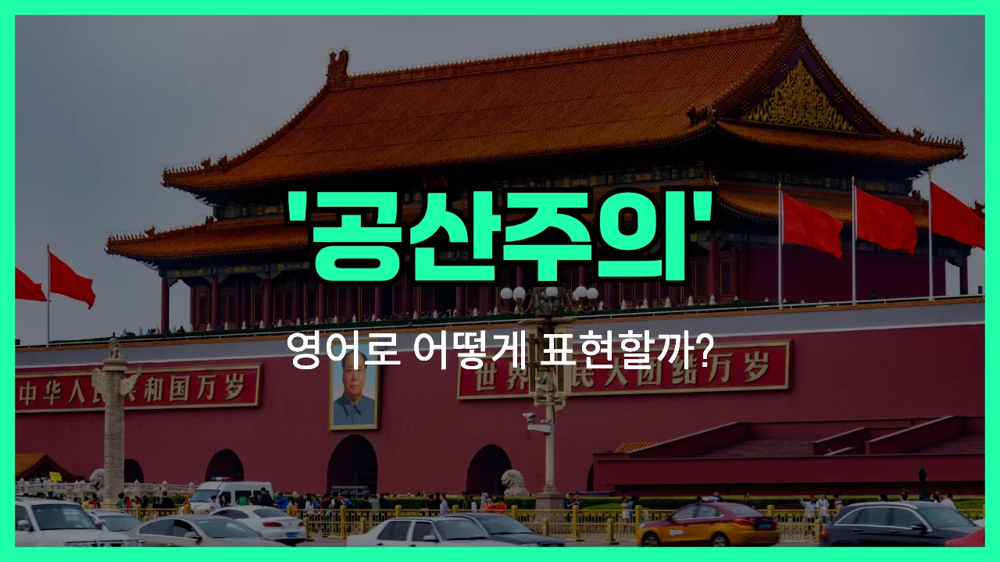

## 🌟 영어 표현 - communism

안녕하세요 👋 오늘은 정치와 경제에서 자주 등장하는 용어인 '**공산주의**'의 영어 표현에 대해 알아보려고 해요. 바로 '**communism**'이라는 단어인데요. 이 단어는 사회의 모든 재산과 생산 수단을 개인이 아니라 공동체가 소유하고, 모두가 평등하게 분배받는 사회 체제를 의미해요.

'**communism**'은 주로 정치, 경제, 역사 수업이나 뉴스에서 많이 들을 수 있는 단어예요. 예를 들어, 어떤 나라가 공산주의 체제를 채택하고 있다거나, 공산주의 이념에 대해 토론할 때 자주 사용돼요.

비슷한 개념으로 '**[socialism](/blog/in-english/613.socialism/)**(사회주의)'이나 '**egalitarianism**(평등주의)'도 있지만, communism은 특히 사유 재산이 없고, 모든 것이 공동 소유라는 점이 특징이에요.

## 📖 예문

1. "그 나라는 공산주의 체제를 따르고 있어요."

   "The country follows a communist [system](/blog/in-english/432.system/)."

2. "공산주의는 모든 사람이 평등하게 사는 사회를 목표로 해요."

   "Communism aims for a society where everyone lives equally."

## 💬 연습해보기

<ul data-interactive-list>

  <li data-interactive-item>
    역사 수업 때문에 공산주의에 대해 많이 읽어봤는데, 생각보다 훨씬 복잡하더라고요.
    I've been <a href="/blog/in-english/436.read/">reading</a> a lot about communism for my <a href="/blog/in-english/532.history/">history</a> class. It's actually more complicated than I thought.
  </li>

  <li data-interactive-item>
    미국처럼 큰 나라에서 공산주의가 과연 가능할까? 그거에 대해 항상 토론이 많아요.
    Do you think communism could ever work in a country as big as the US? People debate about that all the time.
  </li>

  <li data-interactive-item>
    할아버지는 항상 냉전 시대랑 그때 다들 공산주의를 얼마나 무서워했는지 얘기하세요.
    My grandpa always talks about the Cold War and how scared everyone was of communism back then.
  </li>

  <li data-interactive-item>
    우리 집에서 정치 얘기할 때마다 공산주의가 꼭 나와서 싸움거리 되곤 해요.
    Whenever we talk <a href="/blog/in-english/607.politics/">politics</a> in my house, communism always comes up as something to <a href="/blog/in-english/132.argue/">argue</a> about.
  </li>

  <li data-interactive-item>
    그 영화는 공산주의가 공식 제도였던 나라를 배경으로 하잖아요. 그게 사람들 삶에 진짜 큰 영향을 줬어요.
    That movie is set in a country where communism was the official system. It really shaped how people lived.
  </li>

  <li data-interactive-item>
    어떤 사람들은 공산주의를 모두가 나누는 이상적인 세상으로 보는데, 실제로는 안 된다고 생각하는 사람들도 있어요.
    Some people see communism as an ideal world where everyone <a href="/blog/in-english/248.share/">shares</a>, but others think it just doesn't work in <a href="/blog/in-english/247.practice/">practice</a>.
  </li>

  <li data-interactive-item>
    공산주의랑 자본주의가 경제 체계 면에서 완전 반대라는 게 흥미롭죠.
    You know, it's interesting how communism and capitalism are basically opposites in terms of economic systems.
  </li>

  <li data-interactive-item>
    집회에서 공산주의랑 사회주의에 관한 피켓 든 시위자들이 있었어요. 사람들 얘깃거리를 확실히 만들더라고요.
    At the rally, there were protesters <a href="/blog/in-english/388.hold/">holding</a> signs about communism and socialism. It definitely got people talking.
  </li>

  <li data-interactive-item>
    선생님이 공산주의랑 사회주의 차이점에 대해 논문을 내줬는데, 아직도 헷갈리는 부분이 있어요.
    Our teacher assigned us a paper on the differences between communism and socialism. I'm <a href="/blog/in-english/254.still/">still</a> confused about some parts.
  </li>

  <li data-interactive-item>
    동유럽 여행 후에 현지 사람들한테서 공산주의 시절 삶이 어땠는지 많이 배웠어요.
    After traveling to Eastern Europe, I <a href="/blog/in-english/245.learn/">learned</a> a lot more about what life was like under communism from the locals.
  </li>

</ul>

## 🤝 함께 알아두면 좋은 표현들

### socialism

'socialism'은 "사회주의"를 의미하며, 생산 수단을 사회 전체가 소유하거나 통제하는 체제를 말해요. 공산주의와 비슷하게 평등을 추구하지만, 완전한 사유재산 폐지보다는 점진적 개혁과 혼합 경제를 인정하는 경우가 많아요.

- "Many European countries have adopted elements of socialism in their healthcare and education systems."
- "많은 유럽 국가들이 의료와 교육 시스템에 사회주의적인 요소를 도입했어요."

### capitalism

'capitalism'은 "자본주의"를 의미해요. 생산 수단과 자원이 개인이나 기업에 의해 소유되고, 이윤 추구를 목적으로 자유롭게 경제 활동을 하는 체제예요. 공산주의와는 반대되는 개념으로, 개인의 자유와 경쟁을 강조해요.

- "Under capitalism, businesses [compete](/blog/in-english/298.compete/) to offer the best products and services to consumers."
- "자본주의에서는 기업들이 소비자에게 최고의 상품과 서비스를 제공하기 위해 경쟁해요."

### collective ownership

'collective ownership'는 "집단 소유" 또는 "공동 소유"를 의미해요. 이는 재산이나 생산 수단을 개인이 아닌 집단이나 사회 전체가 함께 소유하는 개념으로, 공산주의의 핵심 원리 중 하나예요.

- "In a system of collective ownership, everyone shares responsibility for the resources and their management."
- "집단 소유 체제에서는 모두가 자원과 그 관리에 대한 책임을 함께 져요."

---

오늘은 '**공산주의**'라는 뜻을 가진 영어 표현 '**communism**'에 대해 알아봤어요. 정치나 역사 이야기를 할 때 이 단어를 떠올리면 도움이 될 거예요 😊

오늘 배운 표현과 예문들을 꼭 최소 3번씩 소리 내서 읽어보세요. 다음에도 더 재미있고 유익한 영어 표현으로 찾아올게요! 감사합니다!

