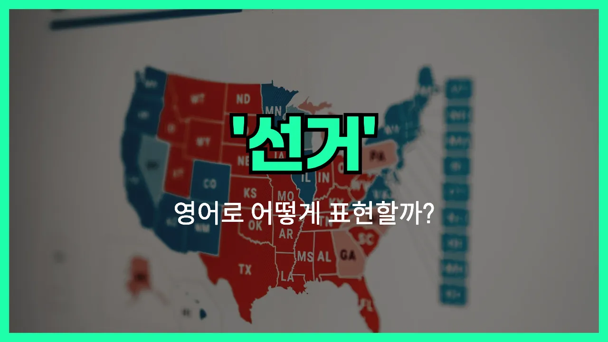

## 🌟 영어 표현 - election

안녕하세요 👋 오늘은 '선거', '투표', '선출'과 관련된 영어 표현을 알아보려고 해요. 바로 '**election**'이라는 단어인데요~

'election'은 국민이나 단체의 구성원이 대표자나 특정 직책을 뽑기 위해 투표하는 과정을 의미해요. 즉, **누군가를 공식적으로 뽑는 절차**를 말할 때 쓰는 단어예요!

이 단어는 정치적인 상황에서 가장 많이 사용되지만, 학교나 회사 등 다양한 조직에서 대표를 뽑을 때도 자연스럽게 쓸 수 있어요. 예를 들어, 대통령 선거, 학생회장 선거, 회사 이사회 선출 등 여러 상황에서 활용돼요~

예를 들어, "대통령 선거가 내년에 있어요."라고 말하고 싶을 때 "The presidential election is next year."라고 표현할 수 있어요.

또는, "그는 선거에서 승리했어요."라고 할 때는 "He [won](/blog/in-english/456.win/) the election."이라고 말할 수 있어요.

## 📖 예문

1. "선거 결과가 발표됐어요."

   "The election results have been announced."

2. "많은 사람들이 이번 선거에 참여했어요."

   "Many people participated in this election."

## 💬 연습해보기

<ul data-interactive-list>

  <li data-interactive-item>
    선거가 다음 주 화요일이에요. 투표할 계획 있어요?
    The election is next Tuesday. Are you planning to <a href="/blog/in-english/615.vote/">vote</a>?
  </li>

  <li data-interactive-item>
    전 날 밤 내내 TV로 선거 결과 봤어요.
    I watched the election results on TV all night.
  </li>

  <li data-interactive-item>
    사람들이 이번 선거에 정말 열정적이에요.
    People are really fired up about this election.
  </li>

  <li data-interactive-item>
    그가 시의원 선거에 출마했는데 몇 표 차이로 졌어요.
    He ran for city council but <a href="/blog/in-english/457.lose/">lost</a> the election by just a few votes.
  </li>

  <li data-interactive-item>
    지난해 선거에서 누가 이겼는지 기억나요?
    Do you remember who won the election last year?
  </li>

  <li data-interactive-item>
    선거 때마다 항상 드라마가 많아요.
    There's so much drama every time there's an election.
  </li>

  <li data-interactive-item>
    우리 부모님은 선거철이면 정치 얘기로 자주 싸우세요.
    My parents always <a href="/blog/in-english/132.argue/">argue</a> about <a href="/blog/in-english/607.politics/">politics</a> around election season.
  </li>

  <li data-interactive-item>
    이번 주에 학생회장 선거를 학교에서 한대요.
    They're <a href="/blog/in-english/388.hold/">holding</a> a school election for student <a href="/blog/in-english/609.president/">president</a> this week.
  </li>

  <li data-interactive-item>
    아직도 누구한테 투표할지 못 정했어요.
    I <a href="/blog/in-english/254.still/">still</a> haven't decided who I'm voting for in the election.
  </li>

  <li data-interactive-item>
    선거 전에 모든 선거운동 광고 봤어요? 엄청 많았어요.
    Did you see all the <a href="/blog/in-english/617.campaign/">campaign</a> ads before the election? They were everywhere.
  </li>

</ul>

## 🤝 함께 알아두면 좋은 표현들

### vote

'vote'는 "투표하다" 또는 "표를 던지다"라는 뜻이에요. 선거나 어떤 결정을 내릴 때 자신의 의견을 표로 표현하는 행위를 말해요. 선거뿐만 아니라 회의나 모임 등에서도 자주 쓰여요.

- "Did you remember to vote in the local election yesterday?"
- "어제 지방 선거에서 투표한 거 기억하고 있었어요?"

### run for office

'run for office'는 "공직에 출마하다"라는 의미예요. 선거에 후보로 나가서 어떤 직책을 얻으려고 도전하는 상황에서 사용해요. 정치인들이 선거에 나갈 때 자주 쓰는 표현이에요.

- "She [decided to](/blog/in-english/062.decide-to/) run for office to make a difference in her community."
- "그녀는 지역 사회에 변화를 주고 싶어서 공직에 출마하기로 결정했어요."

### boycott the election

'boycott the election'은 "선거를 보이콧하다" 또는 "선거에 참여하지 않다"라는 뜻이에요. 선거나 투표가 공정하지 않다고 생각할 때 일부러 참여하지 않는 행동을 나타내요. 주로 항의의 의미로 사용돼요.

- "Some citizens chose to boycott the election because they didn't trust the process."
- "일부 시민들은 선거 과정을 신뢰하지 않아서 선거를 보이콧하기로 했어요."

---

오늘은 '선거', '투표', '선출'이라는 뜻을 가진 영어 표현 '**election**'에 대해 알아봤어요. 앞으로 선거와 관련된 뉴스를 볼 때 이 표현을 떠올리면 좋겠어요 😊

오늘 배운 표현과 예문들을 꼭 최소 3번씩 소리 내서 읽어보세요. 다음에도 더 재미있고 유익한 영어 표현으로 찾아올게요! 감사합니다!
