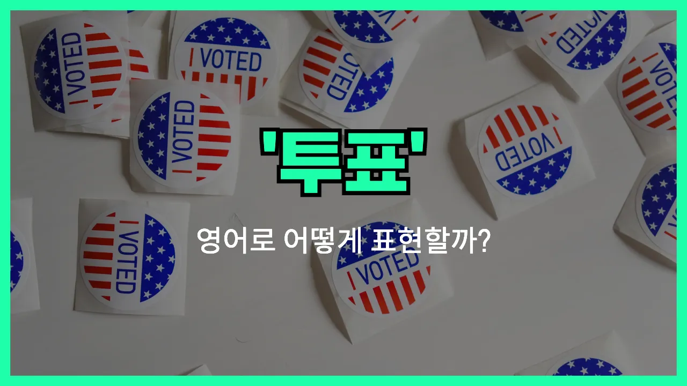

## 🌟 영어 표현 - vote

안녕하세요 👋 오늘은 '**투표하다**'라는 뜻을 가진 영어 표현을 알아보려고 해요. 바로 '**vote**'라는 단어인데요~

'**vote**'는 어떤 의견이나 후보, 안건에 대해 찬성 또는 반대의 의사를 표하는 행위를 의미해요. 즉, **선거**나 **회의** 등에서 자신의 선택을 표시할 때 자주 쓰이는 단어예요!

이 단어는 정치적인 선거뿐만 아니라, 학교나 회사에서 의견을 모을 때, 또는 친구들끼리 어디 갈지 정할 때도 자연스럽게 사용할 수 있어요. 예를 들어, "대통령 선거에서 투표하다"는 "vote in the presidential [election](/blog/in-english/614.election/)"이라고 해요~

또한, "찬성에 투표하다"는 "vote for"를, "반대에 투표하다"는 "vote against"를 사용해서 표현할 수 있어요. 상황에 따라 동사와 명사로 모두 쓸 수 있으니 참고해 주세요!

## 📖 예문

1. "나는 이번 선거에서 투표할 거예요."

   "I will vote in this [election](/blog/in-english/614.election/)."

2. "그들은 새로운 규칙에 찬성 투표를 했어요."

   "They voted for the new rule."

3. "몇 명이 그 제안에 반대 투표를 했어요."

   "Some people voted against the proposal."

## 💬 연습해보기

<ul data-interactive-list>

  <li data-interactive-item>
    시 시골 선거 벌써 투표했어요? 내가 갔을 땐 투표소 진짜 북적였어요.
    Did you already vote in the city election? The polling place was <a href="/blog/in-english/301.pack/">packed</a> when I got there.
  </li>

  <li data-interactive-item>
    난 매년 11월마다 꼭 투표하는 편이에요. 내 의견 내는 게 중요하니까요.
    I always <a href="/blog/in-english/232.make-sure/">make sure</a> to vote every November. It feels <a href="/blog/in-english/318.important/">important</a> to have my say.
  </li>

  <li data-interactive-item>
    투표하려면 미리 등록해야 한단 거 알아요?
    You have to register before you can vote, you know.
  </li>

  <li data-interactive-item>
    솔직히 말하면, 지역 안건마다 다 투표하는 건 아니에요. 잘 모를 때가 있어서요.
    <a href="/blog/in-english/336.honestly/">Honestly</a>, I don't always vote for every local measure. <a href="/blog/in-english/270.sometimes/">Sometimes</a> I don't feel informed enough.
  </li>

  <li data-interactive-item>
    이번 년도 투표할 계획 있어요? 투표율 꽤 높을 것 같아요.
    Are you planning to vote this year? I think turnout's going to be high.
  </li>

  <li data-interactive-item>
    친구들이랑 전부 미리 투표했어요. 인파 피하고 싶어서요.
    My friends and I all voted early because we wanted to avoid the crowds.
  </li>

  <li data-interactive-item>
    아직 누구 찍을지 고민 중이에요. 토론이 엄청 치열했거든요.
    I'm <a href="/blog/in-english/254.still/">still</a> <a href="/blog/고민중이야-영어표현/">trying to decide</a> who to vote for. The debates have been intense.
  </li>

  <li data-interactive-item>
    우리 부모님은 예전엔 투표 안 하셨는데 요즘엔 완전 관심 많으세요.
    My parents never <a href="/blog/in-english/143.used-to/">used to</a> vote, but now they're really into it.
  </li>

  <li data-interactive-item>
    투표일인 거 까먹고 있었는데 동료가 생각나게 해줬어요.
    I <a href="/blog/in-english/023.forget/">forgot</a> it was Election Day until my coworker <a href="/blog/in-english/114.remind/">reminded</a> me to vote.
  </li>

  <li data-interactive-item>
    지난번에 투표 안 한 사람이 그렇게 많다니 놀랍죠? 진짜 차이가 나요.
    Hey, can you believe how many people didn't vote last time? It really makes a difference.
  </li>

</ul>

## 🤝 함께 알아두면 좋은 표현들

### cast a ballot

'cast a ballot'는 "투표하다"라는 뜻으로, 공식적으로 투표용지를 제출하는 행위를 말해요. 주로 선거나 중요한 결정에서 자신의 의견을 표명할 때 사용돼요.

- "Every citizen has the right to cast a ballot in the election."
- "모든 시민은 선거에서 투표할 권리가 있어요."

### abstain from voting

'abstain from voting'은 "투표를 기권하다"라는 의미예요. 투표할 수 있는 상황에서 일부러 투표하지 않거나, 찬성도 반대도 하지 않는 중립적인 태도를 나타낼 때 써요.

- "Several members chose to abstain from voting on the new policy."
- "몇몇 구성원들은 새로운 정책에 대해 투표를 기권하기로 했어요."

### elect

'elect'는 "선출하다" 또는 "뽑다"라는 뜻이에요. 투표를 통해 누군가를 공식적으로 어떤 직위나 역할에 뽑는 상황에서 자주 사용돼요.

- "The committee will elect a new chairperson next week."
- "위원회는 다음 주에 새로운 의장을 선출할 거예요."

---

오늘은 '**투표하다**'라는 뜻의 영어 표현 '**vote**'에 대해 알아봤어요. 앞으로 선거나 의견을 낼 때 이 표현을 떠올리면 좋겠어요 😊

오늘 배운 표현과 예문들을 꼭 소리 내서 여러 번 읽어보세요. 다음에도 더 유익한 영어 표현으로 찾아올게요! 감사합니다~요!
