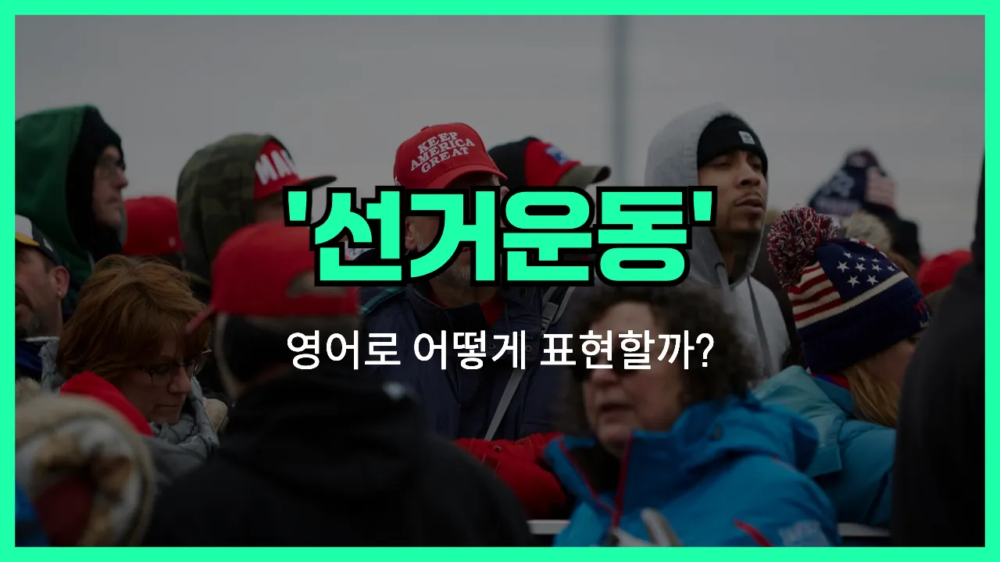

## 🌟 영어 표현 - campaign

안녕하세요 👋 오늘은 우리가 자주 듣는 단어인 '**캠페인**'의 영어 표현에 대해 알아보려고 해요. 바로 '**campaign**'이라는 단어인데요. 이 단어는 **특정 목표를 달성하기 위해 조직적으로 진행하는 활동이나 운동**을 의미해요.

예를 들어, 환경 보호를 위한 캠페인, 금연 캠페인, 또는 신제품을 알리기 위한 광고 캠페인 등 다양한 상황에서 사용할 수 있어요. 즉, 사회적 이슈를 알리거나, 어떤 행동을 촉구하거나, 제품이나 서비스를 홍보할 때 자주 쓰이는 단어예요!

'**campaign**'은 명사로도, 동사로도 사용할 수 있어요. 명사로는 '운동', '캠페인'이라는 뜻이고, 동사로는 '캠페인을 벌이다', '운동하다'라는 의미로 쓰여요.

## 📖 예문

1. "우리는 환경 보호 캠페인에 참여하고 있어요."

   "We are participating in an environmental protection campaign."

2. "그 회사는 신제품을 홍보하기 위해 대규모 캠페인을 시작했어요."

   "The company launched a large campaign to promote its new product."

## 💬 연습해보기

<ul data-interactive-list>

  <li data-interactive-item>
    우리 회사에서 새 제품 홍보하려고 캠페인을 시작했어요. 일이 많긴 한데, 결과가 너무 기대돼요.
    We're starting a new campaign at work to promote our latest product. It's a lot of work, but I'm excited to see how it goes.
  </li>

  <li data-interactive-item>
    그 친구가 시장 후보 캠페인에 기부했어요. 진짜 그 정책들을 믿고 있거든요.
    He donated money to the mayor's campaign. He really believes in her policies.
  </li>

  <li data-interactive-item>
    어제 밤에 TV에서 캠페인 광고 엄청 많이 봤어? 요즘 진짜 어디서나 나오더라고.
    Did you see all the campaign ads on TV last night? They're everywhere <a href="/blog/in-english/525.right-now/">right now</a>.
  </li>

  <li data-interactive-item>
    내 친구가 비영리 단체에서 큰 기금 모금 캠페인에 자원봉사로 참여하고 있어요. 되게 열정적이에요.
    My friend volunteers for a nonprofit that just launched a big fundraising campaign. She's really <a href="/blog/in-english/406.passionate/">passionate</a> about it.
  </li>

  <li data-interactive-item>
    영업팀이 이번 달에 회원 가입 늘리려고 캠페인 진행 중이에요. 들어봤어요?
    The sales team is running a campaign this month to boost sign-ups. Have you heard about it?
  </li>

  <li data-interactive-item>
    그들이 재활용 인식 높이려고 SNS에서 캠페인 엄청 밀고 있어요.
    They've been pushing a campaign on social media to raise awareness about recycling.
  </li>

  <li data-interactive-item>
    그 캠페인 관련 이메일 많이 왔는데, 아직 읽을 시간이 없었어요.
    I got a bunch of emails about that campaign, but I haven't had time to <a href="/blog/in-english/436.read/">read</a> them yet.
  </li>

  <li data-interactive-item>
    선거철이면 캠페인 일하는 사람들한테 전화가 끊임없이 와서 좀 정신없어요.
    During <a href="/blog/in-english/614.election/">election</a> season, <a href="/blog/한-것-같아-영어표현/">it feels like</a> every other call is from someone <a href="/blog/in-english/370.work-on/">working on</a> a campaign.
  </li>

  <li data-interactive-item>
    우리 학교에서 학생들 건강한 식습관 장려하는 캠페인 했는데, 포스터가 꽤 멋졌어요.
    Our school did a campaign to encourage students to eat healthier. The posters were actually pretty cool.
  </li>

  <li data-interactive-item>
    우리 도시 자전거 도로 늘리려고 캠페인에 참여했어요. 좋은 결과 있길 바래요.
    I joined a campaign to get more bike lanes in our city. I <a href="/blog/성공하면-좋겠어-영어표현/">hope</a> we make a difference.
  </li>

</ul>

## 🤝 함께 알아두면 좋은 표현들

### run for office

'run for office'는 "공직에 출마하다"라는 뜻이에요. 선거에서 특정 직책을 얻기 위해 공식적으로 후보로 나서는 것을 말해요. 정치적인 캠페인과 밀접하게 연관된 표현이에요.

- "She [decided to](/blog/in-english/062.decide-to/) run for office in the [upcoming](/blog/in-english/250.upcoming/) city council [election](/blog/in-english/614.election/)."
- "그녀는 다가오는 시의회 선거에 출마하기로 결정했어요."

### advocacy

'advocacy'는 "옹호" 또는 "지지 활동"이라는 뜻이에요. 특정한 이슈나 대상을 위해 적극적으로 목소리를 내고 행동하는 것을 의미해요. 캠페인처럼 조직적으로 움직일 수도 있지만, 꼭 선거나 마케팅에 한정되지 않고 다양한 사회적 이슈에 사용돼요.

- "Their advocacy for environmental protection inspired many people to join the cause."
- "그들의 환경 보호를 위한 옹호 활동이 많은 사람들이 그 운동에 동참하게 만들었어요."

### stay on the sidelines

'stay on the sidelines'는 "관여하지 않고 방관하다"라는 뜻이에요. 캠페인이나 활동에 적극적으로 참여하지 않고, 그냥 지켜보기만 하는 태도를 나타낼 때 써요. 캠페인과는 반대되는 소극적인 행동을 의미해요.

- "Many people chose to stay on the sidelines [instead of](/blog/in-english/169.instead-of/) getting [involved](/blog/in-english/274.involve/) in the campaign."
- "많은 사람들이 그 캠페인에 참여하는 대신 그냥 방관하기로 했어요."

---

오늘은 '**캠페인**'이라는 뜻을 가진 영어 표현 '**campaign**'에 대해 알아봤어요. 앞으로 사회적 운동이나 홍보 활동을 이야기할 때 이 단어를 떠올려 보세요 😊

오늘 배운 표현과 예문들을 꼭 최소 3번씩 소리 내서 읽어보세요. 다음에도 더 재미있고 유익한 영어 표현으로 찾아올게요! 감사합니다!

