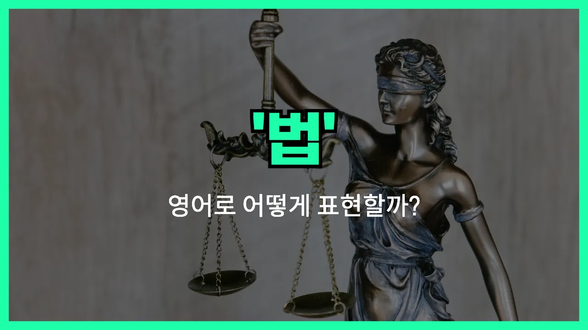

## 🌟 영어 표현 - law

안녕하세요 👋 오늘은 우리가 일상에서 자주 듣는 단어, 바로 '**법**'의 영어 표현 '**law**'에 대해 이야기해보려고 해요.

'**law**'는 사회에서 사람들이 지켜야 할 규칙이나 제도를 의미해요. 즉, 국가나 사회가 정한 규칙, 또는 그 규칙을 모아놓은 체계를 말할 때 사용해요.

이 단어는 법률, 규칙, 제도 등 다양한 상황에서 자연스럽게 쓰여요. 예를 들어, "법을 지키다"는 "obey the law"라고 하고, "새로운 법이 제정되다"는 "A new law is enacted"라고 표현할 수 있어요.

또한, 'law'는 법학이라는 의미로도 쓰여서, "법을 공부하다"는 "study law"라고 해요. 변호사( lawyer )와도 관련이 깊은 단어죠!

## 📖 예문

1. "모든 사람은 법 앞에 평등해요."

   "Everyone is equal before the law."

2. "그는 법을 어겼어요."

   "He broke the law."

3. "그녀는 법을 공부하고 있어요."

   "She is studying law."

## 💬 연습해보기

<ul data-interactive-list>

  <li data-interactive-item>
    우리 언니가 방금 로스쿨에 합격했어요. 언젠가 변호사가 되고 싶대요.
    My sister just got into law school. She wants to be a lawyer someday.
  </li>

  <li data-interactive-item>
    법에 대해서 잘 모르지만, 도둑질은 확실히 불법인 건 알아요.
    I don't know much about law, but I know stealing is definitely illegal.
  </li>

  <li data-interactive-item>
    우리 아빠는 무슨 일이 있어도 법은 절대 어기면 안 된다고 항상 말씀하세요.
    My dad always says you should never break the law, <a href="/blog/in-english/229.no-matter-what/">no matter what</a>.
  </li>

  <li data-interactive-item>
    우리 시에 재활용에 관한 새 법이 생겼는데, 사람들이 진짜 잘 지켰으면 좋겠어요.
    There's a new law about recycling in our city. I <a href="/blog/성공하면-좋겠어-영어표현/">hope</a> people actually follow it.
  </li>

  <li data-interactive-item>
    내 친구가 우리 동네 경찰 활동에 대해 할 말이 많더라고요.
    My friend has a lot of <a href="/blog/in-english/527.opinion/">opinions</a> about law enforcement in our area.
  </li>

  <li data-interactive-item>
    법과 질서에 관한 드라마를 보기 시작했는데, 완전 빠져버렸어요.
    I started watching a show about law and order, and now I'm obsessed with it.
  </li>

  <li data-interactive-item>
    거기 주차하는 게 법에 저촉된다는 게 확실해요? 저는 사람들이 항상 거기 주차하는 걸 보거든요.
    Are you sure it's against the law to <a href="/blog/in-english/463.park/">park</a> there? I see people do it all the time.
  </li>

  <li data-interactive-item>
    솔직히 말하면, 가끔 법이 너무 헷갈릴 때가 있어요.
    <a href="/blog/in-english/336.honestly/">Honestly</a>, <a href="/blog/in-english/270.sometimes/">sometimes</a> the law seems pretty confusing to me.
  </li>

  <li data-interactive-item>
    그 친구는 변호사 비용을 못 내는 사람들을 도우려고 법 공부를 하려고 해요.
    He wants to study law so he can help people who can't afford a lawyer.
  </li>

  <li data-interactive-item>
    길을 무단횡단했다가 벌금 딱지 받았는데, 그런 법이 있는지도 몰랐어요!
    I got a ticket for jaywalking. I didn't even <a href="/blog/in-english/166.realize/">realize</a> there was a law against it!
  </li>

</ul>

## 🤝 함께 알아두면 좋은 표현들

### regulation

'regulation'은 "규정" 또는 "규제"라는 뜻으로, 법(law)과 비슷하지만 보통 특정한 상황이나 분야에서 적용되는 세부적인 규칙을 말해요. 법보다 좀 더 구체적이고 제한적인 경우에 자주 사용돼요.

- "The new regulation [requires](/blog/in-english/155.require/) all restaurants to display calorie information on their menus."
- "새로운 규정 때문에 모든 식당이 메뉴에 칼로리 정보를 표시해야 해요."

### rule

'rule'은 "규칙"이라는 뜻으로, 법(law)보다 더 작고 일상적인 상황에서 적용되는 경우가 많아요. 학교, 게임, 회사 등에서 지켜야 하는 약속이나 기준을 말할 때 자주 써요.

- "You must follow the rules if you want to play on the team."
- "팀에서 뛰고 싶으면 규칙을 꼭 지켜야 해요."

### break the law

'break the law'는 "법을 어기다"라는 뜻으로, law의 반대되는 개념이에요. 법을 지키지 않고 위반하는 행동을 할 때 쓰는 표현이에요.

- "If you break the law, you could [end up](/blog/vocab-1/039.end-up/) in jail."
- "법을 어기면 감옥에 갈 수도 있어요."

---

오늘은 '**법**', '**규칙**', '**법률**'이라는 뜻을 가진 영어 표현 '**law**'에 대해 알아봤어요. 앞으로 법이나 규칙에 대해 이야기할 때 이 단어를 떠올리면 좋겠어요 😊

오늘 배운 표현과 예문들을 꼭 최소 3번씩 소리 내서 읽어보세요. 다음에도 더 재미있고 유익한 영어 표현으로 찾아올게요! 감사합니다!
