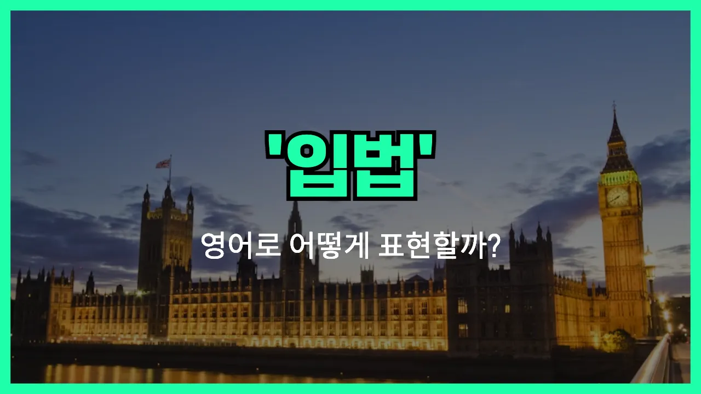

## 🌟 영어 표현 - legislation

안녕하세요 👋 오늘은 '**입법**'이라는 뜻을 가진 영어 표현 '**legislation**'에 대해 알아보려고 해요.

'**legislation**'은 법을 만들거나 제정하는 행위, 또는 그렇게 만들어진 법률 자체를 의미해요. 즉, **법을 만드는 과정**이나 **새로운 법률**을 모두 포괄하는 단어예요!

이 단어는 정치, 행정, 사회 등 다양한 분야에서 자주 사용돼요. 예를 들어, 국회에서 새로운 법을 만들 때 "The legislation was passed by the parliament."라고 할 수 있어요.

또한, "환경 보호를 위한 입법이 필요하다"라고 말하고 싶을 때는 "Legislation is needed to protect the environment."라고 표현할 수 있어요.

'**legislation**'은 주로 명사로 사용되며, 법률이나 입법 행위 모두를 나타낼 수 있어서 정말 유용한 단어예요. 상황에 따라 적절하게 활용해 보세요!

## 📖 예문

1. "정부는 새로운 입법을 준비하고 있어요."

   "The government is preparing new legislation."

2. "이 입법은 모든 시민에게 영향을 미칠 거예요."

   "This legislation will affect all [citizens](/blog/in-english/762.citizen/)."

## 💬 연습해보기

<ul data-interactive-list>

  <li data-interactive-item>
    온라인 개인 정보 보호 관련 새 법안이 나온대요.
    There's some new legislation coming out about online privacy.
  </li>

  <li data-interactive-item>
    우리 시에서 일회용 플라스틱 금지하는 법안 통과시켰는데, 사람들이 엄청 얘기하고 있어요.
    The city just passed legislation to ban single-use plastics. A lot of people are talking about it.
  </li>

  <li data-interactive-item>
    최저임금 올리는 법안이 통과됐는지 알아요?
    Do you know if that legislation about higher minimum <a href="/blog/in-english/735.wage/">wages</a> went through yet?
  </li>

  <li data-interactive-item>
    의료비를 더 저렴하게 만드는 법안을 준비 중이라는데, 잘 됐으면 좋겠어요.
    I heard they're working on legislation to make healthcare more <a href="/blog/in-english/966.affordable/">affordable</a>. I hope it helps.
  </li>

  <li data-interactive-item>
    사촌이 정치학 공부하는데, 법안과 법 만드는 과정에 관심이 많대요.
    My cousin is studying political science because she's interested in legislation and how <a href="/blog/in-english/619.law/">laws</a> are made.
  </li>

  <li data-interactive-item>
    작년에 나온 법안이 작은 가게들에 진짜 영향 컸어요. 많은 곳이 바뀌었죠.
    That legislation from last year really affected small businesses. A lot had to make changes.
  </li>

  <li data-interactive-item>
    TV에서 법안 얘기 나올 때마다 아빠가 엄청 신경 쓰시더라고요.
    Every time they talk about legislation on TV, my dad gets really fired up.
  </li>

  <li data-interactive-item>
    총기 규제 관련 제안된 법안을 두고 지금 토론이 엄청 많아요.
    There's a lot of debate right now about proposed legislation on gun control.
  </li>

  <li data-interactive-item>
    오늘 시민 수업에서 법안 만드는 과정 배웠는데, 생각보다 훨씬 복잡했어요.
    We learned about the process of legislation in our civics class today. Honestly, it's more complicated than I thought.
  </li>

  <li data-interactive-item>
    새 법안은 실제 적용되기까지 시간이 꽤 걸려서, 사람들이 가끔 잊어버리기도 해요.
    New legislation usually takes a while to actually go into effect. People sometimes forget that.
  </li>

</ul>

## 🤝 함께 알아두면 좋은 표현들

### pass a law

'pass a law'는 "법을 통과시키다"라는 뜻이에요. 국회나 의회에서 새로운 법안을 승인해서 실제로 법으로 만드는 과정을 말해요. 입법의 결과로 법이 공식적으로 효력을 갖게 되는 순간을 강조할 때 자주 써요.

- "The government plans to pass a law to improve road safety."
- "정부가 도로 안전을 개선하기 위해 법을 통과시킬 계획이에요."

### repeal a law

'repeal a law'는 "법을 폐지하다"라는 의미예요. 이미 존재하는 법을 더 이상 효력이 없도록 공식적으로 없애는 과정을 말해요. 입법의 반대 개념으로, 불필요하거나 시대에 맞지 않는 법을 없앨 때 사용해요.

- "The parliament voted to repeal a law that was considered [outdated](/blog/in-english/758.outdated/)."
- "국회가 시대에 뒤떨어진 법을 폐지하기로 표결했어요."

### enforce legislation

'enforce legislation'은 "입법을 집행하다" 또는 "법을 시행하다"라는 뜻이에요. 이미 만들어진 법을 실제로 적용하고 지키도록 하는 과정을 말해요. 법이 만들어진 후, 그 법이 제대로 지켜지도록 하는 데 초점을 두는 표현이에요.

- "It's important for authorities to enforce legislation to protect the environment."
- "환경을 보호하려면 당국이 법을 제대로 집행하는 게 중요해요."

---

오늘은 '**입법**'이라는 뜻을 가진 영어 표현 '**legislation**'에 대해 알아봤어요. 법률이나 제도와 관련된 이야기를 할 때 이 단어를 떠올리면 좋겠죠? 😊

오늘 배운 표현과 예문들을 꼭 최소 3번씩 소리 내서 읽어보세요. 다음에도 더 재미있고 유익한 영어 표현으로 찾아올게요! 감사합니다!
