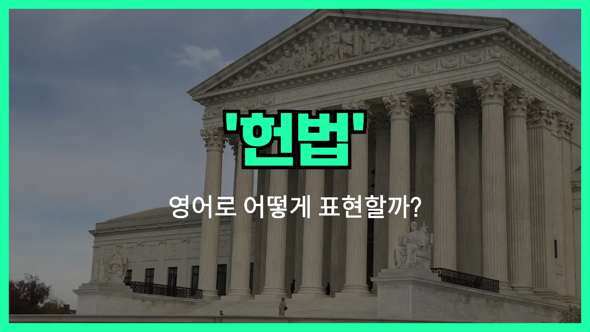

## 🌟 영어 표현 - constitution

안녕하세요 👋 오늘은 우리나라의 가장 중요한 법, 바로 '**헌법**'을 영어로 어떻게 표현하는지 알아보려고 해요. 영어로 '헌법'은 '**constitution**'이라고 해요.

'Constitution'은 한 나라의 기본적인 법과 원칙을 정해 놓은 문서를 의미해요. 즉, 국가의 조직, 국민의 권리와 의무, 정부의 구조와 운영 방식 등을 규정하는 가장 근본적인 법이에요. 우리나라뿐만 아니라 미국, 프랑스 등 많은 나라들이 자신들만의 constitution을 가지고 있어요.

이 단어는 법률, 정치, 사회 등 다양한 분야에서 자주 사용돼요. 예를 들어, 새로운 법이 헌법에 맞는지 확인할 때 "Is this [law](/blog/in-english/619.law/) constitutional?"이라고 물어볼 수 있어요. 또, 헌법을 개정한다는 말은 영어로 "amend the constitution"이라고 해요.

## 📖 예문

1. "대한민국 헌법은 국민의 기본권을 보장해요."

   "The Constitution of the Republic of Korea [guarantees](/blog/in-english/989.guarantee/) the basic rights of its people."

2. "헌법을 개정하려면 국회의 동의가 필요해요."

   "To amend the constitution, the approval of the National Assembly is required."

## 💬 연습해보기

<ul data-interactive-list>

  <li data-interactive-item>
    뉴스에서 또 헌법 개정 얘기 나와요.
    They're talking about amending the constitution on the news again.
  </li>

  <li data-interactive-item>
    헌법에 표현의 자유가 어떻게 적혀 있는지 알아요?
    Do you know what the constitution actually says about freedom of speech?
  </li>

  <li data-interactive-item>
    역사 수업 때문에 헌법 일부를 외워야 했어요.
    I had to memorize part of the constitution for my history class.
  </li>

  <li data-interactive-item>
    솔직히 다들 헌법 한 번쯤은 읽어봤으면 해요.
    Honestly, I think everyone should read the constitution at least once.
  </li>

  <li data-interactive-item>
    사람들이 많으면 헌법을 바꿀 수 있다는 게 사실인가요?
    Is it true that the constitution can be changed if enough people agree?
  </li>

  <li data-interactive-item>
    헌법은 오래전에 만들어졌지만 지금도 진짜 중요해요.
    The constitution was written a long time ago, but it's still super important today.
  </li>

  <li data-interactive-item>
    현대 문제를 해결하려면 새 헌법이 필요하다는 사람들도 있어요.
    Some people believe we need a new constitution to fix modern problems.
  </li>

  <li data-interactive-item>
    헌법이랑 일반 법이랑 차이가 항상 헷갈려요.
    I always get confused about the difference between the constitution and regular laws.
  </li>

  <li data-interactive-item>
    그건 안 돼요. 헌법에 딱 금지돼 있어요.
    That's not allowed. It's literally against the constitution.
  </li>

  <li data-interactive-item>
    정부 수업에서 모든 대통령은 헌법을 지키겠다고 서약해야 한다고 배웠어요.
    We learned in government class that every president has to swear to uphold the constitution.
  </li>

</ul>

## 🤝 함께 알아두면 좋은 표현들

### bill of rights

'bill of rights'는 "권리장전" 또는 "기본권 선언"을 의미해요. 헌법처럼 국민의 기본적인 권리와 자유를 보장하는 문서이지만, 헌법의 일부이거나 별도의 문서로 존재할 수 있어요. 주로 시민의 자유와 권리를 명확히 규정할 때 사용돼요.

- "The Bill of Rights guarantees freedom of speech and religion."
- "권리장전은 언론의 자유와 종교의 자유를 보장해줘요."

### statute

'statute'는 "법률" 또는 "법령"을 의미해요. 헌법보다 하위 개념으로, 국회 등 입법기관에서 제정한 구체적인 법을 말해요. 헌법이 국가의 기본 원칙을 정한다면, statute는 그 원칙을 구체적으로 실현하는 세부 규정이에요.

- "The new statute requires all businesses to recycle their waste."
- "새로운 법률에 따르면 모든 사업장은 폐기물을 재활용해야 해요."

### anarchy

'anarchy'는 "무정부 상태" 또는 "무질서"를 의미해요. 헌법이나 법률 등 공식적인 규칙이 없거나 무시되는 상태를 나타내는 말로, 질서가 없는 사회를 묘사할 때 주로 사용돼요. 헌법의 반대 개념으로 볼 수 있어요.

- "After the government collapsed, the country fell into anarchy."
- "정부가 무너진 후에 그 나라는 무정부 상태에 빠졌어요."

---

오늘은 '헌법'이라는 뜻을 가진 영어 표현 '**constitution**'에 대해 알아봤어요. 국가의 근본이 되는 중요한 단어이니 꼭 기억해 두면 좋겠어요 😊

오늘 배운 표현과 예문들을 꼭 최소 3번씩 소리 내서 읽어보세요. 다음에도 더 재미있고 유익한 영어 표현으로 찾아올게요! 감사합니다!
