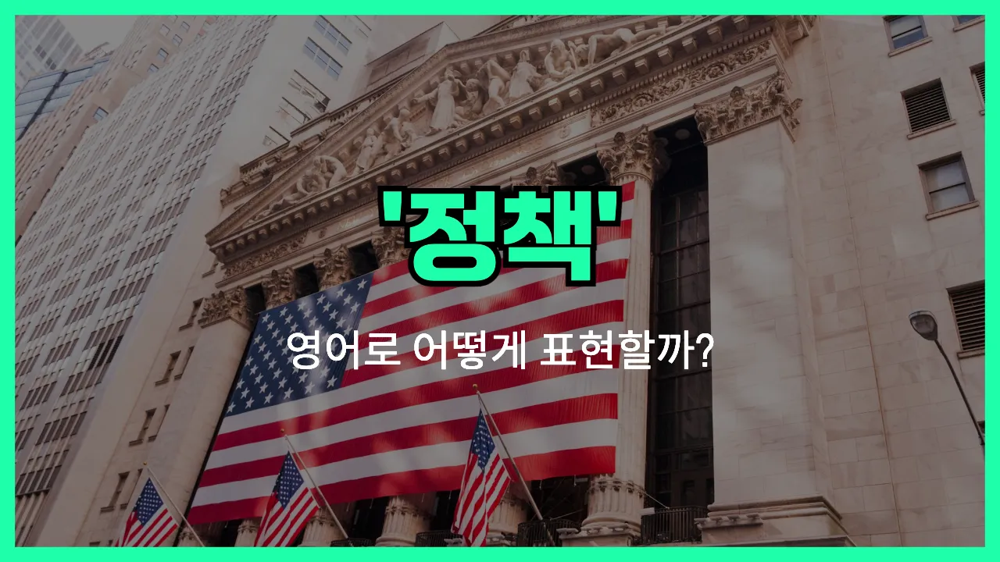

## 🌟 영어 표현 - policy

안녕하세요 👋 오늘은 우리가 자주 듣는 단어인 '**정책**'을 영어로 어떻게 표현하는지 알아보려고 해요. 바로 '**policy**'라는 단어를 사용해요.

'**policy**'는 어떤 조직, 정부, 회사 등이 목표를 달성하기 위해 정해 놓은 공식적인 방침이나 규정을 의미해요. 즉, **방침**이나 **규정**과 같은 뜻으로도 자주 쓰여요!

예를 들어, 회사에서 직원들에게 적용되는 규칙이나, 정부가 국민을 위해 세우는 여러 가지 제도와 같은 것들이 모두 'policy'에 해당해요.

'policy'는 주로 명사로 사용되고, 다양한 분야에서 폭넓게 쓰이는 단어라서 알아두면 정말 유용해요.

## 📖 예문

1. "정부는 새로운 환경 정책을 발표했어요."

   "The [government](/blog/in-english/608.government/) announced a new environmental policy."

2. "우리 회사는 재택근무 방침이 있어요."

   "Our company has a work-from-home policy."

## 💬 연습해보기

<ul data-interactive-list>

  <li data-interactive-item>
    우리 회사가 휴가 정책을 방금 바꿨어요. 이제 휴가를 한 달 전에 미리 신청해야 해요.
    Our company just changed its <a href="/blog/in-english/516.vacation/">vacation</a> policy. Now we have to request days off a month in <a href="/blog/in-english/429.advance/">advance</a>.
  </li>

  <li data-interactive-item>
    그 노트북 사기 전에 환불 정책 읽어봤어요?
    Did you <a href="/blog/in-english/436.read/">read</a> the <a href="/blog/in-english/530.refund/">refund</a> policy before buying that laptop?
  </li>

  <li data-interactive-item>
    저희는 모든 이메일에 24시간 안에 답장하는 게 정책이에요.
    It's our policy to respond to all emails within 24 hours.
  </li>

  <li data-interactive-item>
    정책 만드는 사람이 아니고, 그냥 따르는 사람일 뿐이에요.
    I don't make the policy, I just follow it.
  </li>

  <li data-interactive-item>
    그 회사 반품 정책 진짜 빡세요. 물건 반품하려면 일주일 안에 해야 해요.
    Their return policy is really <a href="/blog/in-english/275.strict/">strict</a>. You only have seven days to bring something back.
  </li>

  <li data-interactive-item>
    학교에서는 괴롭힘에 대해 무관용 정책을 적용해요.
    The school has a zero-tolerance policy on bullying.
  </li>

  <li data-interactive-item>
    그게 회사 정책에 위배되는지 잘 모르겠어요. 직원 수칙을 한번 확인해보는 게 좋을 것 같아요.
    I'm not sure if that's against company policy or not. You should check the handbook.
  </li>

  <li data-interactive-item>
    매장 규정상 환불하려면 영수증이 꼭 필요해요.
    <a href="/blog/in-english/335.due-to/">Due to</a> store policy, you'll need a <a href="/blog/in-english/526.receipt/">receipt</a> to get a refund.
  </li>

  <li data-interactive-item>
    그 여자가 정부의 새 세금 정책에는 동의하지 않아요.
    She disagrees with the government's new tax policy.
  </li>

  <li data-interactive-item>
    죄송한데, 매장 방침상 이제 수표는 받지 않아요.
    Sorry, it's store policy not to accept checks anymore.
  </li>

</ul>

## 🤝 함께 알아두면 좋은 표현들

### guideline

'guideline'은 "지침" 또는 "가이드라인"이라는 뜻으로, 어떤 행동이나 결정을 할 때 참고할 수 있도록 제시된 기본적인 방향이나 규칙을 말해요. 'policy'가 공식적이고 강제력이 있는 규칙이라면, 'guideline'은 좀 더 유연하고 참고용인 경우가 많아요.

- "The company has clear guidelines on how to handle customer complaints."
- "그 회사는 고객 불만을 처리하는 방법에 대한 명확한 지침이 있어요."

### regulation

'regulation'은 "규정" 또는 "규제"라는 뜻으로, 법이나 공식적인 기관에서 정한 엄격한 규칙을 의미해요. 'policy'와 비슷하지만, 보통 더 강제적이고 법적인 힘이 있는 경우에 사용돼요.

- "There are strict regulations about food safety in restaurants."
- "식당에서는 음식 안전에 관한 엄격한 규정이 있어요."

### improvisation

'improvisation'은 "즉흥적으로 처리함" 또는 "즉석에서 결정함"이라는 뜻이에요. 'policy'처럼 미리 정해진 규칙이나 계획 없이, 상황에 따라 즉석에서 판단하고 행동하는 것을 말해요. 즉, 'policy'의 반대 개념이라고 볼 수 있어요.

- "Without a clear plan, we had to [rely on](/blog/in-english/113.rely-on/) improvisation during the meeting."
- "명확한 계획이 없어서 회의 중에 즉흥적으로 대처해야 했어요."

---

오늘은 '**정책**', '**방침**', '**규정**'이라는 뜻을 가진 영어 표현 '**policy**'에 대해 알아봤어요. 앞으로 회사나 학교, 사회에서 규칙이나 제도를 이야기할 때 이 단어를 떠올리면 좋겠어요 😊

오늘 배운 표현과 예문들을 꼭 소리 내서 여러 번 읽어보세요. 다음에도 더 유익한 영어 표현으로 찾아올게요! 감사합니다!
