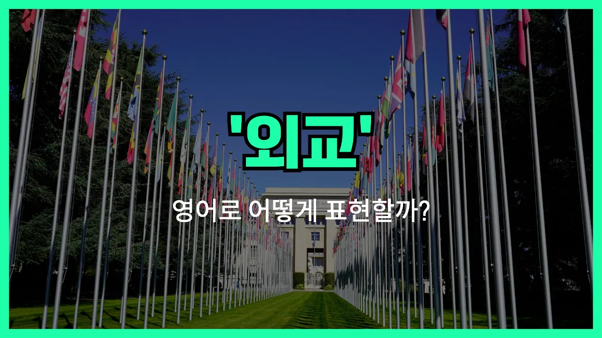

## 🌟 영어 표현 - diplomacy

안녕하세요 👋 오늘은 국제 사회에서 정말 중요한 단어인 '**외교**'의 영어 표현 '**diplomacy**'에 대해 알아보려고 해요.

'**diplomacy**'는 국가와 국가 사이에서 평화롭게 문제를 해결하거나, 서로의 이익을 조율하는 **외교 활동**을 의미해요. 즉, 전쟁이나 갈등 없이 대화와 협상을 통해 관계를 유지하고 발전시키는 것을 말해요!

이 단어는 국제 뉴스, 정치, 역사 등 다양한 분야에서 자주 등장해요. 예를 들어, 두 나라가 무역 문제로 갈등을 겪을 때, 서로의 입장을 조율하기 위해 외교적 노력을 기울인다고 할 수 있어요. 이럴 때 "They are trying to resolve the issue through diplomacy."라고 표현할 수 있어요.

또한, '**diplomacy**'는 단순히 국가 간의 관계뿐만 아니라, 일상생활에서 **사람들과의 관계를 원만하게 이끌어가는 능력**을 의미할 때도 사용돼요. 예를 들어, 회사에서 동료들과 잘 지내기 위해 외교술이 필요하다고 할 수 있어요.

## 📖 예문

1. "그는 외교에 뛰어난 재능이 있어요."

   "He has great talent in diplomacy."

2. "두 나라는 외교를 통해 갈등을 해결하려고 해요."

   "The two countries are trying to resolve the [conflict](/blog/in-english/753.conflict/) through diplomacy."

## 💬 연습해보기

<ul data-interactive-list>

  <li data-interactive-item>
    우리 언니는 국무부에서 일해요. 외교에 정말 관심이 많아요.
    My sister works for the State Department. She's really interested in diplomacy.
  </li>

  <li data-interactive-item>
    외교는 싸우지 않고 문제를 해결하는 거예요. 생각보다 훨씬 복잡하더라고요.
    Diplomacy is all about solving problems without fighting. It's more complicated than I thought.
  </li>

  <li data-interactive-item>
    가끔 상사랑 대화할 때 약간의 외교가 필요해요. 드라마를 피할 수 있거든요.
    Sometimes you need a little diplomacy when talking to your boss. It helps <a href="/blog/in-english/924.avoid/">avoid</a> drama.
  </li>

  <li data-interactive-item>
    아빠는 이웃과 지낼 때 약간의 외교가 큰 도움이 된다고 항상 말씀하세요.
    My dad always says a bit of diplomacy can go a long way when dealing with neighbors.
  </li>

  <li data-interactive-item>
    국제 외교는 온갖 협상과 회의 때문에 정말 힘들 것 같아요.
    International diplomacy must be exhausting with all those negotiations and meetings.
  </li>

  <li data-interactive-item>
    친구들 사이 싸움도 외교로 해결하려고 노력했어요.
    I tried to use some diplomacy to settle the argument between my friends.
  </li>

  <li data-interactive-item>
    사람들이 좋은 외교가 나라 사이 갈등을 막는 힘을 과소평가하는 것 같아요.
    People underestimate how much good diplomacy can prevent conflicts between countries.
  </li>

  <li data-interactive-item>
    걔는 외교력이 엄청 좋아요. 어색한 상황도 척척 해결하더라고요.
    She's got great diplomacy skills. She always knows how to handle awkward situations.
  </li>

  <li data-interactive-item>
    고객 서비스 일할 때 화난 고객 상대할 때 외교가 얼마나 중요한지 배웠어요.
    When I worked in customer service, I learned the importance of diplomacy when dealing with angry customers.
  </li>

  <li data-interactive-item>
    외교가 큰 회의에서만 이뤄지는 줄 아는데, 사실 일상에서도 다 필요해요.
    Some people think diplomacy just happens at big conferences, but it's actually part of everyday life.
  </li>

</ul>

## 🤝 함께 알아두면 좋은 표현들

### negotiation

'negotiation'은 "협상" 또는 "교섭"이라는 뜻으로, 외교와 비슷하게 서로 다른 입장을 가진 사람들이 합의에 도달하기 위해 대화하고 조율하는 과정을 말해요. 외교의 한 부분이기도 하고, 비즈니스나 일상생활에서도 자주 쓰여요.

- "Successful negotiation requires patience and understanding from both sides."
- "성공적인 협상은 양쪽 모두의 인내와 이해가 필요해요."

### confrontation

'confrontation'은 "대립" 또는 "충돌"이라는 뜻이에요. 외교가 평화롭고 우호적인 해결을 추구한다면, confrontation은 갈등이나 의견 차이로 인해 직접적으로 맞서는 상황을 의미해요. 외교의 반대되는 개념으로 볼 수 있어요.

- "Instead of seeking diplomacy, the two countries chose confrontation."
- "두 나라는 외교 대신 대립을 선택했어요."

### mediation

'[mediation](/blog/in-english/756.mediation/)'은 "중재"라는 뜻으로, 갈등이나 분쟁이 있을 때 제3자가 중간에서 양쪽을 조율하고 합의를 이끌어내는 과정을 말해요. 외교와 비슷하게 평화로운 해결을 추구하지만, 주로 외부의 중립적인 인물이 개입하는 점이 달라요.

- "The United Nations often steps in to offer mediation during international conflicts."
- "국제 분쟁이 있을 때 유엔이 중재에 나서는 경우가 많아요."

---

오늘은 '**외교**'라는 뜻을 가진 영어 표현 '**diplomacy**'에 대해 알아봤어요. 국제 뉴스나 다양한 상황에서 이 단어를 들으면 오늘 배운 내용을 떠올려보면 좋겠어요 😊

오늘 배운 표현과 예문들을 꼭 최소 3번씩 소리 내서 읽어보세요. 다음에도 더 재미있고 유익한 영어 표현으로 찾아올게요! 감사합니다!
