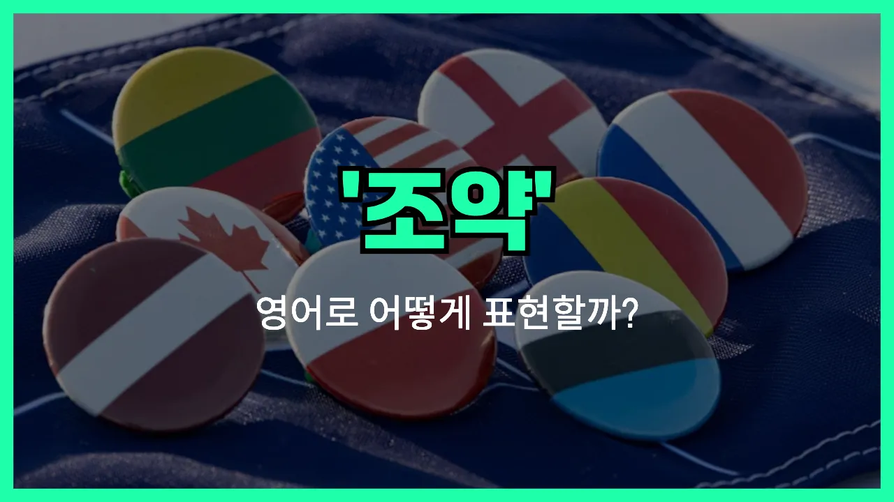

## 🌟 영어 표현 - treaty

안녕하세요 👋 오늘은 국제 관계나 역사에서 자주 등장하는 단어, '**조약**'의 영어 표현 '**treaty**'에 대해 알아보려고 해요.

'**treaty**'는 국가 간에 맺는 공식적인 약속이나 합의를 의미해요. 즉, 두 나라 이상이 서로 동의한 내용을 문서로 남기고, 그 약속을 지키기로 서명하는 것을 말해요. 이런 조약은 전쟁을 끝내거나, 무역, 평화, 국경 등 다양한 주제로 맺어질 수 있어요!

비슷한 의미로 '**협정**', '**약속**' 같은 단어도 있지만, 'treaty'는 특히 **국가 간의 공식적인 합의**에 초점을 두고 사용돼요.

예를 들어, 전쟁이 끝난 후 평화 조약을 맺을 때 "They signed a peace treaty."라고 할 수 있어요.

## 📖 예문

1. "두 나라가 무역 조약을 체결했어요."

   "The two countries signed a trade treaty."

2. "평화 조약이 전쟁을 끝냈어요."

   "The peace treaty ended the war."

## 💬 연습해보기

<ul data-interactive-list>

  <li data-interactive-item>
    대통령님이 옆 나라랑 새 조약에 서명하셨어요. 오늘 아침 뉴스에 다 나오더라구요.
    The president signed a new treaty with the neighboring country. It was all over the news this morning.
  </li>

  <li data-interactive-item>
    작년에 합의한 기후 조약 들어봤어요? 오염 줄이는데 진짜 도움이 됐으면 좋겠어요.
    Have you heard about the climate treaty they agreed on last year? I really hope it helps reduce pollution.
  </li>

  <li data-interactive-item>
    오늘 역사 시간에 2차 세계대전 평화 조약 배웠는데, 그때 싸움이 많이 끝났대요.
    We learned about the peace treaty from World War II in history class today. It ended a lot of fighting back then.
  </li>

  <li data-interactive-item>
    지금 무역 조약 협상 중인데, 어떤 변화가 올지 궁금해요.
    They're negotiating a trade treaty right now. I wonder what changes it'll bring.
  </li>

  <li data-interactive-item>
    몇 달간의 대화 끝에 두 나라가 마침내 조약을 맺었어요. 사람들 많이 안심하는 분위기예요.
    After months of talks, both nations finally reached a treaty. People are pretty relieved.
  </li>

  <li data-interactive-item>
    그 조약 아직 유효해요, 아니면 취소되었나요? 자세한 건 잘 모르겠어요.
    Is that treaty still in effect, or did it get canceled? I'm not sure about the details.
  </li>

  <li data-interactive-item>
    우리 삼촌이 정부에서 일하시는데, 가끔 조약 협상 도와주신대요. 되게 복잡하다고 하더라고요.
    My uncle works for the government, and he sometimes helps with treaty negotiations. He says it's really complicated.
  </li>

  <li data-interactive-item>
    그 조약 서명은 우리나라 역사에서 큰 순간이었어요. 진짜 다 바뀌었죠.
    Signing that treaty was a big moment in our country's history. It changed everything.
  </li>

  <li data-interactive-item>
    그 조약은 양쪽이 엄격한 규칙을 지키게 되어 있어요. 다들 잘 지킬지 궁금해요.
    The treaty requires both sides to follow strict rules. I wonder if everyone will actually stick to them.
  </li>

  <li data-interactive-item>
    국가 간 갈등을 해결하는 가장 좋은 방법이 조약 맺기라고 생각해요? 상황에 따라 다를 것 같아요.
    Do you think making a treaty is the best way to solve disagreements between countries? I guess it depends on the situation.
  </li>

</ul>

## 🤝 함께 알아두면 좋은 표현들

### agreement

'agreement'는 "합의" 또는 "협정"이라는 뜻으로, 여러 당사자들이 어떤 사안에 대해 서로 동의하고 약속하는 것을 말해요. 'treaty'가 주로 국가 간의 공식적이고 법적인 문서라면, 'agreement'는 좀 더 넓은 의미로 공식적이거나 비공식적인 상황 모두에 쓸 수 있어요.

- "The two companies reached an agreement to work together on the new project."
- "두 회사가 새로운 프로젝트를 함께 하기로 합의했어요."

### armistice

'armistice'는 "휴전" 또는 "정전"이라는 뜻이에요. 주로 전쟁이나 무력 충돌 중에 싸움을 멈추기로 공식적으로 약속하는 것을 말해요. 'treaty'가 전반적인 조약이라면, 'armistice'는 전투를 멈추는 데 초점을 맞춘 표현이에요.

- "The armistice was signed, bringing an end to the fighting between the two countries."
- "두 나라가 휴전 협정에 서명해서 전투가 끝났어요."

### conflict

'[conflict](/blog/in-english/753.conflict/)'는 "갈등"이나 "분쟁"이라는 뜻으로, 서로 의견이 다르거나 이해관계가 충돌해서 싸우는 상황을 말해요. 'treaty'가 갈등을 해결하기 위한 공식적인 약속이라면, 'conflict'는 그런 약속이 없거나 깨져서 문제가 생긴 상태를 나타내는 반대 의미예요.

- "The conflict between the two nations lasted for several years before any peace talks began."
- "두 나라 사이의 분쟁은 평화 협상이 시작되기 전까지 몇 년이나 계속됐어요."

---

오늘은 '**조약**'이라는 뜻을 가진 영어 표현 '**treaty**'에 대해 알아봤어요. 국제 뉴스나 역사책에서 이 단어를 자주 볼 수 있으니, 오늘 배운 표현을 꼭 기억해두세요! 😊

오늘의 예문도 소리 내서 여러 번 읽어보면 더 쉽게 외울 수 있어요. 다음에도 더 유익한 영어 표현으로 찾아올게요! 감사합니다~요!
