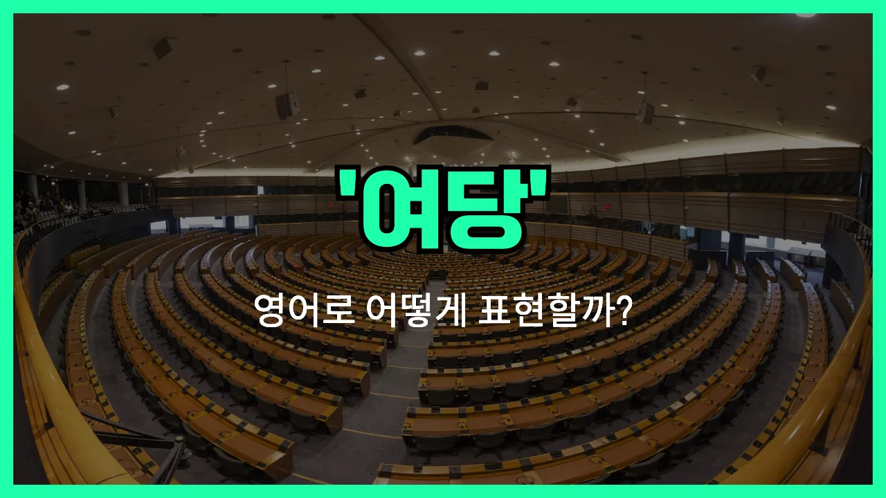

## 🌟 영어 표현 - ruling party

안녕하세요 👋 오늘은 정치 관련 영어 표현 중에서 자주 쓰이는 '**여당**'에 대해 알아보려고 해요. 영어로는 '**ruling party**'라고 해요. 이 표현은 **현재 정부를 이끌고 있는 정당**을 의미해요. 즉, 선거에서 승리해서 정부를 구성하고 있는 정당을 말할 때 사용해요!

'Ruling'은 '지배하는', '통치하는'이라는 뜻이고, 'party'는 '정당'을 의미해요. 그래서 합쳐서 'ruling party'는 '통치하는 정당', 즉 '여당'이 되는 거예요.

반대로, 여당이 아닌 정당은 '야당([opposition party](/blog/in-english/627.opposition-party/))'이라고 해요. 정치 뉴스나 기사에서 자주 볼 수 있는 표현이니 꼭 기억해두면 좋아요!

## 📖 예문

1. "여당이 이번 선거에서 승리했어요."

   "The ruling party [won](/blog/in-english/456.win/) the recent [election](/blog/in-english/614.election/)."

2. "여당과 야당이 새로운 법안에 대해 토론하고 있어요."

   "The ruling party and the opposition party are debating the new [bill](/blog/in-english/620.bill/)."

## 💬 연습해보기

<ul data-interactive-list>

  <li data-interactive-item>
    여당이 방금 새 건강보험 법안을 통과시켰어요. 회사에서도 다들 이 얘기하고 있더라고요.
    The ruling party just passed a new health care bill. Everyone's talking about it at work.
  </li>

  <li data-interactive-item>
    여당이 올해 세금을 또 올려서 사람들이 불만이 많아요.
    People are <a href="/blog/in-english/395.upset/">upset</a> because the ruling party raised taxes again this year.
  </li>

  <li data-interactive-item>
    솔직히 여당이 약속을 지킬까 별로 믿음이 안 가요.
    I don't really trust the ruling party to keep their promises, to be honest.
  </li>

  <li data-interactive-item>
    야당이 점점 지지도를 얻고 있는데, 여전히 여당이 힘이 제일 많아요.
    The opposition is gaining more support, but the ruling party <a href="/blog/in-english/254.still/">still</a> has most of the power <a href="/blog/in-english/525.right-now/">right now</a>.
  </li>

  <li data-interactive-item>
    어젯밤 토론회 봤어요? 여당 후보가 꽤 잘했더라고요.
    Did you watch the debate last night? The ruling party's <a href="/blog/in-english/616.candidate/">candidate</a> did pretty well.
  </li>

  <li data-interactive-item>
    요즘 정책들 보면 여당 지지자들만 챙겨주는 느낌이에요.
    A lot of <a href="/blog/in-english/623.policy/">policies</a> <a href="/blog/in-english/417.these-days/">these days</a> seem to only benefit the ruling party's supporters.
  </li>

  <li data-interactive-item>
    다음 선거는 여당이 힘들 것 같아요. 유권자들이 변화를 원하거든요.
    I think the ruling party is going to have a <a href="/blog/in-english/183.tough/">tough</a> time in the next election. Voters want change.
  </li>

  <li data-interactive-item>
    여당이 의석 대부분을 장악하고 있어도, 여전히 몇몇 사람들은 반대 시위를 해요.
    Even though the ruling party controls most of the seats, some people still protest their decisions.
  </li>

  <li data-interactive-item>
    우리 삼촌은 여당이 하는 일에 항상 잔소리해요. 정치에 완전 관심 많으시거든요.
    My uncle always <a href="/blog/in-english/499.complain/">complains</a> about what the ruling party is doing. He's super into <a href="/blog/in-english/607.politics/">politics</a>.
  </li>

  <li data-interactive-item>
    뉴스에서 여당 대표 교체 가능성 있다고 하더니, 앞으로 상황이 흥미로워질 것 같아요.
    The <a href="/blog/in-english/536.news/">news</a> says the ruling party might have a leadership shakeup soon, so things could get interesting.
  </li>

</ul>

## 🤝 함께 알아두면 좋은 표현들

### governing party

'governing party'는 'ruling party'와 거의 같은 의미로, 현재 정부를 이끌고 있는 정당을 말해요. 국가의 정책과 법률을 주도적으로 결정하는 역할을 해요.

- "The governing party [introduced](/blog/in-english/262.introduce/) a new education reform bill this year."
- "여당이 올해 새로운 교육 개혁 법안을 도입했어요."

### opposition party

'opposition party'는 'ruling party'의 반대 개념으로, 현재 정권을 잡고 있지 않은 정당을 의미해요. 주로 정부의 정책을 비판하거나 견제하는 역할을 해요.

- "The opposition party criticized the [government](/blog/in-english/608.government/)'s handling of the crisis."
- "야당이 정부의 위기 대응 방식을 비판했어요."

### incumbent party

'incumbent party'는 현재 집권하고 있는 정당, 즉 'ruling party'와 비슷한 의미예요. 특히 선거와 관련해서 현직에 있는 정당을 지칭할 때 자주 사용해요.

- "The incumbent party is expected to face tough competition in the [upcoming](/blog/in-english/250.upcoming/) election."
- "여당이 다가오는 선거에서 치열한 경쟁을 할 것으로 보여요."

---

오늘은 '**여당**'이라는 뜻을 가진 영어 표현 '**ruling party**'에 대해 알아봤어요. 정치 관련 뉴스를 볼 때 이 표현을 떠올리면 이해가 더 쉬워질 거예요 😊

오늘 배운 표현과 예문들을 꼭 최소 3번씩 소리 내서 읽어보세요. 다음에도 더 재미있고 유익한 영어 표현으로 찾아올게요! 감사합니다!

