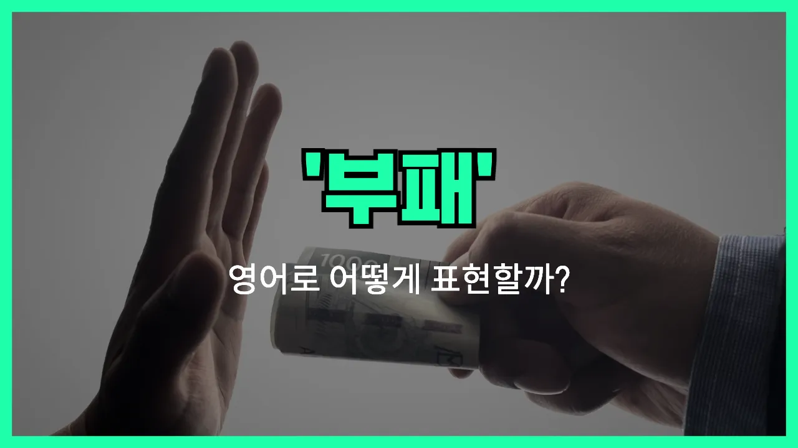

## 🌟 영어 표현 - corruption

안녕하세요 👋 오늘은 '부패', '타락', '비리'와 관련된 영어 표현인 '**corruption**'에 대해 알아보려고 해요.

'**corruption**'은 주로 **권력이나 지위에 있는 사람이 정직하지 못하게 행동하거나, 돈이나 권력을 남용하는 상황**을 말할 때 사용해요. 즉, 정부, 기업, 조직 등에서 부정한 방법으로 이익을 챙기는 행위나, 도덕적으로 타락한 상태를 표현할 때 자주 쓰여요!

이 단어는 정치, 경제, 사회 등 다양한 분야에서 널리 사용돼요. 예를 들어, 공무원이 뇌물을 받거나, 기업에서 비리가 발생할 때 'corruption'이라는 단어를 자연스럽게 쓸 수 있어요.

또한, 'corruption'은 명사로만 사용되며, '부패', '타락', '비리'라는 뜻을 모두 포함하고 있어서 상황에 따라 다양하게 활용할 수 있어요.

## 📖 예문

1. "그 나라는 부패가 심각한 문제예요."

   "Corruption is a [serious](/blog/in-english/146.serious/) problem in that country."

2. "정부는 부패를 근절하기 위해 노력하고 있어요."

   "The [government](/blog/in-english/608.government/) is working to eliminate corruption."

## 💬 연습해보기

<ul data-interactive-list>

  <li data-interactive-item>
    우리 시가 지방 정부 부패 문제로 엄청 골치 아파요. 요즘 뉴스에 자주 나와서 다들 알걸요.
    The city has a big problem with corruption in local government. It's been all over the <a href="/blog/in-english/536.news/">news</a> lately.
  </li>

  <li data-interactive-item>
    부패가 곳곳에 퍼져서 많은 사람들이 진짜 답답해해요.
    A lot of people are frustrated because corruption just seems to be everywhere <a href="/blog/in-english/417.these-days/">these days</a>.
  </li>

  <li data-interactive-item>
    해외여행 갔을 때, 일부 공직자들이 부패에 대해 너무 솔직하게 말하는 걸 듣고 완전 충격받았어요.
    When I traveled abroad, I was shocked by how openly some officials talked about corruption.
  </li>

  <li data-interactive-item>
    부패가 흔한 단체일수록 누구를 믿어야 할지 조심해야 해요.
    You have to be careful who you trust, especially in <a href="/blog/in-english/533.organization/">organizations</a> where corruption is common.
  </li>

  <li data-interactive-item>
    그녀는 회사 부패를 폭로했다가 결국 직장을 잃었어요.
    She <a href="/blog/in-english/457.lose/">lost</a> her job after blowing the whistle on corruption at her company.
  </li>

  <li data-interactive-item>
    부패 스캔들 때문에 계약이 취소됐다니 믿기 어렵죠?
    Can you believe they had to cancel the contract <a href="/blog/in-english/335.due-to/">due to</a> corruption scandals?
  </li>

  <li data-interactive-item>
    그는 당선되면 부패 척결을 최우선으로 하겠다고 해요.
    He says fighting corruption is his top priority if he gets elected.
  </li>

  <li data-interactive-item>
    사람들이 부패 때문에 체제에 대한 믿음을 점점 잃어가고 있어요.
    People are losing faith in the <a href="/blog/in-english/432.system/">system</a> because of all this corruption.
  </li>

  <li data-interactive-item>
    작년에 경찰 내 엄청난 부패를 파헤치는 대규모 조사가 있었어요.
    There was a big investigation last year that uncovered a ton of corruption in the police force.
  </li>

  <li data-interactive-item>
    가끔은 부패 때문에 정직한 사람들이 성공하기 힘든 것 같아 보여요.
    <a href="/blog/in-english/270.sometimes/">Sometimes</a> <a href="/blog/한-것-같아-영어표현/">it feels like</a> corruption <a href="/blog/in-english/244.make-it/">makes it</a> impossible for honest people to get ahead.
  </li>

</ul>

## 🤝 함께 알아두면 좋은 표현들

### bribery

'bribery'는 "뇌물 수수" 또는 "뇌물을 주고받는 행위"를 의미해요. 이는 부정한 이익을 얻기 위해 돈이나 선물을 주고받는 구체적인 부패 행위 중 하나예요. 주로 공직자나 기업에서 불법적으로 이득을 취할 때 사용돼요.

- "The mayor was arrested for accepting bribery from local businesses."
- "그 시장은 지역 업체들로부터 뇌물을 받은 혐의로 체포됐어요."

### integrity

'integrity'는 "정직함" 또는 "청렴함"을 뜻해요. 부패와는 반대되는 개념으로, 도덕적으로 올바르고 원칙을 지키는 태도를 강조할 때 사용해요. 주로 신뢰할 수 있는 사람이나 조직을 묘사할 때 쓰여요.

- "The company is known for its integrity and transparent business [practices](/blog/in-english/247.practice/)."
- "그 회사는 정직함과 투명한 경영 방식으로 유명해요."

### embezzlement

'embezzlement'는 "횡령"을 의미해요. 이는 회사나 조직의 돈을 불법적으로 빼돌리는 구체적인 부패 행위 중 하나예요. 주로 회계 담당자나 고위직이 자신의 이익을 위해 돈을 빼돌릴 때 사용돼요.

- "The accountant was fired after being caught for embezzlement."
- "그 회계사는 횡령이 적발돼서 해고됐어요."

---

오늘은 '**부패**', '**타락**', '**비리**'라는 뜻을 가진 영어 표현 '**corruption**'에 대해 알아봤어요. 사회 문제나 뉴스에서 자주 등장하는 단어이니 꼭 기억해두면 좋겠어요 😊

오늘 배운 표현과 예문들을 꼭 최소 3번씩 소리 내서 읽어보세요. 다음에도 더 재미있고 유익한 영어 표현으로 찾아올게요! 감사합니다!

