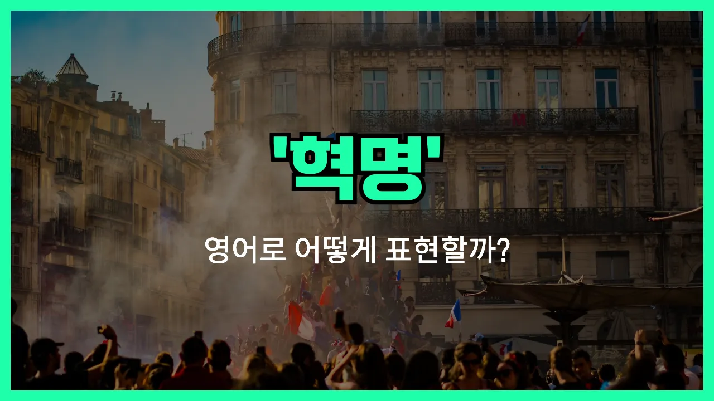

## 🌟 영어 표현 - revolution

안녕하세요 👋 오늘은 '**혁명**'이라는 뜻을 가진 영어 표현 '**revolution**'에 대해 알아보려고 해요.

'**revolution**'은 기존의 체제나 사회, 기술, 사상 등이 **급격하게 변화하거나 완전히 바뀌는 큰 변혁**을 의미해요. 단순한 변화(change)와는 달리, 아주 크고 근본적인 변화가 일어날 때 주로 사용돼요!

이 단어는 역사, 과학, 기술 등 다양한 분야에서 자주 등장해요. 예를 들어, 프랑스 혁명이나 산업 혁명처럼 사회 전체가 바뀌는 사건을 말할 때 'revolution'을 써요. 또, 기술이 크게 발전해서 우리의 삶이 완전히 달라질 때도 'a technological revolution'이라고 표현할 수 있어요.

## 📖 예문

1. "프랑스 혁명은 1789년에 시작됐어요."

   "The French Revolution began in 1789."

2. "인터넷은 정보 혁명을 가져왔어요."

   "The internet brought about an information revolution."

## 💬 연습해보기

<ul data-interactive-list>

  <li data-interactive-item>
    산업혁명이 사람들의 생활과 일하는 방식을 완전히 바꿨다니까요. 오늘 역사 수업에서 배웠어요.
    The industrial revolution changed the way people lived and worked. We <a href="/blog/in-english/245.learn/">learned</a> about it in <a href="/blog/in-english/532.history/">history</a> class today.
  </li>

  <li data-interactive-item>
    요즘 AI 때문에 기술 혁명이 한창이에요. 변화 속도가 진짜 어마어마하더라고요.
    There's a tech revolution happening <a href="/blog/in-english/525.right-now/">right now</a> with AI. It's kind of wild how fast things are moving.
  </li>

  <li data-interactive-item>
    어떤 사람들은 SNS가 소통 방식을 완전 혁명적으로 바꾸고 있다고 하더라고요.
    Some people say social media is causing a revolution in the way we communicate.
  </li>

  <li data-interactive-item>
    친환경 에너지 혁명이 점점 더 힘을 얻고 있어요. 점점 더 많은 사람들이 태양광 에너지로 바꾸고 있거든요.
    The green energy revolution is gaining momentum. More and more people are switching to solar power.
  </li>

  <li data-interactive-item>
    내 친구는 역사에 완전 빠져 있어요. 미국 혁명 얘기를 항상 하더라고요.
    My friend is super into history. He talks about the American Revolution all the time.
  </li>

  <li data-interactive-item>
    지속 가능한 브랜드들이 쏟아지면서 패션 업계에 혁명이 일어나고 있어요.
    There's a revolution in the fashion industry with all these new sustainable brands popping up.
  </li>

  <li data-interactive-item>
    스트리밍 서비스가 TV 시청 방식을 완전히 뒤바꿨어요. 케이블은 거의 안 쓰게 됐어요.
    Streaming services <a href="/blog/vocab-1/004.lead-to/">led to</a> a revolution in how we watch TV. I <a href="/blog/in-english/078.barely/">barely</a> even use cable anymore.
  </li>

  <li data-interactive-item>
    그 식당 셰프가 새 스타일 요리법으로 작은 혁명을 일으켰어요.
    The chef at that restaurant started a little revolution with his new style of <a href="/blog/in-english/461.cook/">cooking</a>.
  </li>

  <li data-interactive-item>
    나는 학교 수학 교육 방식에 혁명이 필요하다고 느껴요. 너무 구식인 것 같아요.
    I feel like there needs to be a revolution in the way schools teach math. It's so outdated.
  </li>

  <li data-interactive-item>
    그 책이 나한테 완전 개인적인 혁명을 일으켰어요. 지금은 모든 걸 다르게 보게 됐어요.
    That <a href="/blog/in-english/447.book/">book</a> totally sparked a personal revolution for me. I see things so differently now.
  </li>

</ul>

## 🤝 함께 알아두면 좋은 표현들

### uprising

'uprising'은 "봉기" 또는 "반란"이라는 뜻으로, 기존의 권력이나 체제에 맞서 사람들이 집단적으로 저항하는 상황을 말해요. 'revolution'과 비슷하게 큰 변화를 추구하지만, 규모나 조직력 면에서 조금 더 작거나 자발적인 느낌이 있어요.

- "The uprising in the city lasted for several days before the [government](/blog/in-english/608.government/) regained control."
- "도시에서 일어난 봉기는 정부가 다시 통제권을 잡기 전까지 며칠 동안 계속됐어요."

### status quo

'status quo'는 "현상 유지"라는 뜻이에요. 즉, 현재의 상태나 체제를 그대로 유지하려는 태도나 상황을 말해요. 'revolution'이 변화를 추구한다면, 'status quo'는 변화를 거부하고 지금의 모습을 지키려는 반대 의미예요.

- "Some people [prefer](/blog/in-english/191.prefer/) to maintain the status quo rather than risk the uncertainty of a revolution."
- "어떤 사람들은 혁명이라는 불확실함을 감수하기보다는 현상 유지를 선호해요."

### radical change

'radical change'는 "근본적인 변화" 또는 "대대적인 변화"라는 뜻이에요. 'revolution'처럼 기존의 체제나 방식을 완전히 바꾸는 큰 변화를 의미하지만, 꼭 정치적인 맥락이 아니어도 쓸 수 있어요.

- "The introduction of the internet brought about a radical change in how people communicate."
- "인터넷의 도입은 사람들이 소통하는 방식에 대대적인 변화를 가져왔어요."

---

오늘은 '**혁명**', '**대변혁**', '**혁신**'이라는 뜻을 가진 영어 표현 '**revolution**'에 대해 알아봤어요. 일상에서 큰 변화나 혁신을 이야기할 때 이 단어를 떠올려 보세요 😊

오늘 배운 표현과 예문들을 꼭 최소 3번씩 소리 내서 읽어보세요. 다음에도 더 재미있고 유익한 영어 표현으로 찾아올게요! 감사합니다!
