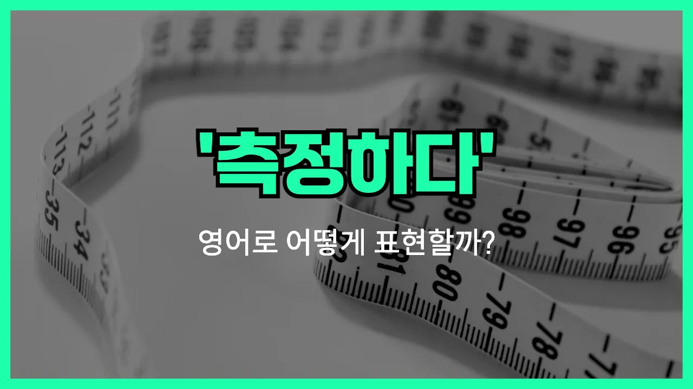

## 🌟 영어 표현 - measure (측정하다)

안녕하세요 👋 오늘은 영어로 '측정하다'라는 뜻을 가진 표현 '**measure**'에 대해 알아보려고 해요.

'**measure**'는 어떤 것의 크기, 길이, 양, 온도 등 **정확한 수치나 상태를 재는 것**을 의미해요. 우리가 일상에서 무언가의 길이를 자로 재거나, 체온을 온도계로 잴 때 모두 'measure'라는 동사를 사용할 수 있어요!

뿐만 아니라, 'measure'는 **평가하다**라는 의미로도 쓰여요. 예를 들어, 성과나 효과를 수치로 나타내거나 비교할 때도 이 단어를 사용할 수 있어요.

## 📖 예문

1. "온도를 측정하고 있어요."

   "I am measuring the temperature."

2. "방의 크기를 측정해 주세요."

   "Please measure the size of the room."

3. "이 기계는 혈압을 측정해요."

   "This machine measures blood pressure."

4. "성과를 어떻게 측정할 수 있나요?"

   "How can we measure the results?"

## 💬 연습해보기

<ul data-interactive-list>

  <li data-interactive-item>
    여기 선반이 들어갈지 재보는 거 좀 도와줄 수 있을까? 공간이 좀 작을 수도 있을 것 같아서요.
    Can you help me measure this shelf to see if it'll fit here? I think the space might be too small.
  </li>

  <li data-interactive-item>
    베이킹 시작하기 전에 온도를 꼭 재야 해요. 레시피가 꽤 까다롭거든요.
    I need to measure the temperature before I start baking. The recipe is pretty specific.
  </li>

  <li data-interactive-item>
    파스타에 물이 얼마나 필요한지 재보자. 나 엄청 많이 넣어서 늘 걱정돼요.
    Let's measure how much water we need for the pasta. I always end up adding too much.
  </li>

  <li data-interactive-item>
    어제 병원에서 키 잰다고 했는데, 다행히 키가 줄지 않았대요!
    They measured my height at the doctor's office yesterday. Apparently, I haven't shrunk!
  </li>

  <li data-interactive-item>
    선생님이 책상 사이 거리를 재보라고 하셨어요. 교실을 재배치 중이라서요.
    Our teacher asked us to measure the distance between the desks. We're rearranging the classroom.
  </li>

  <li data-interactive-item>
    쿠키 만들려고 설탕 한 컵 재줄 수 있어요?
    Can you measure out a cup of sugar for me? I'm making cookies.
  </li>

  <li data-interactive-item>
    커튼 길이를 재는 걸 깜빡하고 주문해버렸는데, 창문에 잘 맞았으면 좋겠어요.
    I forgot to measure the curtain length before ordering. I hope it still fits my window.
  </li>

  <li data-interactive-item>
    벽 두 개에 페인트가 충분한지 페인트 양을 재보더라고요.
    He measured out the paint to make sure there was enough for both walls.
  </li>

  <li data-interactive-item>
    케이크가 타지 않게 타이밍을 재봤어요.
    We measured the timing to make sure the cake wouldn't burn.
  </li>

  <li data-interactive-item>
    소파 사기 전에 거실 크기 재봤는데, 겨우 맞더라고요!
    Before buying the couch, we measured the living room to see if it would fit. It was a close call!
  </li>

</ul>

## 🤝 함께 알아두면 좋은 표현들

### gauge

'gauge'는 '측정하다' 또는 '판단하다'라는 뜻으로, 어떤 것의 크기, 양, 수준 등을 재거나 평가할 때 사용해요. 'measure'와 비슷하게 수치나 상태를 알아볼 때 쓰는 표현이에요.

- "It's hard to gauge how much progress we've made so far."
- "지금까지 우리가 얼마나 진전했는지 측정하기가 어려워요."

### estimate

'estimate'는 '추정하다' 또는 '어림잡다'라는 뜻이에요. 정확하게 측정하는 것보다는 대략적으로 수치나 양을 짐작할 때 사용해요. 완벽한 수치가 없을 때 자주 쓰는 표현이에요.

- "Can you estimate how long the repairs will take?"
- "수리가 얼마나 걸릴지 대략적으로 말해줄 수 있어요?"

### ignore

'ignore'는 '무시하다'라는 뜻으로, 어떤 것을 일부러 신경 쓰지 않거나 고려하지 않을 때 사용해요. 'measure'와는 반대되는 의미로, 측정하거나 평가하지 않고 그냥 넘기는 상황에서 써요.

- "He chose to ignore the warning signs and continued working."
- "그는 경고 신호를 무시하고 계속 일했어요."

---

오늘은 '측정하다'라는 뜻을 가진 영어 표현 '**measure**'에 대해 알아봤어요. 일상에서 무언가를 잴 때나 평가할 때 이 단어를 떠올리면 좋겠어요 😊

오늘 배운 표현과 예문들을 꼭 소리 내서 여러 번 읽어보세요. 다음에도 더 유익한 영어 표현으로 찾아올게요! 감사합니다!

