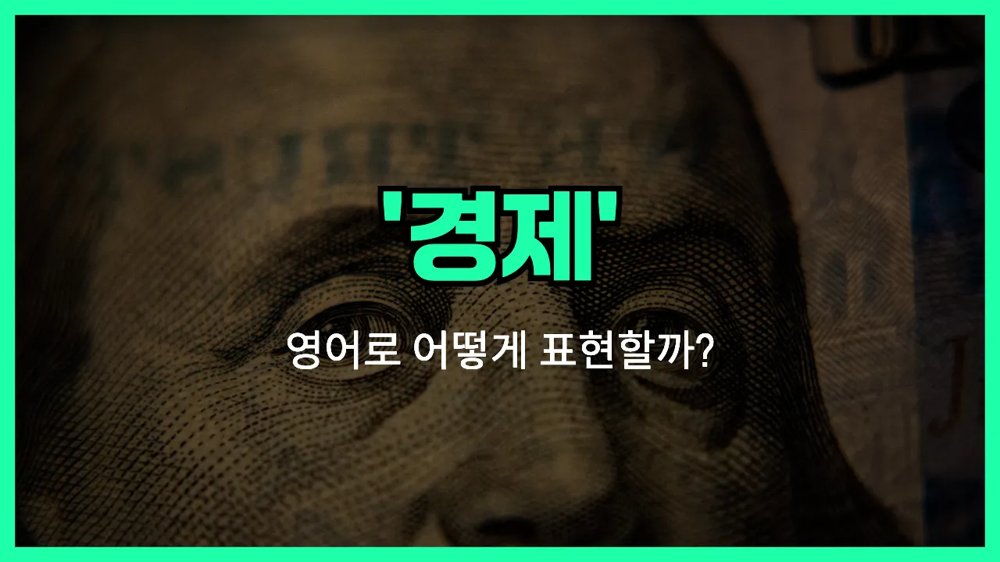

## 🌟 영어 표현 - economy

안녕하세요 👋 오늘은 우리가 자주 듣는 단어, 바로 '**경제**'의 영어 표현 '**economy**'에 대해 알아보려고 해요.

'**economy**'는 한 나라나 지역의 **돈의 흐름, 생산, 소비, 그리고 자원의 분배**와 관련된 모든 활동을 의미해요. 쉽게 말해, 사람들이 어떻게 돈을 벌고 쓰는지, 기업과 정부가 어떻게 자원을 관리하는지 등을 모두 포함하는 개념이에요.

이 단어는 뉴스, 신문, 학교 수업 등 다양한 곳에서 자주 등장해요. 예를 들어, "한국 경제가 성장하고 있어요."라고 말하고 싶을 때 "The Korean economy is growing."이라고 표현할 수 있어요.

또한, 'economy'는 '경제'뿐만 아니라 '절약'이라는 뜻으로도 쓰일 수 있어요. 예를 들어, "We need to [practice](/blog/in-english/247.practice/) economy."라고 하면 "우리는 절약을 실천해야 해요."라는 의미가 돼요.

## 📖 예문

1. "세계 경제가 빠르게 변화하고 있어요."

   "The global economy is changing rapidly."

2. "경제를 공부하는 것은 정말 흥미로워요."

   "Studying the economy is really interesting."

3. "정부는 경제를 안정시키기 위해 노력하고 있어요."

   "The [government](/blog/in-english/608.government/) is [trying to](/blog/in-english/117.try-to/) stabilize the economy."

## 💬 연습해보기

<ul data-interactive-list>

  <li data-interactive-item>
    요즘 경제 진짜 예측하기 어렵죠. 다들 앞으로 어떻게 될지 좀 걱정하고 있어요.
    The economy is really unpredictable <a href="/blog/in-english/525.right-now/">right now</a>. Everyone's a little <a href="/blog/in-english/115.nervous/">nervous</a> about what might happen next.
  </li>

  <li data-interactive-item>
    오늘 경제 뉴스 봤어요? 상황이 그렇게 좋진 않은 것 같아요.
    Did you see the <a href="/blog/in-english/536.news/">news</a> about the economy today? Things aren't looking too good.
  </li>

  <li data-interactive-item>
    대학 다닐 때 경제가 어떻게 돌아가는지 배우려고 수업 들었어요.
    I took a class in college just to <a href="/blog/in-english/245.learn/">learn</a> how the economy works.
  </li>

  <li data-interactive-item>
    기름값 오르면 경제가 안 좋다는 신호인 거 알죠.
    Whenever gas <a href="/blog/in-english/640.price/">prices</a> go up, you know the economy is struggling.
  </li>

  <li data-interactive-item>
    우리 아빠는 옛날에 경제가 훨씬 좋았다고 항상 말씀하시곤 해요.
    My dad always talks about how the economy was better when he was young.
  </li>

  <li data-interactive-item>
    경기 침체 뒤에 경제가 조금 회복되는 것 같아요.
    It seems like the economy is starting to bounce back after the downturn.
  </li>

  <li data-interactive-item>
    많은 사람이 경제가 모두에게 잘 작동하지 않는다고 걱정하고 있어요.
    A lot of people are worried that the economy isn't working for everyone.
  </li>

  <li data-interactive-item>
    코로나 때문에 경제가 안 좋아져서 그녀가 실직했어요.
    She <a href="/blog/in-english/457.lose/">lost</a> her job because the economy took a hit during the pandemic.
  </li>

  <li data-interactive-item>
    아침 토크쇼 보면 항상 경제 상황 얘기하더라고요.
    They're always discussing the state of the economy on morning talk shows.
  </li>

  <li data-interactive-item>
    경제가 나아질 때까지 좀 더 알뜰히 살림해야 할지도 몰라요.
    We might have to budget more carefully until the economy <a href="/blog/in-english/394.improve/">improves</a>.
  </li>

</ul>

## 🤝 함께 알아두면 좋은 표현들

### market

'[market](/blog/in-english/641.market/)'은 "시장"이라는 뜻으로, 경제 활동이 실제로 이루어지는 공간이나 시스템을 의미해요. 경제와 밀접하게 연결되어 있으며, 상품이나 서비스가 사고팔리는 곳을 말할 때 자주 사용해요.

- "The stock market reacted quickly to the news of the new [policy](/blog/in-english/623.policy/)."
- "주식시장은 새로운 정책 소식에 빠르게 반응했어요."

### recession

'recession'은 "경기 침체" 또는 "불황"을 의미해요. 경제가 전반적으로 침체되어 성장률이 떨어지고, 실업률이 높아지는 등 경제 상황이 나빠질 때 쓰는 표현이에요. 'economy'의 부정적인 상황을 나타내는 말이에요.

- "During the recession, many small businesses struggled to survive."
- "경기 침체 동안 많은 소규모 사업체들이 살아남기 위해 고군분투했어요."

### prosperity

'prosperity'는 "번영" 또는 "번창"을 의미해요. 경제가 매우 좋고, 사람들이 풍요롭게 잘 사는 상태를 나타낼 때 쓰는 표현이에요. 'economy'의 긍정적인 상황을 강조할 때 자주 사용해요.

- "The country enjoyed a period of prosperity after the new reforms were [introduced](/blog/in-english/262.introduce/)."
- "새로운 개혁이 도입된 후 그 나라는 번영의 시기를 누렸어요."

---

오늘은 '**경제**'라는 뜻을 가진 영어 표현 '**economy**'에 대해 알아봤어요. 앞으로 뉴스나 기사에서 이 단어를 보면 오늘 배운 내용을 떠올려 보세요 😊

오늘 배운 표현과 예문들을 꼭 최소 3번씩 소리 내서 읽어보세요. 다음에도 더 재미있고 유익한 영어 표현으로 찾아올게요! 감사합니다!
