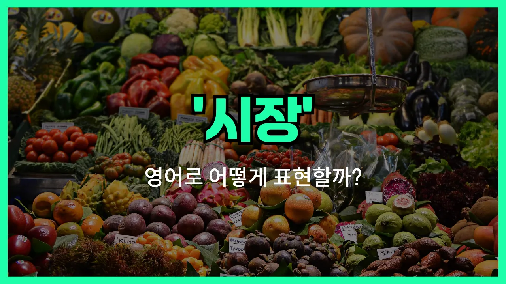

## 🌟 영어 표현 - market

안녕하세요 👋 오늘은 우리가 일상에서 자주 쓰는 단어, '**시장**'의 영어 표현 '**market**'에 대해 이야기해보려고 해요.

'**market**'은 물건을 사고파는 장소, 즉 **시장**이나 **장터**를 의미해요. 우리가 흔히 가는 재래시장, 농산물 시장, 또는 대형 마트까지 모두 'market'이라는 단어로 표현할 수 있어요.

또한, 'market'은 단순히 물리적인 장소뿐만 아니라, **경제 시장**이나 **금융 시장**처럼 상품이나 서비스가 거래되는 추상적인 공간을 의미할 때도 사용돼요. 예를 들어, 'stock market'은 '주식 시장', 'job market'은 '취업 시장'이라는 뜻이에요.

## 📖 예문

1. "나는 토요일마다 시장에 가요."

   "I go to the market every Saturday."

2. "이 마을에는 큰 농산물 시장이 있어요."

   "There is a big farmers' market in this town."

3. "요즘 주식 시장이 불안정해요."

   "The stock market is unstable [these days](/blog/in-english/417.these-days/)."

## 💬 연습해보기

<ul data-interactive-list>

  <li data-interactive-item>
    새 아이폰이 드디어 출시됐어요. 다들 완전 난리예요.
    The new iPhone is <a href="/blog/in-english/182.finally/">finally</a> on the market. Everyone's talking about it.
  </li>

  <li data-interactive-item>
    내 생각엔 이 동네 수제 쿠키 시장이 잘 될 것 같아요.
    I think there's a real market for homemade cookies in this town.
  </li>

  <li data-interactive-item>
    몇 달 개발 끝에 우리 앱이 이제 시장에 나갈 준비가 됐어요.
    After months of development, our app is ready to market.
  </li>

  <li data-interactive-item>
    아무도 진짜 필요로 안 하는 제품을 팔기란 쉽지 않아요.
    <a href="/blog/in-english/111.hard-to/">It's hard to</a> market a product that nobody really needs.
  </li>

  <li data-interactive-item>
    우리는 올해 유럽 시장 진출을 노리고 있어요.
    We're <a href="/blog/in-english/117.try-to/">trying to</a> break into the European market this year.
  </li>

  <li data-interactive-item>
    걔는 마케팅 배경이 있어서 물건 잘 파는 법을 알아요.
    She's got a background in marketing, so she knows how to sell things.
  </li>

  <li data-interactive-item>
    요즘 주택 시장 완전 치열해요. 가격이 엄청 올랐거든요.
    The housing market is so competitive <a href="/blog/in-english/525.right-now/">right now</a>. <a href="/blog/in-english/640.price/">Prices</a> are through the roof.
  </li>

  <li data-interactive-item>
    나는 주식 시장엔 관심 없는데, 내 동생은 그걸 엄청 잘 따라가요.
    I'm not into stock markets, but my brother follows them closely.
  </li>

  <li data-interactive-item>
    우리 회사는 이번 분기에 디지털 마케팅에 집중하고 있어요.
    Our company is <a href="/blog/in-english/186.focus-on/">focusing on</a> digital marketing this quarter.
  </li>

  <li data-interactive-item>
    제품 출시 전에 시장 조사를 하느라 엄청난 돈을 썼어요.
    They <a href="/blog/in-english/258.spend/">spent</a> a ton of money on market research before launching their product.
  </li>

</ul>

## 🤝 함께 알아두면 좋은 표현들

### bazaar

'bazaar'는 '시장'과 비슷한 의미로, 특히 야외에서 열리는 전통적인 장터나 플리마켓을 가리킬 때 사용해요. 다양한 물건을 사고팔 수 있는 장소라는 점에서 'market'과 유사하지만, 좀 더 이국적이거나 특별한 분위기를 강조할 때 자주 써요.

- "We visited a local bazaar and found some unique handmade crafts."
- "우리는 동네 바자회에 가서 독특한 수공예품을 발견했어요."

### supermarket

'supermarket'은 '대형 슈퍼마켓'을 의미하며, 'market'보다 더 크고 다양한 상품을 한 곳에서 살 수 있는 현대적인 상점을 말해요. 일상적으로 식료품이나 생필품을 살 때 주로 사용하는 표현이에요.

- "I stopped by the supermarket to [pick up](/blog/in-english/178.pick-up/) some groceries on my way home."
- "집에 가는 길에 슈퍼마켓에 들러서 장을 좀 봤어요."

### private sale

'private sale'은 '시장'과는 반대되는 개념으로, 공개적으로 여러 사람이 모여 거래하는 시장과 달리, 소수의 사람들끼리 비공개로 물건을 사고파는 상황을 말해요. 주로 집이나 자동차 같은 큰 물건을 개인적으로 거래할 때 사용해요.

- "She bought her car through a private sale [instead of](/blog/in-english/169.instead-of/) going to a dealership or market."
- "그녀는 딜러샵이나 시장에 가지 않고 개인 거래로 차를 샀어요."

---

오늘은 '**시장**', '**장터**'라는 뜻을 가진 영어 표현 '**market**'에 대해 알아봤어요. 일상 대화뿐만 아니라 경제 관련 뉴스나 기사에서도 자주 등장하는 단어이니 꼭 기억해두면 좋겠어요 😊

오늘 배운 표현과 예문들을 소리 내서 여러 번 읽어보세요. 다음에도 더 유익한 영어 표현으로 찾아올게요! 감사합니다!

