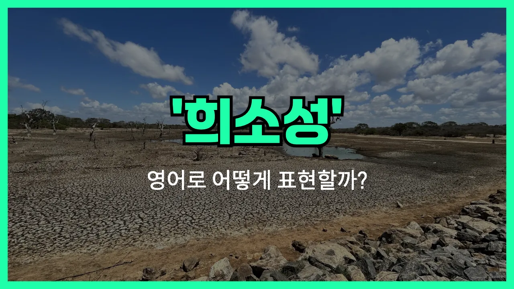

## 🌟 영어 표현 - scarcity

안녕하세요 👋 오늘은 일상에서 자주 쓰이는 단어인 '**부족함**', '**결핍**', '**희소**'와 관련된 영어 표현 '**scarcity**'에 대해 알아보려고 해요.

'**scarcity**'는 어떤 것이 충분하지 않거나, 매우 드물어서 쉽게 얻을 수 없는 상태를 의미해요. 즉, **자원이나 물건, 시간 등이 부족해서 원하는 만큼 쓸 수 없는 상황**을 나타낼 때 자주 사용돼요!

이 단어는 경제, 환경, 일상생활 등 다양한 분야에서 자연스럽게 쓰여요. 예를 들어, 물이 부족한 지역에 대해 "There is a scarcity of water in the region."이라고 말할 수 있어요.

또는, "The scarcity of jobs is a big problem [these days](/blog/in-english/417.these-days/)."라고 하면 "요즘 일자리 부족이 큰 문제야."라는 의미가 돼요.

'**scarcity**'는 주로 명사로 사용되며, '희소성', '부족'이라는 뜻으로 쓰이니 상황에 맞게 활용해 보세요!

## 📖 예문

1. "식량 부족이 심각한 문제예요."

   "There is a [serious](/blog/in-english/146.serious/) scarcity of food."

2. "깨끗한 물이 부족해요."

   "There is a scarcity of [clean](/blog/in-english/523.clean/) water."

## 💬 연습해보기

<ul data-interactive-list>

  <li data-interactive-item>
    팬데믹 때는 화장지가 진짜 귀했어요. 다들 가게 앞에서 완전 난리였거든요.
    There was a real scarcity of toilet paper during the pandemic. Everyone was freaking out at the stores.
  </li>

  <li data-interactive-item>
    겨울에는 신선한 과일이 잘 안 나와서 가격이 확 올라가요.
    Because of the scarcity of fresh fruit in winter, <a href="/blog/in-english/640.price/">prices</a> go way up.
  </li>

  <li data-interactive-item>
    도시에서 저렴한 주택이 부족한 건 요즘 젊은 사람들한테 큰 골치예요.
    The scarcity of affordable housing in the city is a huge problem for young people today.
  </li>

  <li data-interactive-item>
    이 동네엔 괜찮은 커피숍이 별로 없더라고요. 좀 아쉬워요.
    I've <a href="/blog/in-english/061.notice/">noticed</a> a scarcity of good coffee shops in this neighborhood. It's kind of <a href="/blog/in-english/302.disappoint/">disappointing</a>.
  </li>

  <li data-interactive-item>
    도심에 주차 공간이 너무 부족해서 짜증나요. 자리를 찾으려고 한참 빙빙 돌아야 해요.
    The scarcity of parking spaces downtown is so <a href="/blog/in-english/364.annoying/">annoying</a>. I have to circle for ages <a href="/blog/in-english/173.look-for/">looking for</a> a spot.
  </li>

  <li data-interactive-item>
    대학 시절 시험 기간 직전에는 항상 시간이 부족했었어요.
    Back in college, there was always a scarcity of time right before finals week.
  </li>

  <li data-interactive-item>
    어떤 사람들은 희소성이 있으면 실제로 잘 없어도 더 가치 있어 보인다고 믿어요.
    Some people believe that scarcity makes things seem more valuable, even if they're not actually rare.
  </li>

  <li data-interactive-item>
    가뭄 때문에 이 지역에 물이 심각하게 모자라요.
    With the drought, there's been a serious scarcity of water in the area.
  </li>

  <li data-interactive-item>
    콘서트 티켓은 희소성 때문에 거의 금방 매진됐어요.
    Tickets for the concert sold out almost instantly because of their scarcity.
  </li>

  <li data-interactive-item>
    우리 고향에 일자리 기회가 부족해서 많은 사람들이 결국 떠나게 돼요.
    The scarcity of job opportunities in my hometown is why so many people <a href="/blog/vocab-1/039.end-up/">end up</a> moving away.
  </li>

</ul>

## 🤝 함께 알아두면 좋은 표현들

### shortage

'shortage'는 'scarcity'와 비슷하게 '부족' 또는 '결핍'을 의미해요. 주로 어떤 자원이나 물건이 수요에 비해 충분하지 않을 때 사용해요. 일상 대화나 뉴스에서 자주 들을 수 있는 표현이에요.

- "There is a shortage of affordable housing in the city."
- "도시에는 저렴한 주택이 부족해요."

### abundance

'abundance'는 'scarcity'의 반대말로, '풍부함'이나 '충분함'을 뜻해요. 어떤 것이 넉넉하게 많을 때 쓰는 긍정적인 표현이에요.

- "During the harvest season, there is an abundance of fresh fruits and vegetables at the [market](/blog/in-english/641.market/)."
- "수확철에는 시장에 신선한 과일과 채소가 풍부해요."

### in short supply

'in short [supply](/blog/in-english/638.supply/)'는 'scarcity'와 비슷하게 '수급이 부족하다', '구하기 어렵다'는 뜻이에요. 어떤 물건이나 자원이 충분하지 않아서 찾기 힘들 때 자주 쓰는 표현이에요.

- "After the storm, clean drinking water was [in short supply](/blog/in-english/107.in-short-supply/)."
- "폭풍이 지나간 후에는 깨끗한 식수가 부족했어요."

---

오늘은 '**부족함**', '**결핍**', '**희소**'라는 뜻을 가진 영어 표현 '**scarcity**'에 대해 알아봤어요. 앞으로 자원이 부족하거나 드문 상황을 설명할 때 이 단어를 떠올려 보세요 😊

오늘 배운 표현과 예문들을 꼭 최소 3번씩 소리 내서 읽어보세요. 다음에도 더 재미있고 유익한 영어 표현으로 찾아올게요! 감사합니다!
