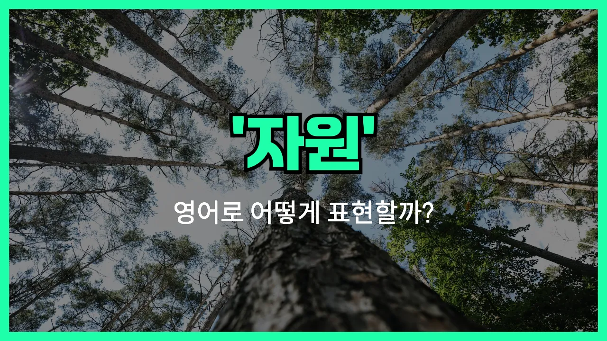

## 🌟 영어 표현 - resource

안녕하세요 👋 오늘은 영어 단어 '**resource**'에 대해 이야기해보려고 해요. 혹시 '**자원**', '**자산**', '**원천**'이라는 단어를 영어로 어떻게 표현하는지 궁금하셨나요? 바로 '**resource**'라는 단어가 그 뜻을 담고 있어요.

'**resource**'는 우리가 필요로 하는 것을 얻거나 사용할 수 있는 **원천**이나 **수단**을 의미해요. 예를 들어, 자연에서 얻을 수 있는 물, 석유, 나무 같은 **자연 자원**도 resource라고 하고, 시간, 돈, 인력처럼 어떤 일을 할 때 필요한 **자산**이나 **수단**도 resource라고 부를 수 있어요.

이 단어는 일상생활뿐만 아니라 회사, 학교, 환경 등 다양한 분야에서 정말 자주 쓰여요. 예를 들어, "우리 팀에는 충분한 자원이 필요해요."라고 말하고 싶을 때 "We need enough resources for our team."이라고 표현할 수 있어요.

## 📖 예문

1. "이 도서관은 학생들에게 많은 자원을 제공해요."

   "This library provides many resources for students."

2. "회사가 새로운 프로젝트를 위해 더 많은 자원이 필요해요."

   "The company needs more resources for the new project."

## 💬 연습해보기

<ul data-interactive-list>

  <li data-interactive-item>
    이 사이트는 기타 배우기 너무 좋은 자료들이 많아서 열심히 이용하고 있어요.
    This website is such a great resource for <a href="/blog/in-english/245.learn/">learning</a> guitar. I use it all the time.
  </li>

  <li data-interactive-item>
    도움이 필요하면 도서관 한번 가보는 것도 괜찮은 자료가 될 거예요.
    If you ever need help, the library is a good resource to <a href="/blog/in-english/104check-out/">check out</a>.
  </li>

  <li data-interactive-item>
    교수님께서 우리 연구 과제에 도움이 될 자료 목록을 주셨어요.
    My professor gave us a list of resources to help with our research paper.
  </li>

  <li data-interactive-item>
    경력 조언이 필요하면 제시카한테 물어보는 게 좋아요. 걔가 진짜 믿을 만한 조언자예요.
    You should ask Jessica about it. She's a good resource for career <a href="/blog/in-english/379.advice/">advice</a>.
  </li>

  <li data-interactive-item>
    캠핑 가서 자원이랑 물자가 진짜 금방 다 떨어졌어요.
    We <a href="/blog/in-english/340.run-out-of/">ran out of</a> resources pretty fast during the camping trip.
  </li>

  <li data-interactive-item>
    온라인에서 스페인어 말하기 연습할 만한 곳 있나요?
    Is there a resource where I can <a href="/blog/in-english/247.practice/">practice</a> speaking Spanish online?
  </li>

  <li data-interactive-item>
    인사부서가 우리 회사 모든 채용 서류를 맡고 있어요.
    The human resources department handles all our <a href="/blog/in-english/331.hire/">hiring</a> paperwork.
  </li>

  <li data-interactive-item>
    우리 팀이 이 프로젝트를 제때 끝내기에 자원이 부족해서 너무 스트레스 받아요.
    Our team doesn't have enough resources to <a href="/blog/in-english/295.finish/">finish</a> the project <a href="/blog/vocab-1/043.on-time/">on time</a>. <a href="/blog/in-english/116.that-is-why/">That's why</a> we're so stressed.
  </li>

  <li data-interactive-item>
    학교에 좀 더 좋은 자원이 있었으면 좋겠어요. 컴퓨터가 너무 낡아서 힘들어요.
    <a href="/blog/in-english/118.i-wish/">I wish</a> we had better resources at our school—the computers are so old.
  </li>

  <li data-interactive-item>
    막히면 항상 유튜브가 제일 믿고 보는 해결책이에요.
    Whenever I'm <a href="/blog/in-english/389.stuck/">stuck</a>, YouTube is my go-to resource for figuring things out.
  </li>

</ul>

## 🤝 함께 알아두면 좋은 표현들

### asset

'asset'은 "자산" 또는 "귀중한 것"이라는 뜻이에요. 'resource'와 비슷하게 어떤 목적을 달성하는 데 도움이 되는 유용한 것, 사람, 능력 등을 가리킬 때 사용해요.

- "Her creativity is a valuable asset to the team."
- "그녀의 창의력은 팀에 정말 소중한 자산이에요."

### liability

'liability'는 "부채" 또는 "짐이 되는 것"이라는 뜻으로, 'resource'의 반대 개념이에요. 도움이 되기보다는 부담이 되거나 방해가 되는 것을 말할 때 써요.

- "His constant lateness has become a liability for the project."
- "그가 계속 지각하는 게 프로젝트에 짐이 되고 있어요."

### means

'means'는 "수단" 또는 "방법"이라는 뜻으로, 어떤 목표를 이루기 위해 사용할 수 있는 자원이나 방법을 말할 때 써요. 'resource'와 비슷하게 쓰이지만, 더 넓은 의미로 사용돼요.

- "Education is a means to achieve your dreams."
- "교육은 꿈을 이루기 위한 하나의 수단이에요."

---

오늘은 '**자원**', '**자산**', '**원천**'이라는 뜻을 가진 영어 표현 '**resource**'에 대해 알아봤어요. 앞으로 영어로 무언가의 원천이나 수단을 말할 때 이 단어를 떠올려보면 좋겠어요 😊

오늘 배운 표현과 예문들을 꼭 최소 3번씩 소리 내서 읽어보세요. 다음에도 더 재미있고 유익한 영어 표현으로 찾아올게요! 감사합니다!
