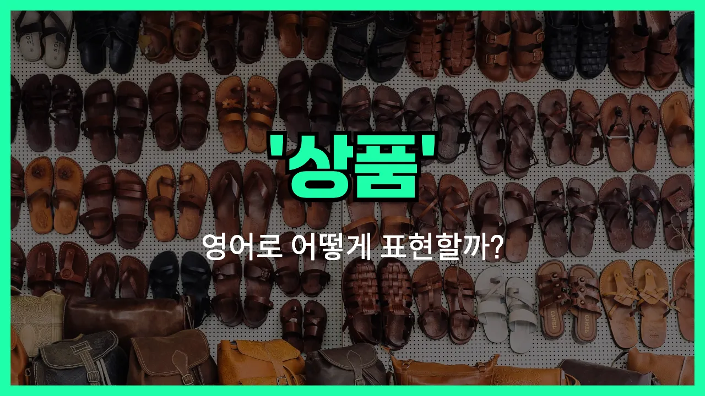

## 🌟 영어 표현 - goods (상품)

안녕하세요 👋 오늘은 영어로 '**상품**'을 어떻게 표현하는지 알아보려고 해요. 바로 '**goods**'라는 단어가 있어요. 이 단어는 우리가 상점이나 마트, 온라인 쇼핑몰 등에서 볼 수 있는 **판매되는 물건**이나 **제품**을 의미해요.

'goods'는 주로 **복수형**으로 사용되며, 한 가지 물건이 아니라 여러 가지 상품, 즉 **여러 종류의 물품**을 가리킬 때 자주 써요. 예를 들어, "이 가게는 다양한 상품을 판매해요."라고 말하고 싶을 때 "This store sells a variety of goods."라고 할 수 있어요.

또한, 'goods'는 일상 대화뿐만 아니라 비즈니스, 무역, 경제 등 공식적인 상황에서도 널리 쓰이는 단어예요. 예를 들어, 수출입, 거래, 배송 등과 관련된 문장에서도 자주 등장해요.

## 📖 예문

1. "이 상점은 고품질 상품을 판매해요."

   "This shop sells high-quality goods."

2. "모든 상품이 무료로 배송돼요."

   "All goods are shipped for free."

## 💬 연습해보기

<ul data-interactive-list>

  <li data-interactive-item>
    방금 온라인으로 주문한 물건이 도착했어요. 박스 열어보는 게 너무 기대돼요.
    They just delivered the goods I ordered online. I can't wait to open the box.
  </li>

  <li data-interactive-item>
    이 회사 물건들은 진짜 퀄리티가 최고로 유명하거든요.
    This company's goods are known for being super high quality.
  </li>

  <li data-interactive-item>
    물건 배송할 때 꼼꼼히 포장해 주세요.
    Please make sure the goods are packed carefully before shipping them out.
  </li>

  <li data-interactive-item>
    거의 다 현지에서 만든 거라서 인기가 많아요.
    Most of their goods are made locally. That's why they're so popular.
  </li>

  <li data-interactive-item>
    물건 가격이 그만한 가치가 있다고 생각해? 어떤 사람들은 너무 비싸다고 하더라고요.
    Do you think their goods are worth the price? Some people say they're overpriced.
  </li>

  <li data-interactive-item>
    이번 주말에 쇼핑몰에서 야외용품 대규모 세일을 해요.
    There's a huge sale on outdoor goods at the mall this weekend.
  </li>

  <li data-interactive-item>
    물건 환불하려고 했는데, 가게에서 모든 판매는 최종이라고 하더라고요.
    I tried to return the goods, but the store said all sales were final.
  </li>

  <li data-interactive-item>
    새 브랜드 물건 살 때는 보통 후기를 먼저 확인해요.
    I usually check reviews before buying goods from a new brand.
  </li>

  <li data-interactive-item>
    가게 문은 닫혔지만, 창문 너머로 물건들은 다 볼 수 있었어요.
    The store was closed, but you could still see all the goods through the window.
  </li>

  <li data-interactive-item>
    그 친구는 작은 사업 위해 해외에서 물건을 많이 수입해요.
    He imports a lot of goods from overseas for his small business.
  </li>

</ul>

## 🤝 함께 알아두면 좋은 표현들

### merchandise

'merchandise'는 '상품'이나 '물품'을 의미하는 단어로, 상점이나 기업에서 판매를 목적으로 보유하고 있는 모든 제품을 가리켜요. 'goods'와 거의 같은 의미로 쓰이지만, 좀 더 공식적이거나 비즈니스적인 상황에서 자주 사용돼요.

- "The store offers a wide range of merchandise, from clothing to electronics."
- "그 가게는 옷부터 전자제품까지 다양한 상품을 판매하고 있어요."

### commodities

'commodities'는 주로 원자재나 대량으로 거래되는 상품을 의미해요. 예를 들어, 석유, 곡물, 금 등과 같이 국제적으로 거래되는 물품을 말할 때 사용해요. 일상적인 'goods'보다 더 경제적이고 전문적인 느낌이 있어요.

- "Oil and wheat are two of the most traded commodities in the world."
- "석유와 밀은 세계에서 가장 많이 거래되는 상품 중 두 가지예요."

### services

'services'는 'goods'의 반대 개념으로, 물리적인 상품이 아니라 누군가가 제공하는 서비스, 즉 '용역'이나 '서비스업'을 의미해요. 예를 들어, 미용실, 택시, 컨설팅 등과 같이 형태가 없는 경제적 가치를 말할 때 사용해요.

- "Unlike goods, services cannot be stored or transported."
- "상품과는 달리, 서비스는 저장하거나 운반할 수 없어요."

---

오늘은 '상품', '물품', '제품'이라는 뜻을 가진 영어 표현 '**goods**'에 대해 알아봤어요. 쇼핑이나 비즈니스 상황에서 이 단어를 떠올리면 도움이 될 거예요 😊

오늘 배운 표현과 예문들을 꼭 최소 3번씩 소리 내서 읽어보세요. 다음에도 더 재미있고 유익한 영어 표현으로 찾아올게요! 감사합니다!

