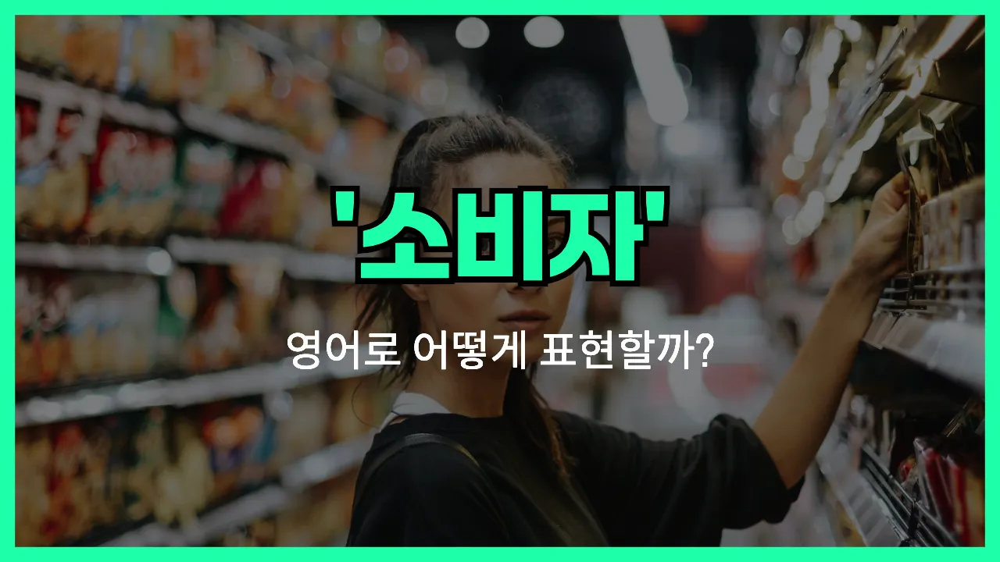

## 🌟 영어 표현 - consumer

안녕하세요 👋 오늘은 일상에서 자주 쓰이는 단어인 '**소비자**'의 영어 표현 '**consumer**'에 대해 알아보려고 해요.

'**consumer**'는 상품이나 서비스를 구매해서 사용하는 사람, 즉 **소비자**를 의미해요. 우리가 마트에서 물건을 사거나, 온라인에서 제품을 주문할 때 모두 'consumer'에 해당돼요.

이 단어는 경제, 마케팅, 일상 대화 등 다양한 상황에서 널리 사용돼요. 예를 들어, 새로운 제품이 출시될 때 "소비자 반응이 궁금하다"라고 할 수 있죠. 영어로는 "We are [curious](/blog/in-english/327.curious/) about consumer reactions."라고 표현할 수 있어요.

또한, 'consumer'는 '고객(customer)', '구매자(buyer)'와 비슷한 의미로 쓰이지만, 보통 **최종적으로 상품이나 서비스를 사용하는 사람**을 가리킬 때 가장 많이 사용돼요.

## 📖 예문

1. "소비자들은 가격에 민감해요."

   "Consumers are sensitive to [prices](/blog/in-english/640.price/)."

2. "이 제품은 소비자 만족도가 높아요."

   "This product has high consumer satisfaction."

## 💬 연습해보기

<ul data-interactive-list>

  <li data-interactive-item>
    커피는 저는 항상 좀 까다롭게 고르는 편이에요. 딱 입맛에 맞아야 하거든요.
    I've always been a pretty picky consumer <a href="/blog/in-english/269.when-it-comes-to/">when it comes to</a> coffee. I need it to taste just right.
  </li>

  <li data-interactive-item>
    요즘엔 SNS 덕분에 보통 사람들도 훨씬 똑똑해졌어요. 다들 뭘 사기 전에 꼼꼼히 찾아보더라고요.
    <a href="/blog/in-english/417.these-days/">These days</a>, the average consumer is way more informed because of social media. Everyone does their research before buying anything.
  </li>

  <li data-interactive-item>
    저는 온라인으로 뭔가 살 때 항상 리뷰부터 확인하려고 해요.
    As a consumer, I always <a href="/blog/in-english/117.try-to/">try to</a> check <a href="/blog/in-english/251.review/">reviews</a> before I order stuff online.
  </li>

  <li data-interactive-item>
    요즘 식료품값 오르는 거 보고 소비자들이 많이 걱정하는 것 같아요.
    A lot of consumers are <a href="/blog/in-english/209.worry-about/">worried about</a> rising prices at the grocery store lately.
  </li>

  <li data-interactive-item>
    그 회사는 젊은 소비자층을 잡으려고 새 광고 캠페인을 내놓고 있어요.
    The company is trying to reach younger consumers with their new ad <a href="/blog/in-english/617.campaign/">campaign</a>.
  </li>

  <li data-interactive-item>
    전 제 최애 칩 브랜드에 완전 충성하는 소비자여서, 다른 브랜드로는 못 바꾸겠더라고요!
    I'm definitely a loyal consumer when it comes to my favorite brand of chips. Can't switch brands!
  </li>

  <li data-interactive-item>
    어떤 소비자들은 제품보다 친환경 포장에 더 신경 쓰기도 해요.
    Some consumers care more about eco-friendly packaging than the product itself.
  </li>

  <li data-interactive-item>
    저는 의식 있는 소비자라고 생각해요. 가능한 한 패스트 패션은 피하려고 해요.
    I feel like I'm a conscious consumer—I try to avoid fast fashion whenever I can.
  </li>

  <li data-interactive-item>
    소비자를 제대로 대접하지 않으면, 소비자들은 다른 데로 다 옮겨가 버릴 거예요.
    If you don't treat your consumers well, they're just going to find somewhere else to shop.
  </li>

  <li data-interactive-item>
    고객 서비스가 너무 별로여서 소비자로서 정말 답답해요.
    I'm frustrated as a consumer because customer service just hasn't been helpful at all.
  </li>

</ul>

## 🤝 함께 알아두면 좋은 표현들

### customer

'customer'는 '소비자'와 비슷하게 '상품이나 서비스를 구매하는 사람'을 의미해요. 하지만 'consumer'가 좀 더 넓은 의미로, 실제로 상품을 사용하는 사람까지 포함한다면, 'customer'는 주로 구매 행위 자체에 초점을 맞춰요.

- "The store always puts the customer first and tries to meet their needs."
- "그 가게는 항상 고객을 최우선으로 생각하고, 그들의 필요를 맞추려고 해요."

### producer

'[producer](/blog/in-english/646.producer/)'는 '생산자'라는 뜻으로, 'consumer(소비자)'의 반대말이에요. 즉, 상품이나 서비스를 만들어내는 사람이나 회사를 가리켜요. 경제 활동에서 생산자와 소비자는 서로 반대되는 역할을 해요.

- "The producer is responsible for [ensuring](/blog/in-english/356.ensure/) the [quality](/blog/in-english/304.quality/) of the products before they reach the [market](/blog/in-english/641.market/)."
- "생산자는 제품이 시장에 나오기 전에 품질을 보장하는 책임이 있어요."

### end user

'end user'는 '최종 사용자'라는 뜻으로, 제품이나 서비스를 실제로 사용하는 사람을 말해요. 'consumer'와 비슷하지만, 특히 IT나 소프트웨어 분야에서 많이 쓰여요.

- "The software was designed to be easy for the end user to understand and operate."
- "그 소프트웨어는 최종 사용자가 쉽게 이해하고 사용할 수 있도록 설계됐어요."

---

오늘은 '**소비자**'라는 뜻을 가진 영어 표현 '**consumer**'에 대해 알아봤어요. 앞으로 쇼핑이나 경제 관련 이야기를 할 때 이 단어를 떠올려보면 좋겠어요 😊

오늘 배운 표현과 예문들을 꼭 최소 3번씩 소리 내서 읽어보세요. 다음에도 더 재미있고 유익한 영어 표현으로 찾아올게요! 감사합니다!

