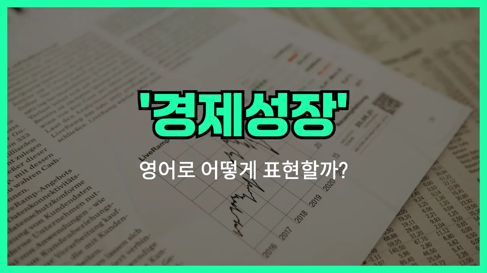

## 🌟 영어 표현 - economic growth

안녕하세요 👋 오늘은 경제와 관련된 중요한 영어 표현, 바로 '**economic growth**'에 대해 알아보려고 해요.

'**economic growth**'는 말 그대로 '**경제 성장**'을 의미해요. 즉, 한 나라의 경제가 일정 기간 동안 얼마나 더 커지고 발전했는지를 나타내는 표현이에요. 주로 **국가의 생산, 소득, 부가가치 등이 증가하는 현상**을 설명할 때 사용돼요!

이 표현은 뉴스, 경제 기사, 학교 수업 등에서 정말 자주 등장해요. 예를 들어, 한 나라의 경제가 작년보다 더 좋아졌을 때 "The country experienced strong economic growth last year."라고 말할 수 있어요.

또한, 경제 성장률을 이야기할 때도 "economic growth rate"라는 표현을 써요. 예를 들어, "The economic growth rate reached 3% this year."라고 할 수 있어요.

## 📖 예문

1. "한국의 경제 성장이 빠르게 이루어지고 있어요."

   "South Korea is experiencing rapid economic growth."

2. "정부는 경제 성장을 촉진하기 위한 정책을 발표했어요."

   "The [government](/blog/in-english/608.government/) announced [policies](/blog/in-english/623.policy/) to promote economic growth."

## 💬 연습해보기

<ul data-interactive-list>

  <li data-interactive-item>
    시장님이 기자회견에서 도시 경제 성장에 대해 얘기하셨어요.
    The mayor talked about the city's economic growth during the <a href="/blog/in-english/606.press-conference/">press conference</a>.
  </li>

  <li data-interactive-item>
    최근 몇 년 동안 이 지역에서 경제 성장이 많이 일어났어요.
    We've seen a lot of economic growth in this region over the past few years.
  </li>

  <li data-interactive-item>
    탄탄한 교육 시스템이 경제 성장을 확실히 끌어올려요.
    A strong education <a href="/blog/in-english/432.system/">system</a> can really boost economic growth.
  </li>

  <li data-interactive-item>
    뉴스에서 이번 분기에 경제 성장 속도가 느려졌대요.
    The <a href="/blog/in-english/536.news/">news</a> said that economic growth slowed down this quarter.
  </li>

  <li data-interactive-item>
    많은 사람들이 새 정책이 경제 성장을 촉진하길 바라고 있어요.
    Many people <a href="/blog/성공하면-좋겠어-영어표현/">hope</a> that the new policies will encourage economic growth.
  </li>

  <li data-interactive-item>
    솔직히 말해서, 인플레이션이 경제 성장에 영향을 줄까 걱정돼요.
    <a href="/blog/in-english/336.honestly/">Honestly</a>, I'm <a href="/blog/in-english/209.worry-about/">worried about</a> <a href="/blog/in-english/652.inflation/">inflation</a> affecting our economic growth.
  </li>

  <li data-interactive-item>
    우리 회사가 잘 되는 건 나라 경제 성장 덕분이에요.
    Our company is doing well because of the country's economic growth.
  </li>

  <li data-interactive-item>
    그 비즈니스 팟캐스트에서는 항상 경제 성장 이야기를 해요.
    They always discuss economic growth on those business podcasts.
  </li>

  <li data-interactive-item>
    관광업이 그 지역 경제 성장에 큰 기여를 했어요.
    Tourism has played a big role in the area's economic growth.
  </li>

  <li data-interactive-item>
    솔직히 말하면, 경제 성장이 꼭 다에게 혜택을 주는 건 아니에요.
    To be honest, economic growth doesn't always mean everyone benefits.
  </li>

</ul>

## 🤝 함께 알아두면 좋은 표현들

### economic development

'economic development'는 '경제 발전'이라는 뜻으로, 단순히 경제 규모가 커지는 것뿐만 아니라 사회 전반의 생활 수준, 인프라, 복지 등이 함께 향상되는 것을 의미해요. 경제 성장보다 더 넓은 개념이에요.

- "The government is [focusing on](/blog/in-english/186.focus-on/) economic development to [improve](/blog/in-english/394.improve/) the [quality](/blog/in-english/304.quality/) of life for its citizens."
- "정부는 국민들의 삶의 질을 높이기 위해 경제 발전에 집중하고 있어요."

### economic recession

'economic recession'은 '경기 침체' 또는 '경제 불황'이라는 뜻이에요. 경제 성장의 반대 개념으로, 경제 활동이 둔화되고 실업률이 오르며 전반적으로 경기가 나빠지는 상황을 말해요.

- "Many businesses struggled to survive during the economic recession."
- "많은 기업들이 경기 침체 동안 살아남기 위해 고군분투했어요."

### stagnant economy

'stagnant [economy](/blog/in-english/637.economy/)'는 '정체된 경제'라는 뜻이에요. 경제가 성장하지 않고 오랫동안 제자리걸음을 하는 상황을 나타내요. 경제 성장과는 반대되는 개념이에요.

- "The country has been dealing with a stagnant economy for several years."
- "그 나라는 몇 년째 정체된 경제로 어려움을 겪고 있어요."

---

오늘은 '**경제 성장**'이라는 뜻을 가진 영어 표현 '**economic growth**'에 대해 알아봤어요. 경제 관련 뉴스를 볼 때 이 표현을 떠올리면 이해가 더 쉬워질 거예요 😊

오늘 배운 표현과 예문들을 꼭 최소 3번씩 소리 내서 읽어보세요. 다음에도 더 재미있고 유익한 영어 표현으로 찾아올게요! 감사합니다!

