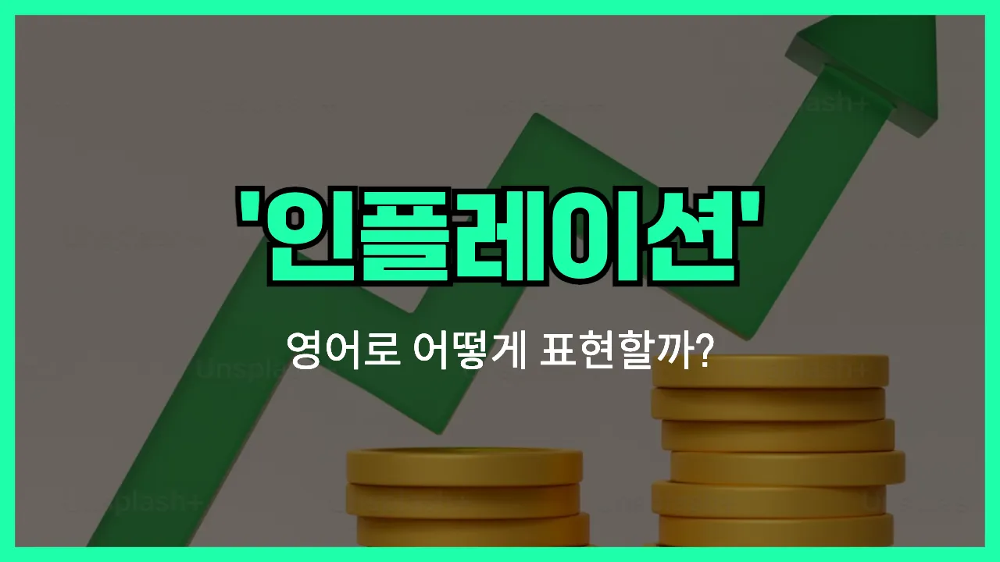

## 🌟 영어 표현 - inflation

안녕하세요 👋 오늘은 경제 뉴스나 일상 대화에서 자주 듣는 단어, '**물가상승**'을 영어로 어떻게 표현하는지 알아보려고 해요. 바로 '**inflation**'이라는 단어인데요~

'**inflation**'은 경제에서 **상품이나 서비스의 전반적인 가격이 오르는 현상**을 의미해요. 즉, 같은 돈으로 살 수 있는 물건이나 서비스의 양이 줄어드는 걸 말해요. 그래서 물가가 오르면 우리의 실질적인 구매력이 떨어지게 되죠~

이 단어는 뉴스, 신문, 회사 회의 등 다양한 상황에서 자주 등장해요. 예를 들어, "최근에 물가가 많이 올랐어요."라고 말하고 싶을 때 "There has been a lot of inflation recently."라고 할 수 있어요~

또는, "인플레이션 때문에 생활비가 늘었어요."라고 말할 때는 "The cost of living has increased [due to](/blog/in-english/335.due-to/) inflation."이라고 표현할 수 있어요~

## 📖 예문

1. "정부가 인플레이션을 억제하려고 노력하고 있어요."

   "The [government](/blog/in-english/608.government/) is [trying to](/blog/in-english/117.try-to/) control inflation."

2. "인플레이션 때문에 식료품 가격이 올랐어요."

   "Food [prices](/blog/in-english/640.price/) have gone up because of inflation."

## 💬 연습해보기

<ul data-interactive-list>

  <li data-interactive-item>
    요즘 장보는 거 가격 진짜 많이 올랐더라구요. 아마도 인플레이션 때문인 것 같아요.
    I <a href="/blog/in-english/061.notice/">noticed</a> the price of groceries has gone up a lot lately. That's <a href="/blog/in-english/281.probably/">probably</a> because of inflation.
  </li>

  <li data-interactive-item>
    올해도 집세가 또 올랐어요. 인플레이션 진짜 걷잡을 수 없네요.
    My rent increased again this year. Inflation is getting out of control.
  </li>

  <li data-interactive-item>
    월급 받으면 예전만큼 안 느껴지는 거, 다 인플레이션 탓이에요.
    Because of inflation, <a href="/blog/한-것-같아-영어표현/">it feels like</a> my paycheck doesn't go as far as it <a href="/blog/in-english/143.used-to/">used to</a>.
  </li>

  <li data-interactive-item>
    기름값이 엄청 올랐는데, 다 인플레이션 덕분이에요.
    Gas prices are way higher now. It's all thanks to inflation.
  </li>

  <li data-interactive-item>
    아빠가 인플레이션 때문에 생활비가 얼마나 달라졌는지 계속 불평하셨어요.
    Dad was <a href="/blog/in-english/499.complain/">complaining</a> about how much inflation has changed the cost of living.
  </li>

  <li data-interactive-item>
    커피 한 잔에 천 원이던 시절 기억나세요? 인플레이션 진짜 심하게 왔어요.
    Remember when a cup of coffee was like a dollar? Inflation really hit hard.
  </li>

  <li data-interactive-item>
    몇몇 회사는 인플레이션에 맞춰서 임금 인상해 주고 있어요.
    Some companies are giving raises just to <a href="/blog/vocab-1/027.keep-up-with/">keep up with</a> inflation.
  </li>

  <li data-interactive-item>
    인플레이션 좀만 진정됐으면 좋겠어요. 모든 게 다 너무 비싸지네요.
    <a href="/blog/in-english/118.i-wish/">I wish</a> inflation would slow down. Everything's getting more <a href="/blog/in-english/317.expensive/">expensive</a>.
  </li>

  <li data-interactive-item>
    사람들이 돈을 덜 쓰게 되는 것도 인플레이션이 예산을 많이 잠식해서 그런 것 같아요.
    People are starting to <a href="/blog/in-english/293.save/">save</a> less because inflation keeps eating into their budgets.
  </li>

  <li data-interactive-item>
    뉴스에서 인플레이션 얘기만 계속 하는데, 솔직히 그냥 물가 좀 잡혔으면 좋겠어요.
    The <a href="/blog/in-english/536.news/">news</a> keeps talking about inflation, but <a href="/blog/in-english/336.honestly/">honestly</a>, I just want things to stop being so expensive.
  </li>

</ul>

## 🤝 함께 알아두면 좋은 표현들

### rising prices

'rising prices'는 "물가가 오르다"라는 뜻이에요. 인플레이션이 일어날 때 실제로 사람들이 가장 먼저 체감하는 현상으로, 상품이나 서비스의 가격이 전반적으로 상승하는 상황을 말해요.

- "Many families are struggling to keep up with rising prices at the grocery store."
- "많은 가정이 식료품점에서 오르는 물가를 따라가기 힘들어하고 있어요."

### deflation

'[deflation](/blog/in-english/653.deflation/)'은 "디플레이션" 또는 "물가 하락"을 의미해요. 인플레이션과는 반대로, 전반적으로 상품과 서비스의 가격이 떨어지는 현상을 말해요. 경제가 침체될 때 자주 나타나요.

- "During the recession, the country experienced deflation for several consecutive months."
- "경기 침체 동안 그 나라는 몇 달 연속으로 물가 하락을 겪었어요."

### stable prices

'stable prices'는 "물가가 안정적이다"라는 뜻이에요. 인플레이션이나 디플레이션 없이 가격이 큰 변동 없이 유지되는 상황을 나타내요. 경제가 건강할 때 자주 쓰는 표현이에요.

- "The government is working hard to maintain stable prices for [essential](/blog/in-english/446.essential/) goods."
- "정부는 필수품의 물가를 안정적으로 유지하려고 열심히 노력하고 있어요."

---

오늘은 '**물가상승**', '**인플레이션**'이라는 뜻을 가진 영어 표현 '**inflation**'에 대해 알아봤어요. 앞으로 경제 관련 이야기를 할 때 이 단어를 떠올리면 좋겠죠? 😊

오늘 배운 표현과 예문들을 꼭 최소 3번씩 소리 내서 읽어보세요. 다음에도 더 재미있고 유익한 영어 표현으로 찾아올게요! 감사합니다!
