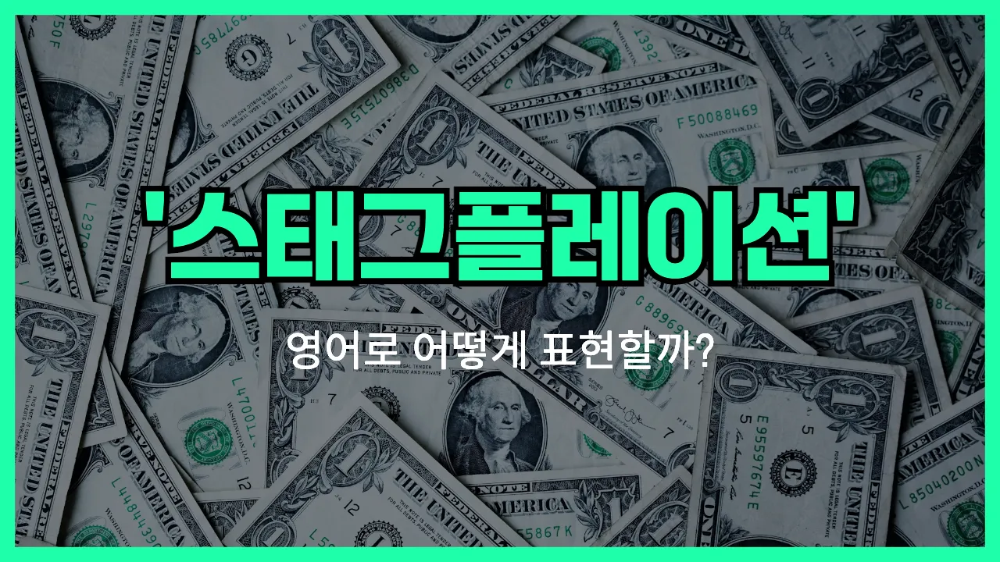

## 🌟 영어 표현 - stagflation

안녕하세요 👋 오늘은 경제 뉴스에서 자주 등장하는 용어인 '**스태그플레이션**'에 대해 알아보려고 해요. 혹시 이 단어의 영어 표현을 알고 계신가요? 바로 '**stagflation**'이에요.

'**stagflation**'은 두 단어가 합쳐진 말이에요. 'stagnation(경기침체)'와 '[inflation](/blog/in-english/652.inflation/)(물가상승)'이 결합된 단어로, **경기가 침체되어 성장하지 않으면서도 물가는 계속 오르는** 특이한 경제 상황을 의미해요.

보통 경제가 침체되면 물가도 같이 떨어지는 경우가 많은데, 스태그플레이션은 이와 반대로 경기는 나쁜데도 불구하고 물가가 계속 오르는 현상을 말해요. 그래서 경제 기사나 뉴스에서 "스태그플레이션 우려가 커지고 있다"는 표현을 자주 볼 수 있어요.

## 📖 예문

1. "현재 경제는 스태그플레이션 위험에 직면해 있어요."

   "The [economy](/blog/in-english/637.economy/) is currently facing the risk of stagflation."

2. "스태그플레이션은 실업률 증가와 물가 상승이 동시에 일어나는 현상이에요."

   "Stagflation is a situation where unemployment rises and [prices](/blog/in-english/640.price/) increase at the same time."

## 💬 연습해보기

<ul data-interactive-list>

  <li data-interactive-item>
    수업 시간에 스태그플레이션에 대해 얘기했는데, 그게 경제를 완전 꼬이게 한다고 해요. 간단히 말하면 물가는 오르는데 실업률도 높은 상태를 말해요.
    We were talking in class about stagflation and how it really messes with the economy. Basically, it's when prices go up but people are <a href="/blog/in-english/254.still/">still</a> out of work.
  </li>

  <li data-interactive-item>
    아빠가 70년대 미국은 다 스태그플레이션 시기였다고 하셨는데 물가 상승과 실업이 동시에 일어났대요.
    My dad said the 1970s were all about stagflation in the U.S. You'd have <a href="/blog/in-english/652.inflation/">inflation</a> and unemployment at the same time.
  </li>

  <li data-interactive-item>
    기사 봤는데 어떤 경제학자들은 우리가 다시 스태그플레이션에 빠질까 봐 걱정하고 있더라고요. 그거 진짜 최악일 거예요.
    I <a href="/blog/in-english/436.read/">read</a> an article saying some economists are worried we might be headed for stagflation again. That would be a <a href="/blog/in-english/390.nightmare/">nightmare</a>.
  </li>

  <li data-interactive-item>
    스태그플레이션 진짜 이상한 게 보통 물가가 오르면 경제가 좋아야 하는데, 이건 그렇지 않다니까요.
    Stagflation is so <a href="/blog/in-english/296.weird/">weird</a>, because normally if prices go up, the economy's supposed to be strong, right? But not with stagflation.
  </li>

  <li data-interactive-item>
    어젯밤 뉴스에서 계속 스태그플레이션 얘기 해서, 진짜 무슨 뜻인지 찾아봤어요.
    Last night's <a href="/blog/in-english/536.news/">news</a> kept mentioning stagflation. I had to look it up to really get what it means.
  </li>

  <li data-interactive-item>
    경제 선생님이 그러시길 스태그플레이션 때는 비용은 오르는데 사람들이 소비를 안 해서 회사들이 힘들대요.
    My econ teacher explained that companies struggle during stagflation since costs rise but people aren't <a href="/blog/in-english/258.spend/">spending</a> as much.
  </li>

  <li data-interactive-item>
    스태그플레이션 고치려면 어떻게 해야 할지 의견이 많이 갈리는데, 금리 올린다고 꼭 해결되는 건 아니래요.
    There's a lot of debate on how to <a href="/blog/in-english/524.fix/">fix</a> stagflation, because raising interest rates doesn't always help.
  </li>

  <li data-interactive-item>
    친구한테 스태그플레이션 배운 거 기억나냐고 물었더니, 겨우 좀 알 것 같대요.
    I asked my friend if she remembered <a href="/blog/in-english/245.learn/">learning</a> about stagflation, and she said she only sort of gets it.
  </li>

  <li data-interactive-item>
    정부가 스태그플레이션 막으려고 얘기할 때마다 내 저축이 걱정돼요.
    Whenever the <a href="/blog/in-english/608.government/">government</a> talks about avoiding stagflation, I get <a href="/blog/in-english/115.nervous/">nervous</a> for my savings.
  </li>

  <li data-interactive-item>
    스태그플레이션은 들어보면 복잡한 경제 용어 같지만, 사실 한꺼번에 다 안 좋은 상황이라는 뜻이에요.
    Stagflation is one of those economic terms that sounds confusing but basically just means everything's bad <a href="/blog/in-english/358.at-once/">at once</a>.
  </li>

</ul>

## 🤝 함께 알아두면 좋은 표현들

### economic recession

'economic recession'은 "경기 침체"를 의미해요. 경제가 전반적으로 위축되고, 생산과 소비가 줄어들며, 실업률이 높아지는 상황을 가리켜요. 스태그플레이션과 비슷하게 경제가 좋지 않은 상태지만, 인플레이션(물가 상승)은 동반하지 않을 수도 있어요.

- "Many countries struggled to recover from the economic recession in the [late](/blog/in-english/391.late/) 2000s."
- "많은 나라들이 2000년대 후반 경기 침체에서 벗어나기 위해 고생했어요."

### deflation

'[deflation](/blog/in-english/653.deflation/)'은 "디플레이션" 또는 "물가 하락"을 의미해요. 스태그플레이션이 물가 상승과 경기 침체가 동시에 일어나는 현상이라면, 디플레이션은 물가가 전반적으로 떨어지는 현상이에요. 보통 소비가 줄고 경기가 침체될 때 나타나요.

- "Japan experienced a long period of [deflation](/blog/in-english/653.deflation/) in the 1990s, which slowed down its [economic growth](/blog/in-english/651.economic-growth/)."
- "일본은 1990년대에 오랜 기간 디플레이션을 겪으면서 경제 성장 속도가 느려졌어요."

### economic boom

'economic boom'은 "경제 호황"을 의미해요. 경기가 활발하게 성장하고, 일자리도 많아지고, 물가도 안정적인 상태를 말해요. 스태그플레이션과는 반대되는 개념이에요.

- "During the economic boom, businesses expanded rapidly and unemployment rates [dropped](/blog/in-english/361.drop/)."
- "경제 호황기에는 기업들이 빠르게 성장하고 실업률도 많이 줄었어요."

---

오늘은 '**스태그플레이션**'이라는 경제 용어의 영어 표현 '**stagflation**'에 대해 알아봤어요. 경제 뉴스를 볼 때 이 단어가 나오면 오늘 배운 내용을 떠올려 보세요 😊

오늘 배운 표현과 예문들을 꼭 최소 3번씩 소리 내서 읽어보세요. 다음에도 더 재미있고 유익한 영어 표현으로 찾아올게요! 감사합니다!~요

