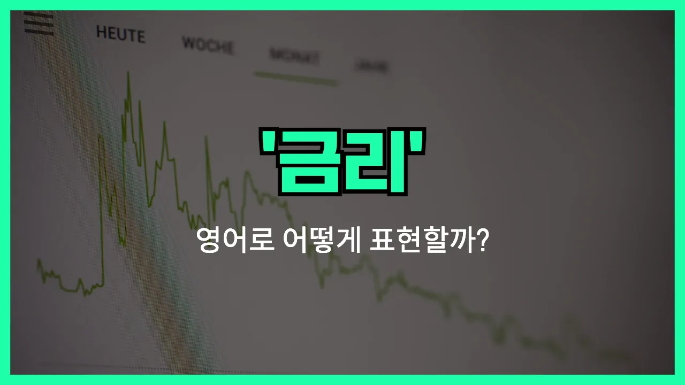

## 🌟 영어 표현 - interest rate

안녕하세요 👋 오늘은 금융과 관련해서 자주 듣는 단어, '**이자율**'의 영어 표현에 대해 알아보려고 해요. 바로 '**interest rate**'라는 단어인데요. 이 표현은 은행이나 금융기관에서 돈을 빌리거나 예금할 때 적용되는 **이자의 비율**을 의미해요.

'interest'는 '이자', 'rate'는 '비율'이라는 뜻이니, 합쳐서 '이자율' 또는 '금리'라는 의미가 돼요. 예를 들어, 은행에 돈을 맡기면 일정한 이자율에 따라 이자를 받게 되고, 반대로 돈을 빌릴 때도 이자율에 따라 이자를 내야 해요.

이 단어는 경제 뉴스, 은행 업무, 투자 등 다양한 상황에서 자주 사용돼요. 예를 들어, "The interest rate has increased this year."라고 하면 "올해 이자율이 올랐어요."라는 뜻이에요.

## 📖 예문

1. "은행의 이자율이 얼마나 돼요?"

   "What is the interest rate at the bank?"

2. "이자율이 낮아서 대출받기 좋아요."

   "The interest rate is low, so it's a good time to get a loan."

## 💬 연습해보기

<ul data-interactive-list>

  <li data-interactive-item>
    내 신용카드 이자율이 갑자기 올랐더니 지금 납부액이 엄청 부담돼요.
    The interest rate on my credit card just went up and now my payments are crazy high.
  </li>

  <li data-interactive-item>
    새 차를 살까 고민 중인데, 작년보다 대출 이자율이 훨씬 높아서 망설여져요.
    I'm thinking about getting a new car, but the interest rate on loans is so much higher than last year.
  </li>

  <li data-interactive-item>
    저축계좌 만들기 전에 이자율 확인해 봤어요?
    Did you check what the interest rate is before opening that savings account?
  </li>

  <li data-interactive-item>
    낮은 이자율이면 시간이 지나면서 진짜 돈을 많이 아낄 수 있어요.
    A low interest rate can really help you <a href="/blog/in-english/293.save/">save</a> money <a href="/blog/in-english/189.over-time/">over time</a>.
  </li>

  <li data-interactive-item>
    이자율이 오르면 집 사기가 더 어려워져요.
    When the interest rate goes up, it gets harder for people to buy houses.
  </li>

  <li data-interactive-item>
    항상 이자율 제일 낮은 신용카드를 찾으려고 노력해요.
    I always <a href="/blog/in-english/117.try-to/">try to</a> find a credit card with the lowest interest rate possible.
  </li>

  <li data-interactive-item>
    은행에서 개인대출에 꽤 괜찮은 이자율 제안해 줬어요.
    My bank offered me a pretty decent interest rate for a personal loan.
  </li>

  <li data-interactive-item>
    이자율이 또 올랐는데, 그래서 내 주택담보대출 납부액이 더 늘었어요.
    They raised the interest rate again, so my mortgage payments just got more <a href="/blog/in-english/317.expensive/">expensive</a>.
  </li>

  <li data-interactive-item>
    고정 이자율로 묶어두는 게 가능하면 좋은 선택이에요.
    It's a good idea to lock in a fixed interest rate if you can.
  </li>

  <li data-interactive-item>
    이자율이 조금만 변해도 상환액에 큰 차이가 날 수 있어요.
    Even a small change in the interest rate can make a big difference in how much you pay back.
  </li>

</ul>

## 🤝 함께 알아두면 좋은 표현들

### annual percentage rate (APR)

'annual percentage rate (APR)'는 "연이율" 또는 "연간 수익률"을 의미해요. 이 표현은 대출이나 신용카드 등에서 1년 동안 실제로 부담하게 되는 이자율을 나타낼 때 사용돼요. 단순한 이자율보다 수수료나 기타 비용까지 포함해서 실제로 내야 하는 전체 비용을 보여주는 개념이에요.

- "Before signing the loan agreement, [make sure](/blog/in-english/232.make-sure/) you understand the annual percentage rate (APR)."
- "대출 계약서에 서명하기 전에 연이율이 어떻게 되는지 꼭 확인해보세요."

### fixed rate

'fixed rate'는 "고정 금리"라는 뜻이에요. 이 표현은 대출이나 예금 등에서 이자율이 일정 기간 동안 변하지 않고 고정되어 있다는 의미로 사용돼요. 금리가 오르거나 내려도 계약 기간 동안에는 변동이 없어서 예측이 쉬운 장점이 있어요.

- "Many homeowners [prefer](/blog/in-english/191.prefer/) a fixed rate mortgage for stability."
- "많은 집주인들이 안정성을 위해 고정 금리 주택담보대출을 선호해요."

### variable rate

'variable rate'는 "변동 금리"라는 뜻이에요. 이 표현은 이자율이 시장 상황이나 기준 금리에 따라 주기적으로 변할 수 있음을 나타내요. 금리가 오르면 이자 부담이 커질 수 있고, 반대로 내리면 이자 부담이 줄어들 수 있어요.

- "With a variable rate loan, your monthly payments could increase if interest rates go up."
- "변동 금리 대출을 받으면 금리가 오를 때마다 매달 내는 금액이 늘어날 수 있어요."

---

오늘은 '**이자율**', '**금리**', '**이율**'이라는 뜻을 가진 영어 표현 '**interest rate**'에 대해 알아봤어요. 앞으로 은행이나 금융 관련 대화를 할 때 이 표현을 꼭 활용해 보세요! 😊

오늘 배운 표현과 예문들을 꼭 최소 3번씩 소리 내서 읽어보세요. 다음에도 더 재미있고 유익한 영어 표현으로 찾아올게요! 감사합니다!
