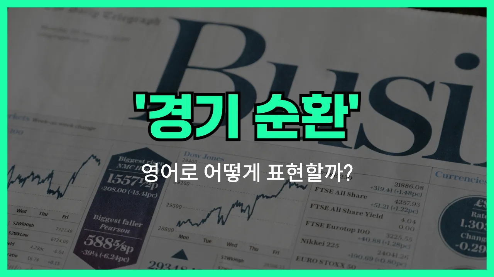

## 🌟 영어 표현 - business cycle (경기순환)

안녕하세요 👋 오늘은 경제에서 자주 듣는 용어인 '**경기순환**'을 영어로 어떻게 표현하는지 알아보려고 해요.

바로 '**business cycle**'이라는 표현이에요. 이 단어는 경제가 시간이 지남에 따라 성장과 침체를 반복하는 현상을 의미해요. 즉, **경기가 좋아졌다가 나빠졌다가 하는 흐름**을 설명할 때 쓰는 말이에요!

'Business cycle'은 경제 뉴스, 보고서, 수업 등에서 정말 자주 등장하는 표현이에요. 예를 들어, 경기가 호황(boom)에서 불황(recession)으로, 다시 회복(expansion)으로 이어지는 과정을 모두 포함해요.

이 표현을 알면 경제 상황을 영어로 설명할 때 훨씬 자연스럽게 말할 수 있어요!

## 📖 예문

1. "경기순환은 경제가 성장과 침체를 반복하는 현상이에요."

   "The business cycle is the process in which the economy goes through periods of growth and recession."

2. "정부는 경기순환의 변동에 대응하기 위한 정책을 마련하고 있어요."

   "The government is preparing policies to respond to changes in the business cycle."

## 💬 연습해보기

<ul data-interactive-list>

  <li data-interactive-item>
    요즘 경기 사이클 진짜 예측 불가해요. 가끔 경제가 다들 놀랄 정도로 반전을 보여주거든요.
    The business cycle is really unpredictable these days. Sometimes the economy just surprises everyone.
  </li>

  <li data-interactive-item>
    실업률이 오르면 경기 침체가 시작된다는 얘기가 들리기 시작해요.
    When unemployment goes up, people start talking about the business cycle going into a downturn.
  </li>

  <li data-interactive-item>
    대학 때 경기 사이클이 산업에 어떻게 영향을 주는지 배웠어요.
    In college, we studied how the business cycle affects different industries.
  </li>

  <li data-interactive-item>
    불황기에는 경기 사이클이 침체를 겪는 게 자연스러워요.
    During a recession, it's normal for the business cycle to go through a slump.
  </li>

  <li data-interactive-item>
    어느 경기 국면이든 잘 나가는 회사들도 있더라고요.
    Some companies seem to do well no matter where we are in the business cycle.
  </li>

  <li data-interactive-item>
    투자자들 항상 경기 회복될 때까지 큰 움직임 안 한다고 해요.
    I always hear investors say they're waiting for the business cycle to pick up again before making big moves.
  </li>

  <li data-interactive-item>
    동네 가게들 경기 사이클 힘들어지면 진짜 바로 체감해요.
    Local businesses really feel it when the business cycle hits a rough patch.
  </li>

  <li data-interactive-item>
    아빠가 부동산 시장은 경기 변동에 아주 민감하다고 하셨어요.
    My dad says the real estate market is super sensitive to swings in the business cycle.
  </li>

  <li data-interactive-item>
    어제 뉴스에서 경기 사이클 단계에 대해 자세히 설명해주더라고요.
    The news yesterday had a whole segment explaining the phases of the business cycle.
  </li>

  <li data-interactive-item>
    전문가들도 경기 사이클이 다음에 어떻게 될지 아무도 정확히 못 맞춰요.
    Nobody can really predict where the business cycle is headed next, even the experts.
  </li>

</ul>

## 🤝 함께 알아두면 좋은 표현들

### economic boom

'economic boom'은 "경기 호황" 또는 "경제적 호황기"를 의미해요. 경기가 매우 좋아져서 기업의 이익이 늘고, 고용이 증가하며, 소비가 활발해지는 시기를 나타내는 말이에요. 경기순환에서 상승 국면을 강조할 때 자주 사용돼요.

- "During the economic boom, many new businesses opened and unemployment rates dropped significantly."
- "경기 호황기에는 많은 새로운 사업체가 생기고 실업률도 크게 줄었어요."

### recession

'recession'은 "경기 침체" 또는 "불황"을 뜻해요. 경제가 전반적으로 위축되고, 생산과 소비가 줄어들며, 실업률이 높아지는 경기순환의 하강 국면을 나타내는 표현이에요.

- "The country faced a severe recession, leading to job losses and decreased consumer spending."
- "그 나라는 심각한 경기 침체를 겪으면서 일자리를 잃는 사람이 많아지고 소비도 줄었어요."

### steady growth

'steady growth'는 "꾸준한 성장" 또는 "안정적인 성장"을 의미해요. 경기순환처럼 오르내림이 심하지 않고, 경제가 일정하게 성장하는 상태를 나타낼 때 사용해요. 변동이 적고 안정적인 경제 상황을 강조할 때 쓰여요.

- "Thanks to steady growth, the company was able to expand its operations without major risks."
- "꾸준한 성장 덕분에 그 회사는 큰 위험 없이 사업을 확장할 수 있었어요."

---

오늘은 '**경기순환**'이라는 뜻을 가진 영어 표현 '**business cycle**'에 대해 알아봤어요. 경제 관련 대화를 할 때 이 표현을 꼭 활용해 보세요! 😊

오늘 배운 표현과 예문들을 꼭 최소 3번씩 소리 내서 읽어보세요. 다음에도 더 재미있고 유익한 영어 표현으로 찾아올게요! 감사합니다!~요

