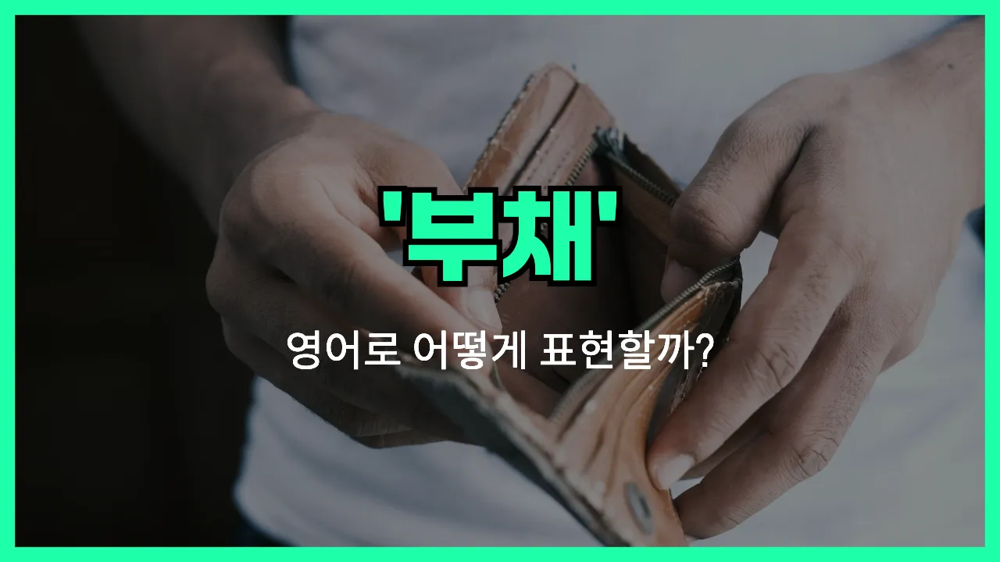

## 🌟 영어 표현 - debt

안녕하세요 👋 오늘은 우리가 일상에서 자주 듣는 단어, '**빚**'을 영어로 어떻게 표현하는지 알아보려고 해요. 바로 '**debt**'라는 단어인데요. 이 단어는 **누군가에게 돈이나 물건을 빌려서 갚아야 하는 상황**을 의미해요.

'**debt**'는 주로 금융, 경제, 일상 대화 등 다양한 상황에서 사용돼요. 예를 들어, 은행에서 돈을 빌렸거나 친구에게 돈을 빌렸을 때 모두 'debt'라는 단어를 쓸 수 있어요.

예를 들어, "나는 아직 학자금 빚이 있어요."라고 말하고 싶을 때 "I still have student debt."라고 표현할 수 있어요.

또한, 'debt'는 돈뿐만 아니라 **감사나 의무감** 같은 비유적인 의미로도 쓰일 수 있어요. 예를 들어, "나는 그에게 큰 빚을 졌어요."라고 할 때 "I owe him a great debt."라고 할 수 있답니다!

## 📖 예문

1. "그는 많은 빚을 지고 있어요."

   "He is in a lot of debt."

2. "나는 신용카드 빚을 갚아야 해요."

   "I need to pay off my [credit card](/blog/in-english/763.credit-card/) debt."

## 💬 연습해보기

<ul data-interactive-list>

  <li data-interactive-item>
    저는 아직도 학자금 대출 갚는 중이에요. 진짜 끝이 안 보이는 것 같아요.
    I'm still paying off my student debt. It feels like it'll take forever.
  </li>

  <li data-interactive-item>
    그는 직장을 잃고 한동안 빚 때문에 정말 힘들었어요.
    After losing his job, he really struggled with debt for a while.
  </li>

  <li data-interactive-item>
    신용카드 빚은 조심하지 않으면 걷잡을 수 없이 늘어날 수 있어요.
    Credit card debt can get out of control if you're not careful.
  </li>

  <li data-interactive-item>
    그녀는 병원비 때문에 대출을 받았는데, 그래서 지금 빚이 좀 있대요.
    She took out a loan to cover her medical bills, so now she's in some debt.
  </li>

  <li data-interactive-item>
    작년에 드디어 빚에서 벗어났는데, 진짜 엄청난 안도감이었어요.
    We finally managed to get out of debt last year. It was such a relief.
  </li>

  <li data-interactive-item>
    사업이 망하고 나서 그들은 큰 빚더미에 빠졌어요.
    They fell into a lot of debt after the business went under.
  </li>

  <li data-interactive-item>
    저는 최대한 빚 지는 걸 피하려고 해요. 부모님이 항상 빨리 갚으라고 가르쳐주셨거든요.
    I'm trying to <a href="/blog/in-english/924.avoid/">avoid</a> debt as much as possible. My parents taught me to always pay things off quickly.
  </li>

  <li data-interactive-item>
    매달 밀리는 고지서에 빚만 늘까 봐 걱정돼요.
    With all these monthly bills, I worry about racking up debt.
  </li>

  <li data-interactive-item>
    그는 예전 빚을 갚으려고 부모님한테 돈을 빌렸대요.
    He had to borrow money from his parents to pay off some old debt.
  </li>

  <li data-interactive-item>
    빚 있는 거 부끄러운 일이 아니지만, 꼭 갚을 계획은 세우는 게 중요해요.
    There's no shame in having debt, but it's important to have a plan to pay it back.
  </li>

</ul>

## 🤝 함께 알아두면 좋은 표현들

### owe money

'[owe money](/blog/in-english/730.owe-money/)'는 "돈을 빚지다" 또는 "남에게 돈을 갚아야 하는 상황"을 의미해요. 누군가에게 돈을 빌렸거나 아직 갚지 않은 상태를 나타낼 때 자주 써요.

- "I still owe money to the bank for my car loan."
- "나는 아직 자동차 대출 때문에 은행에 돈을 갚아야 해요."

### be in the red

'be in the red'는 "적자 상태이다" 또는 "재정적으로 마이너스인 상태"를 뜻해요. 주로 회사나 개인이 빚이 많거나 수입보다 지출이 많을 때 사용해요.

- "After the holiday season, many people find themselves in the red."
- "연말연시가 지나면 많은 사람들이 적자 상태가 돼요."

### be debt-free

'be [debt-free](/blog/in-english/729.debt-free/)'는 "빚이 없는 상태"를 의미해요. 모든 부채를 다 갚아서 더 이상 갚아야 할 돈이 없을 때 쓰는 긍정적인 표현이에요.

- "She worked hard for years to finally be debt-free."
- "그녀는 몇 년 동안 열심히 일해서 마침내 빚을 다 갚았어요."

---

오늘은 '**빚**'이라는 뜻을 가진 영어 표현 '**debt**'에 대해 알아봤어요. 혹시 돈을 빌리거나 갚는 상황이 생기면 이 표현을 떠올려 보세요! 😊

오늘 배운 표현과 예문들을 꼭 최소 3번씩 소리 내서 읽어보세요. 다음에도 더 재미있고 유익한 영어 표현으로 찾아올게요! 감사합니다!
