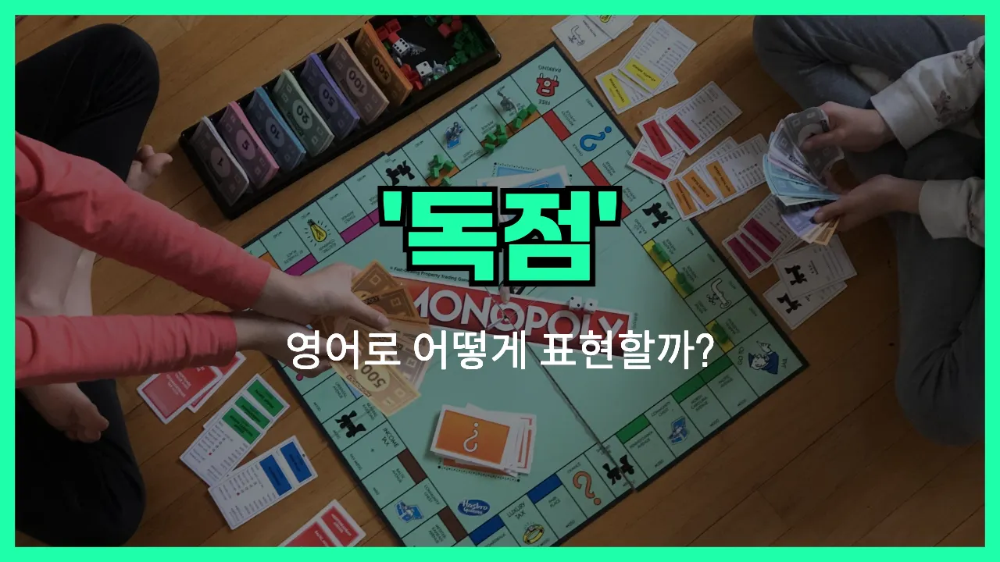

## 🌟 영어 표현 - monopoly

안녕하세요 👋 오늘은 경제나 비즈니스에서 자주 듣는 단어, '**독점**'을 영어로 어떻게 표현하는지 알아보려고 해요. 바로 '**monopoly**'라는 단어인데요~

'**monopoly**'는 한 기업이나 개인이 시장이나 상품, 서비스의 공급을 완전히 장악해서 경쟁자가 없는 상태를 의미해요. 즉, **오직 한 곳만이 특정 상품이나 서비스를 제공하는 상황**을 말할 때 쓰여요~

이 단어는 경제 기사, 뉴스, 그리고 일상 대화에서도 자주 등장해요. 예를 들어, 한 회사가 어떤 제품을 유일하게 판매할 때 "That company has a monopoly on that product."라고 할 수 있어요~

또는, "The [government](/blog/in-english/608.government/) is [trying to](/blog/in-english/117.try-to/) break up the monopoly in the telecommunications industry."라고 하면 "정부가 통신 산업의 독점을 해체하려고 하고 있어요."라는 뜻이에요~

'**monopoly**'는 명사로만 사용되고, '독점하다'라는 동사로는 'monopolize'라는 단어를 쓸 수 있어요. 상황에 따라 적절하게 활용해 보세요~

## 📖 예문

1. "그 회사는 지역 내에서 전기 공급을 독점하고 있어요."

   "The company has a monopoly on electricity [supply](/blog/in-english/638.supply/) in the area."

2. "정부는 독점 기업을 규제하려고 해요."

   "The government is trying to regulate monopoly companies."

## 💬 연습해보기

<ul data-interactive-list>

  <li data-interactive-item>
    내 동네에 인터넷 서비스가 한 회사가 독점하고 있어서 진짜 짜증나요. 다른 선택지가 전혀 없더라고요.
    I'm so sick of that one company having a monopoly on internet service in my area. There's really no other <a href="/blog/in-english/399.choice/">choice</a>.
  </li>

  <li data-interactive-item>
    애플이 요즘 새 제품을 되게 많이 내면서 독점 기업 되는 거 아니냐고 생각해요? 친구가 다 먹어치우고 있다고 하더라고요.
    Do you think Apple's becoming a monopoly with all their new products? My friend was saying they're taking over everything.
  </li>

  <li data-interactive-item>
    옛날에 스탠다드 오일이 완전 석유 산업을 독점했었다고 하더라고요. 지금 생각하면 진짜 놀랍죠.
    Back in the day, Standard Oil had a total monopoly on the oil industry. It's wild to think about now.
  </li>

  <li data-interactive-item>
    콘서트 티켓 사려고 할 때마다 티켓마스터 독점 때문에 가격이 너무 비싸져서 너무 짜증나요.
    Every time I try to buy tickets to that concert, Ticketmaster's monopoly just makes everything way more <a href="/blog/in-english/317.expensive/">expensive</a>.
  </li>

  <li data-interactive-item>
    방금 아마존이 온라인 쇼핑 시장을 점점 독점하고 있다는 얘기했어요.
    We were just talking about how Amazon's kind of <a href="/blog/in-english/400.turn-into/">turning into</a> a monopoly for online shopping.
  </li>

  <li data-interactive-item>
    솔직히 케이블 회사도 선택지가 더 많았으면 좋겠어요. 여긴 독점 같아서 답답해요.
    <a href="/blog/in-english/336.honestly/">Honestly</a>, <a href="/blog/in-english/118.i-wish/">I wish</a> there were more options for cable companies. <a href="/blog/한-것-같아-영어표현/">It feels like</a> we've just got a monopoly here.
  </li>

  <li data-interactive-item>
    정부가 독점을 막아야 하는 거 맞죠? 근데 제가 보기엔 제대로 안 하는 느낌이에요.
    The government is supposed to stop monopolies, right? But I feel like they're not really doing enough.
  </li>

  <li data-interactive-item>
    독점이 가끔은 효율적일 수 있는데, 보통은 가격만 올라가서 별로인 것 같아요.
    <a href="/blog/in-english/270.sometimes/">Sometimes</a> having a monopoly can make things <a href="/blog/in-english/286.efficient/">efficient</a>, but usually it just makes <a href="/blog/in-english/640.price/">prices</a> go up.
  </li>

  <li data-interactive-item>
    요즘 SNS가 몇 개 대형 플랫폼만 있어서 거의 독점이라던데, 기사로 읽었어요.
    I <a href="/blog/in-english/436.read/">read</a> an article about how social media is almost a monopoly <a href="/blog/in-english/417.these-days/">these days</a>, because everyone is on just a few big platforms.
  </li>

  <li data-interactive-item>
    내 동생은 보드게임 '모노폴리' 하면서 독점이 뭔지 알게 됐는데, 지금 완전 빠졌어요.
    My little brother didn't understand what a monopoly was until we played Monopoly the board game. Now he's obsessed with the idea.
  </li>

</ul>

## 🤝 함께 알아두면 좋은 표현들

### corner the market

'corner the [market](/blog/in-english/641.market/)'는 "시장(을) 장악하다" 또는 "독점하다"라는 뜻이에요. 한 회사나 개인이 특정 상품이나 서비스 시장에서 거의 모든 점유율을 차지해서 경쟁자가 거의 없는 상황을 말해요. 독점과 비슷한 의미로 쓰여요.

- "With their new technology, the company [managed to](/blog/in-english/175.manage-to/) corner the market in smartphone batteries."
- "새로운 기술 덕분에 그 회사는 스마트폰 배터리 시장을 장악하게 됐어요."

### free competition

'free competition'은 "자유 경쟁"이라는 뜻이에요. 여러 기업이나 개인이 제한 없이 경쟁할 수 있는 시장 환경을 말해요. 독점(monopoly)과는 반대되는 개념으로, 누구나 시장에 진입할 수 있고 경쟁이 활발하게 일어나는 상황을 나타내요.

- "Free competition encourages innovation and better prices for [consumers](/blog/in-english/645.consumer/)."
- "자유 경쟁은 혁신을 촉진하고 소비자들에게 더 좋은 가격을 제공해줘요."

### oligopoly

'oligopoly'는 "과점"이라는 뜻이에요. 소수의 기업만이 시장을 지배하는 상황을 말해요. 독점(monopoly)이 한 회사가 시장을 지배하는 것이라면, 과점은 몇몇 회사가 시장을 나눠서 지배하는 거예요.

- "The airline industry is [often](/blog/in-english/326.often/) considered an oligopoly because only a few companies control most of the market."
- "항공 산업은 소수의 회사들이 시장 대부분을 차지하고 있어서 보통 과점이라고 불려요."

---

오늘은 '**독점**'이라는 뜻을 가진 영어 표현 '**monopoly**'에 대해 알아봤어요. 경제나 사회 이슈를 이야기할 때 이 단어를 떠올리면 좋겠죠? 😊

오늘 배운 표현과 예문들을 꼭 최소 3번씩 소리 내서 읽어보세요. 다음에도 더 재미있고 유익한 영어 표현으로 찾아올게요! 감사합니다!~
