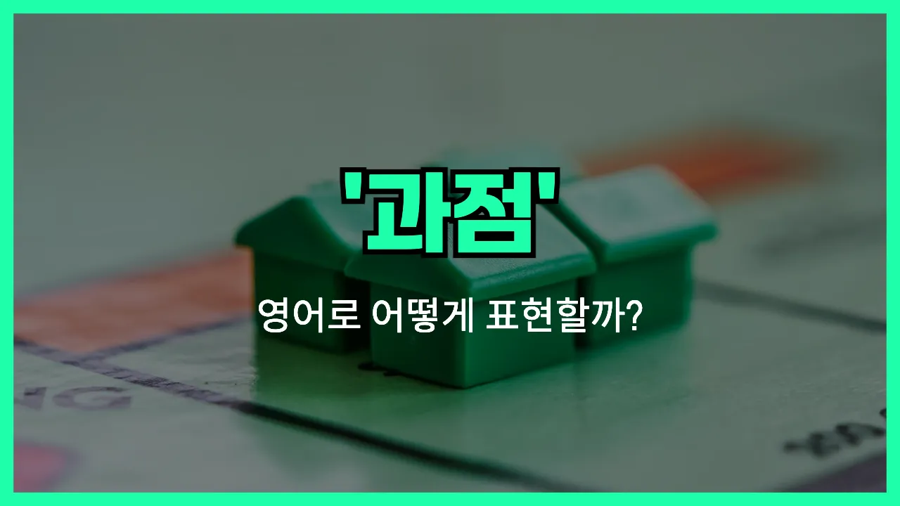

## 🌟 영어 표현 - oligopoly

안녕하세요 👋 오늘은 경제 용어 중 하나인 '**과점**'을 영어로 어떻게 표현하는지 알아보려고 해요. 바로 '**oligopoly**'라는 단어인데요. 이 단어는 시장에서 소수의 기업만이 상품이나 서비스를 공급하면서 시장을 지배하는 구조를 의미해요.

즉, 경쟁자가 많지 않고 몇몇 큰 기업들이 시장의 가격이나 공급량을 결정할 수 있는 상황을 말해요. 우리 주변에서는 통신사, 항공사, 정유사 등에서 이런 구조를 쉽게 볼 수 있어요.

'**oligopoly**'는 경제 기사나 뉴스, 비즈니스 회의 등에서 자주 등장하는 단어이니 알아두면 정말 유용해요!

## 📖 예문

1. "이 시장은 소수의 기업이 지배하는 과점 상태예요."

   "This market is in an oligopoly dominated by [a few](/blog/in-english/911.a-few/) companies."

2. "과점에서는 기업들이 가격을 쉽게 조정할 수 있어요."

   "In an oligopoly, companies can easily adjust prices."

## 💬 연습해보기

<ul data-interactive-list>

  <li data-interactive-item>
    경제 수업에서 휴대폰 산업이 몇몇 대기업이 시장을 꽉 잡는 과점 시장이라고 배웠어요.
    I learned in my economics class that the cell phone <a href="/blog/in-english/693.industry/">industry</a> is kind of an oligopoly. There aren't that many major companies controlling the market.
  </li>

  <li data-interactive-item>
    기름값이 다 같이 오르는 걸 보면 연료 시장이 거의 과점이라서 그런가 봐요.
    Gas prices always seem to go up together. That's probably because the fuel market is pretty much an oligopoly.
  </li>

  <li data-interactive-item>
    친구가 항공사에서 일하는데 경쟁이 너무 치열한 건 진짜 과점 시장 때문이라고 하더라고요.
    My friend works at one of the airlines, and she says competition is tough because it's really an oligopoly.
  </li>

  <li data-interactive-item>
    코카콜라랑 펩시가 과점하고 있어서 새로운 소다 브랜드가 뜨기 너무 힘들대요.
    It's so hard for new soda brands to break out because the industry's an oligopoly dominated by Coke and Pepsi.
  </li>

  <li data-interactive-item>
    예전에 비디오 게임 콘솔 시장이 지금보다 더 과점 시장이었다는 다큐를 봤어요.
    I saw a documentary about how the video game console market used to be more of an oligopoly than it is now.
  </li>

  <li data-interactive-item>
    몇몇 기업이 시장 대부분을 장악한 걸 과점이라고 해요. 그래서 가격이 어디서나 비슷할 수 있대요.
    When a few companies control most of the market, it's called an oligopoly. That's why prices might be similar everywhere.
  </li>

  <li data-interactive-item>
    케이블 회사도 과점처럼 행동하는 것 같아요. 선택지가 별로 없잖아요.
    I always thought the cable companies acted kind of like an oligopoly. You don't have a ton of choices.
  </li>

  <li data-interactive-item>
    제약회사가 과점이라서 약값이 비싸다는 비판을 많이 받아요.
    Pharmaceuticals are often <a href="/blog/in-english/971.criticize/">criticized</a> for being an oligopoly, which is why medicine can be so expensive.
  </li>

  <li data-interactive-item>
    과점 시장에서는 기업들이 서로 가격을 계속 살피고 있는 걸 눈치채게 돼요.
    You notice in an oligopoly, companies are always keeping an eye on each other's prices.
  </li>

  <li data-interactive-item>
    경제 교수님이 과점 시장에선 한 회사의 작은 변화가 전체 시장 반응을 불러일으킬 수 있다고 하셨는데 와 진짜 그렇더라고요.
    My economics professor said that in an oligopoly, small changes by one company can cause the whole market to react.
  </li>

</ul>

## 🤝 함께 알아두면 좋은 표현들

### monopoly

'[monopoly](/blog/in-english/667.monopoly/)'는 "독점"을 의미해요. 한 기업이나 단체가 시장 전체를 지배해서 경쟁자가 없는 상태를 말해요. 과점(oligopoly)과 달리, 독점은 오직 한 곳만이 상품이나 서비스를 제공하는 상황이에요.

- "The company had a monopoly on electricity in the region for decades."
- "그 회사는 수십 년 동안 그 지역에서 전기 공급을 독점했어요."

### perfect competition

'perfect competition'은 "완전 경쟁"을 뜻해요. 수많은 기업이 동일한 상품을 판매해서, 어느 한 기업도 시장 가격에 영향을 줄 수 없는 상태를 말해요. 과점과는 반대로, 시장에 진입 장벽이 없고 경쟁이 매우 치열한 상황이에요.

- "In perfect competition, no single seller can [influence](/blog/in-english/941.influence/) the market price."
- "완전 경쟁 시장에서는 어느 한 판매자도 시장 가격에 영향을 줄 수 없어요."

### cartel

'cartel'은 "카르텔"이라고 하며, 여러 기업이 서로 협력해서 가격이나 생산량을 조정하는 것을 의미해요. 과점 시장에서 기업들이 경쟁을 줄이고 이익을 극대화하기 위해 비밀리에 협력할 때 자주 쓰는 표현이에요.

- "Several oil companies formed a cartel to control prices."
- "몇몇 석유 회사들이 가격을 조절하기 위해 카르텔을 형성했어요."

---

오늘은 '**과점**'이라는 뜻을 가진 영어 표현 '**oligopoly**'에 대해 알아봤어요. 경제 관련 대화나 기사에서 이 단어가 나오면 이제 쉽게 이해할 수 있겠죠? 😊

오늘 배운 표현과 예문들을 꼭 최소 3번씩 소리 내서 읽어보세요. 다음에도 더 재미있고 유익한 영어 표현으로 찾아올게요! 감사합니다!
