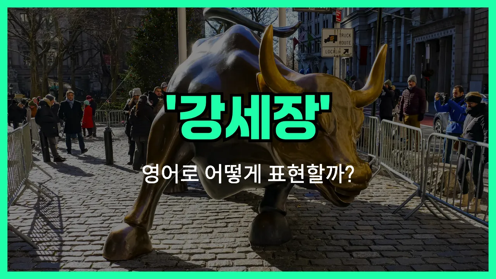

## 🌟 영어 표현 - bull market

안녕하세요 👋 오늘은 주식이나 금융 시장에서 자주 듣는 표현인 '**강세장**'을 영어로 어떻게 말하는지 알아볼 거예요. 바로 '**bull [market](/blog/in-english/641.market/)**'이라는 표현이에요.

'**bull market**'은 주식, 부동산, 암호화폐 등 다양한 자산 시장에서 **가격이 전반적으로 오르고 투자 심리가 활발한 상황**을 의미해요. 즉, 많은 사람들이 시장이 더 오를 거라고 기대하면서 적극적으로 투자하는 시기를 말해요!

이 표현은 경제 뉴스, 투자 관련 대화, 금융 기사 등에서 정말 자주 등장해요. 예를 들어, 최근 주식 시장이 계속 오르고 있다면 "We are in a bull market [right now](/blog/in-english/525.right-now/)."라고 할 수 있어요.

반대로, 가격이 전반적으로 하락하는 시장은 '**[bear market](/blog/in-english/679.bear-market/)**'이라고 해요. 두 표현을 함께 알아두면 더 좋겠죠?

## 📖 예문

1. "지금은 강세장이에요."

   "We are in a bull market right now."

2. "강세장에서는 투자자들이 더 적극적으로 매수해요."

   "Investors buy more actively during a bull market."

## 💬 연습해보기

<ul data-interactive-list>

  <li data-interactive-item>
    요즘 월가에서 다들 강세장 얘기하느라 바빠요. 주식이 쭉쭉 오르고 있거든요.
    Everyone's talking about the bull market on Wall Street <a href="/blog/in-english/417.these-days/">these days</a>. <a href="/blog/in-english/671.stock/">Stocks</a> just keep going up.
  </li>

  <li data-interactive-item>
    저는 지난 강세장 때 투자 시작했는데 꽤 괜찮은 수익 냈어요.
    I started investing during the last bull market and made some good <a href="/blog/in-english/663.profit/">profits</a>.
  </li>

  <li data-interactive-item>
    사람들 다 갑자기 주식 사려고 하면 그게 강세장인 거예요.
    You can tell it's a bull market when everyone suddenly wants to buy <a href="/blog/in-english/671.stock/">stocks</a>.
  </li>

  <li data-interactive-item>
    강세장일 때 아빠는 뉴스 읽는 걸 좋아하세요. 그땐 기분도 더 좋으시고요.
    My dad loves <a href="/blog/in-english/436.read/">reading</a> the <a href="/blog/in-english/536.news/">news</a> when we're in a bull market. He's always more upbeat then.
  </li>

  <li data-interactive-item>
    올해 후반에 또 강세장 온다니까 돈 좀 모아놨어요 투자하려고.
    They're predicting <a href="/blog/in-english/513.another/">another</a> bull market later this year, so I'm <a href="/blog/in-english/293.save/">saving</a> up to invest.
  </li>

  <li data-interactive-item>
    강세장일 땐 다 이길 것 같잖아요, 하지만 조심하는 게 여전히 중요해요.
    In a bull market, it's easy to feel like you can't <a href="/blog/in-english/457.lose/">lose</a>, but you <a href="/blog/in-english/254.still/">still</a> need to be careful.
  </li>

  <li data-interactive-item>
    지난 강세장 놓쳐서 이번엔 꼭 참여하고 싶어요.
    I <a href="/blog/in-english/339.miss/">missed</a> out on the last bull market, so I don't want to sit on the sidelines this time.
  </li>

  <li data-interactive-item>
    강세장만 되면 제 폰이 팁과 루머로 계속 울려요.
    Whenever there's a bull market, my phone's buzzing nonstop with tips and rumors.
  </li>

  <li data-interactive-item>
    90년대 후반 기술주 강세장 때의 열기, 진짜 대단했어요.
    You should have seen the excitement during the tech bull market in the <a href="/blog/in-english/391.late/">late</a> '90s.
  </li>

  <li data-interactive-item>
    강세장 때 친구들 중 몇 명은 자신감 너무 넘쳐서 계속 안 끝난다고 생각해요.
    Some of my friends get a little too <a href="/blog/in-english/420.confident/">confident</a> during a bull market. They <a href="/blog/in-english/023.forget/">forget</a> it doesn't last forever.
  </li>

</ul>

## 🤝 함께 알아두면 좋은 표현들

### bear market (약세장)

'bear market'은 'bull market'의 반대말로, 주식이나 자산 가격이 전반적으로 하락하는 시장 상황을 의미해요. 투자 심리가 위축되고, 많은 사람들이 주식을 팔려고 할 때 주로 사용해요.

- "Many investors become cautious during a bear market, fearing further losses."
- "약세장에서는 많은 투자자들이 추가 손실을 걱정해서 조심스러워져요."

### rally (랠리)

'rally'는 주식이나 자산 가격이 단기간에 빠르게 상승하는 현상을 말해요. 꼭 전체 시장이 강세장일 필요는 없고, 하락장 중에도 일시적으로 가격이 오를 때 쓸 수 있어요.

- "The stock market experienced a strong rally after the [government](/blog/in-english/608.government/) announced new economic [policies](/blog/in-english/623.policy/)."
- "정부가 새로운 경제 정책을 발표한 후에 주식시장이 강하게 반등했어요."

### market correction (시장 조정)

'market correction'은 주가가 단기간에 너무 많이 올랐을 때, 일정 부분 하락하며 균형을 맞추는 현상을 의미해요. 강세장 중에도 일시적으로 나타날 수 있어요.

- "After months of rapid gains, the market went through a correction to adjust inflated [prices](/blog/in-english/640.price/)."
- "몇 달 동안 급등한 후에 시장이 과도하게 오른 가격을 조정하려고 조정 국면에 들어갔어요."

---

오늘은 '**강세장**'이라는 뜻을 가진 영어 표현 '**bull market**'에 대해 알아봤어요. 앞으로 경제 뉴스나 투자 이야기를 할 때 이 표현을 자연스럽게 써보면 좋겠어요 😊

오늘 배운 표현과 예문들을 꼭 최소 3번씩 소리 내서 읽어보세요. 다음에도 더 재미있고 유익한 영어 표현으로 찾아올게요! 감사합니다!

