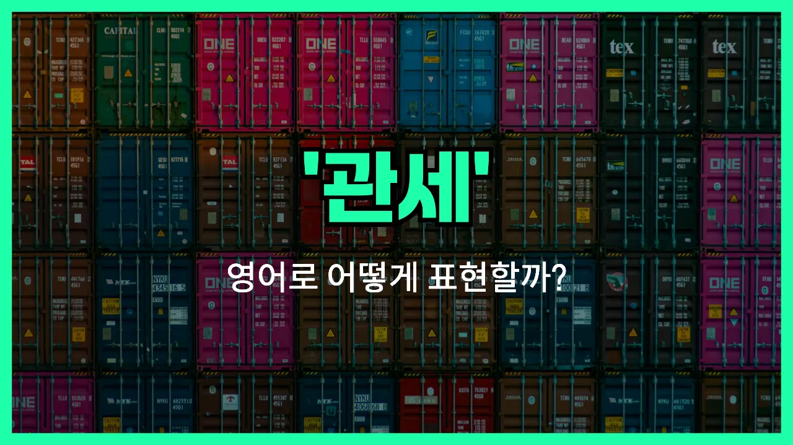

## 🌟 영어 표현 - tariff

안녕하세요 👋 오늘은 무역이나 수출입 관련 뉴스에서 자주 볼 수 있는 단어, '**관세**'의 영어 표현 '**tariff**'에 대해 알아보려고 해요.

'**tariff**'는 한 나라가 외국에서 들어오는 상품에 부과하는 세금, 즉 **수입품에 붙는 세금**을 의미해요. 이 단어는 경제, 무역, 국제 관계 등 다양한 분야에서 자주 사용돼요!

예를 들어, 어떤 나라가 자국 산업을 보호하기 위해 외국 상품에 높은 관세를 매길 때 "The [government](/blog/in-english/608.government/) imposed high tariffs on imported cars."라고 할 수 있어요.

또한, 'tariff'는 때때로 서비스 요금표나 가격표를 의미하기도 하지만, 일상적으로는 주로 **무역에서의 관세**를 뜻해요.

## 📖 예문

1. "정부가 수입 의류에 새로운 관세를 부과했어요."

   "The government has imposed new tariffs on imported clothing."

2. "관세 인상으로 인해 전자제품 가격이 올랐어요."

   "The increase in tariffs has raised the [prices](/blog/in-english/640.price/) of electronics."

## 💬 연습해보기

<ul data-interactive-list>

  <li data-interactive-item>
    수입차에 새 관세가 붙었대요. 어젯밤에 아빠가 그 얘기 하시더라고요.
    There's a new tariff on imported cars. My dad was talking about it last night.
  </li>

  <li data-interactive-item>
    정부에서 새로 발표한 관세 들었어요? 전자제품들이 더 비싸질 거래요.
    Have you heard about the new tariffs the government just announced? They're making electronics more <a href="/blog/in-english/317.expensive/">expensive</a>.
  </li>

  <li data-interactive-item>
    해외에서 뭔가 살 때까지 관세가 가격에 얼마나 영향을 주는지 몰랐어요.
    I didn't <a href="/blog/in-english/166.realize/">realize</a> how much tariffs could affect prices until I bought something from overseas.
  </li>

  <li data-interactive-item>
    관세 때문에 진짜 많은 제품들이 예전보다 훨씬 비싸졌어요.
    <a href="/blog/in-english/335.due-to/">Due to</a> tariffs, a lot of products <a href="/blog/in-english/664.cost/">cost</a> way more than they <a href="/blog/in-english/143.used-to/">used to</a>.
  </li>

  <li data-interactive-item>
    회사가 가격을 낮게 유지하려고 관세를 피해 갈 방법을 찾고 있대요.
    The company is <a href="/blog/in-english/117.try-to/">trying to</a> find ways around the tariffs to keep their prices low.
  </li>

  <li data-interactive-item>
    뉴스에서 보니까 관세 분쟁이 곧 끝날 수도 있대요.
    I saw on the <a href="/blog/in-english/536.news/">news</a> that the tariff dispute might be coming to an end soon.
  </li>

  <li data-interactive-item>
    이런 관세 때문에 사실 다른 나라에서 온라인 쇼핑하는 게 너무 부담돼요.
    With all these tariffs, it's <a href="/blog/in-english/336.honestly/">honestly</a> getting too expensive to shop online from other countries.
  </li>

  <li data-interactive-item>
    친구가 수입업체에서 일하는데 관세 때문에 수익이 많이 줄었다고 하더라고요.
    My friend works for a business that <a href="/blog/in-english/680.import/">imports</a> <a href="/blog/in-english/644.goods/">goods</a>, and she says the tariffs have really hurt their <a href="/blog/in-english/663.profit/">profits</a>.
  </li>

  <li data-interactive-item>
    오늘 경제 수업에서 관세 얘기했는데 생각보다 훨씬 복잡하더라고요.
    We talked about tariffs in my economics class today. It's a lot more complicated than I thought.
  </li>

  <li data-interactive-item>
    전에는 관세에 별 관심 없었는데, 요즘은 매일 사는 물건에 얼마나 영향 주는지 알겠어요.
    I never <a href="/blog/in-english/171.used/">used</a> to care about tariffs, but now I see how much they affect stuff I buy every day.
  </li>

</ul>

## 🤝 함께 알아두면 좋은 표현들

### customs duty

'customs duty'는 '관세'와 같은 의미로, 해외에서 물건이 들어올 때 부과되는 세금을 말해요. 주로 공식 문서나 무역 관련 대화에서 많이 사용돼요.

- "The customs duty on imported electronics has increased this year."
- "올해는 수입 전자제품에 대한 관세가 올랐어요."

### free trade

'free trade'는 '자유 무역'이라는 뜻으로, 국가 간에 관세나 무역 장벽 없이 자유롭게 상품과 서비스를 교환하는 것을 말해요. 'tariff'의 반대 개념이에요.

- "Many countries support free trade to encourage [economic growth](/blog/in-english/651.economic-growth/)."
- "많은 나라들이 경제 성장을 위해 자유 무역을 지지해요."

### import restriction

'import restriction'은 '수입 제한'이라는 뜻으로, 관세뿐만 아니라 쿼터나 규제 등 다양한 방법으로 외국 상품의 수입을 제한하는 정책을 말해요. 관세와 비슷하게 무역을 통제하는 수단이에요.

- "The government imposed import restrictions to protect local farmers."
- "정부가 국내 농민들을 보호하기 위해 수입 제한을 뒀어요."

---

오늘은 '**관세**'라는 뜻을 가진 영어 표현 '**tariff**'에 대해 알아봤어요. 무역이나 경제 관련 뉴스를 볼 때 이 단어를 떠올리면 이해가 더 쉬워질 거예요 😊

오늘 배운 표현과 예문들을 꼭 소리 내서 여러 번 읽어보세요. 다음에도 더 유익한 영어 표현으로 찾아올게요! 감사합니다!

