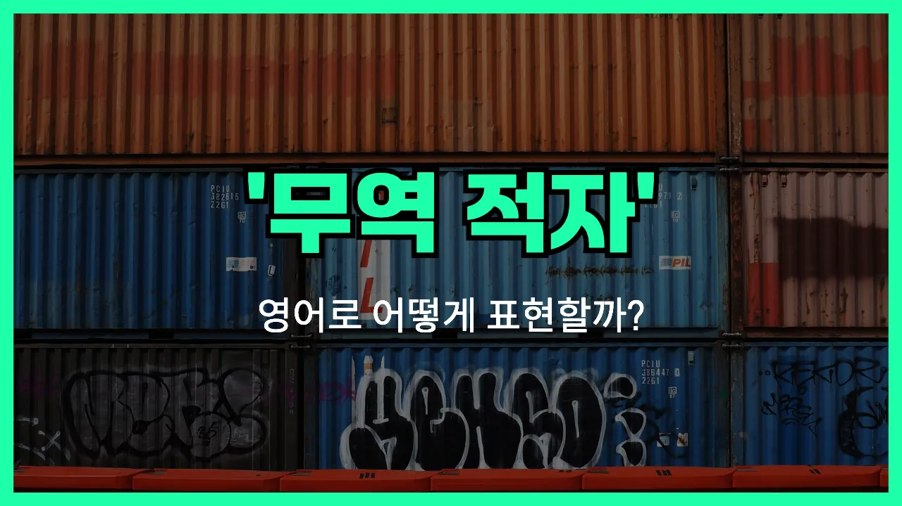

## 🌟 영어 표현 - trade deficit

안녕하세요 👋 오늘은 경제 뉴스에서 자주 볼 수 있는 표현, '**무역 적자**'의 영어 표현에 대해 알아보려고 해요. 바로 '**trade deficit**'이라는 단어인데요. 이 표현은 한 나라가 수출보다 수입을 더 많이 해서, 무역에서 손해를 보는 상황을 의미해요.

즉, **수입이 수출보다 많아서 무역수지에 적자가 발생하는 것**을 말할 때 'trade deficit'을 사용해요. 경제 기사나 뉴스에서 "한국의 무역 적자가 늘었다"와 같은 문장을 자주 볼 수 있죠!

이와 반대로, 수출이 수입보다 많아서 이익이 나는 경우에는 '[trade surplus](/blog/in-english/685.trade-surplus/)'라는 표현을 쓴답니다. 두 표현을 함께 알아두면 경제 관련 영어를 이해하는 데 큰 도움이 될 거예요.

## 📖 예문

1. "한국은 올해 무역 적자가 크게 늘었어요."

   "South Korea's trade deficit has increased significantly this year."

2. "정부는 무역 적자를 줄이기 위한 대책을 발표했어요."

   "The [government](/blog/in-english/608.government/) announced [measures](/blog/in-english/634.measure/) to reduce the trade deficit."

## 💬 연습해보기

<ul data-interactive-list>

  <li data-interactive-item>
    뉴스에서 무역 적자가 다시 커지고 있다고 하더라고요. 점점 큰 문제인 것 같아요.
    The <a href="/blog/in-english/536.news/">news</a> was talking about the growing trade deficit again. I guess it's becoming a big issue.
  </li>

  <li data-interactive-item>
    해외에서 너무 많은 제품을 수입해서 무역 적자가 나는 게 당연한 것 같아요.
    We <a href="/blog/in-english/680.import/">import</a> so many products overseas that it's <a href="/blog/in-english/079.no-wonder/">no wonder</a> we have a trade deficit.
  </li>

  <li data-interactive-item>
    정부는 무역 적자가 해마다 심해져서 걱정하고 있어요.
    The government is worried because the trade deficit keeps <a href="/blog/in-english/234.get-worse/">getting worse</a> every year.
  </li>

  <li data-interactive-item>
    수출이 빨리 늘지 않으면 무역 적자가 더 커질 수도 있겠어요.
    If our <a href="/blog/in-english/681.export/">exports</a> don't <a href="/blog/in-english/178.pick-up/">pick up</a> soon, the trade deficit might widen even more.
  </li>

  <li data-interactive-item>
    아빠가 무역 적자는 우리가 다른 나라에서 더 많이 사오고 판 것보다 적다는 뜻이라고 설명해주셨어요.
    My dad explained that a trade deficit means we buy more from other countries than we sell to them.
  </li>

  <li data-interactive-item>
    어떤 사람들은 큰 무역 적자가 경제에 안 좋다고 생각하는데, 다른 사람들은 확신이 없대요.
    Some people think a big trade deficit is bad for the <a href="/blog/in-english/637.economy/">economy</a>, but others aren't so sure.
  </li>

  <li data-interactive-item>
    지난달 무역 적자가 사상 최고치를 기록했다는 제목을 봤어요.
    I saw a headline about the trade deficit hitting a record high last month.
  </li>

  <li data-interactive-item>
    무역 적자가 크면 제조업 일자리에 영향이 갈 때도 있어요.
    Manufacturing jobs <a href="/blog/in-english/270.sometimes/">sometimes</a> get affected by a large trade deficit.
  </li>

  <li data-interactive-item>
    교수님이 무역 적자가 우리나라 돈 가치 변화로 이어질 수 있다고 말씀하셨어요.
    The professor mentioned that trade deficit can <a href="/blog/vocab-1/004.lead-to/">lead to</a> changes in the value of our currency.
  </li>

  <li data-interactive-item>
    무역 적자가 왜 중요한지 아직 완전히 이해하진 못했지만, 국제 무역과 관련된 거라는 건 알아요.
    I'm <a href="/blog/in-english/254.still/">still</a> not totally clear on why a trade deficit matters, but I know it has to do with international trade.
  </li>

</ul>

## 🤝 함께 알아두면 좋은 표현들

### trade surplus

'trade surplus'는 '무역 흑자'를 의미해요. 즉, 한 나라가 수출하는 금액이 수입하는 금액보다 많을 때 쓰는 표현이에요. 무역 적자(trade deficit)와는 반대되는 개념이에요.

- "Thanks to increased [exports](/blog/in-english/681.export/), the country reported a trade surplus this year."
- "수출이 늘어난 덕분에 올해는 무역 흑자를 기록했어요."

### current account deficit

'current account deficit'는 '경상수지 적자'를 뜻해요. 무역 적자와 비슷하지만, 상품뿐만 아니라 서비스, 투자 소득 등도 포함해서 전체적으로 해외로 나가는 돈이 들어오는 돈보다 많을 때 쓰는 표현이에요.

- "The nation is [worried about](/blog/in-english/209.worry-about/) its growing current account deficit."
- "그 나라는 점점 커지는 경상수지 적자 때문에 걱정하고 있어요."

### balance of trade

'balance of trade'는 '무역 수지'라는 뜻이에요. 한 나라의 수출과 수입의 차이를 나타내는 중립적인 표현으로, 무역 적자나 무역 흑자 모두를 포괄해서 쓸 수 있어요.

- "The government is closely monitoring the balance of trade to [ensure](/blog/in-english/356.ensure/) economic stability."
- "정부는 경제 안정을 위해 무역 수지를 면밀히 지켜보고 있어요."

---

오늘은 '무역 적자'라는 뜻을 가진 영어 표현 'trade deficit'에 대해 알아봤어요. 경제 뉴스나 기사에서 이 표현을 보면 이제 더 쉽게 이해할 수 있겠죠? 😊

오늘 배운 표현과 예문들을 꼭 소리 내서 여러 번 읽어보세요. 다음에도 더 유익한 영어 표현으로 찾아올게요! 감사합니다!
