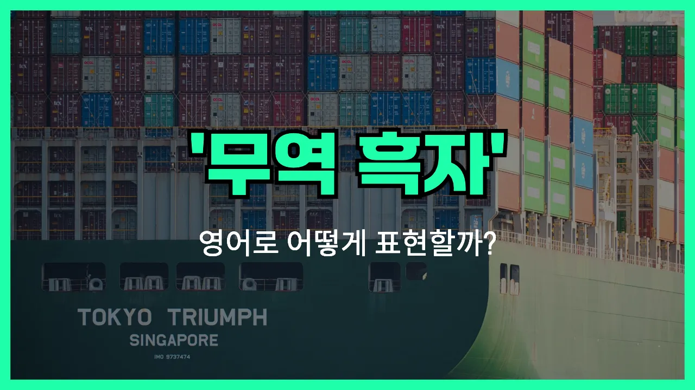

## 🌟 영어 표현 - trade surplus

안녕하세요 👋 오늘은 경제 뉴스에서 자주 볼 수 있는 표현인 '**무역 흑자**'의 영어 표현에 대해 알아보려고 해요.

'**무역 흑자**'는 영어로 '**trade surplus**'라고 해요. 여기서 'trade'는 '무역'을, 'surplus'는 '잉여' 또는 '초과'를 의미해요. 즉, 한 나라가 수출한 금액이 수입한 금액보다 많을 때, 그 차액을 '무역 흑자'라고 부르는 거예요!

이 표현은 국가 경제 상황을 설명할 때 자주 사용돼요. 예를 들어, 어떤 나라가 해외에 물건을 많이 팔아서 번 돈이, 외국에서 사온 물건에 쓴 돈보다 많을 때 "trade surplus"라는 말을 쓰는 거예요.

반대로, 수입이 수출보다 많아서 적자가 나는 경우에는 '[trade deficit](/blog/in-english/684.trade-deficit/)'이라는 표현을 사용해요. 오늘은 '흑자'에 집중해서 알아볼게요!

## 📖 예문

1. "한국은 지난해 무역 흑자를 기록했어요."

   "Korea recorded a trade surplus last year."

2. "무역 흑자가 경제 성장에 긍정적인 영향을 미쳤어요."

   "The trade surplus had a positive impact on [economic growth](/blog/in-english/651.economic-growth/)."

## 💬 연습해보기

<ul data-interactive-list>

  <li data-interactive-item>
    뉴스에서 지난달에 우리나라가 무역 흑자를 엄청 냈대요. 그러니까 경제에 좋은 소식인 거 같아요.
    The <a href="/blog/in-english/536.news/">news</a> said the country posted a huge trade surplus last month. That's got to be good for their <a href="/blog/in-english/637.economy/">economy</a>.
  </li>

  <li data-interactive-item>
    이번 분기에도 일본이 또 무역 흑자 나왔다고 들었어요? 수출이 진짜 잘나가는 거 같아요.
    Did you hear that Japan had a trade surplus again this quarter? Their <a href="/blog/in-english/681.export/">exports</a> are just killing it.
  </li>

  <li data-interactive-item>
    미국이 무역 흑자를 원하면 수입보다 수출을 더 많이 해야 해요.
    If the U.S. wants a trade surplus, we need to <a href="/blog/in-english/681.export/">export</a> more than we <a href="/blog/in-english/680.import/">import</a>.
  </li>

  <li data-interactive-item>
    중국이 미국과 무역 흑자를 몇 년째 유지하고 있는데, 좀 민감한 문제죠.
    China has maintained a trade surplus with the U.S. for years. It's kind of a <a href="/blog/in-english/131.touchy/">touchy</a> topic.
  </li>

  <li data-interactive-item>
    독일 무역 흑자가 세계에서 손꼽힐 정도라고 어디서 읽었어요. 그래서 경제가 튼튼한 거 같아요.
    I <a href="/blog/in-english/436.read/">read</a> somewhere that Germany's trade surplus is one of the highest in the world. <a href="/blog/in-english/079.no-wonder/">No wonder</a> their economy is strong.
  </li>

  <li data-interactive-item>
    자국 기업이 국가 무역 흑자에 기여해서 다들 축하했대요.
    They were celebrating because their company contributed to the national trade surplus.
  </li>

  <li data-interactive-item>
    무역 흑자가 많으면 일자리가 더 생긴다면서요? 제가 들은 얘기예요.
    A trade surplus can mean more jobs at home, right? That's what I heard.
  </li>

  <li data-interactive-item>
    일부 정치인들은 무역 적자를 줄이고 무역 흑자를 목표로 해야 한다고 주장해요.
    Some politicians <a href="/blog/in-english/132.argue/">argue</a> that we need to reduce our <a href="/blog/in-english/684.trade-deficit/">trade deficit</a> and aim for a trade surplus.
  </li>

  <li data-interactive-item>
    무역 흑자가 있으면 보통 그 나라 화폐가 강해지는 거 맞죠?
    When a country has a trade surplus, doesn't that usually strengthen their currency?
  </li>

  <li data-interactive-item>
    올해 무역 흑자가 좀 줄긴 했는데 그래도 아직 플러스예요.
    The trade surplus went down a bit this year, but it's <a href="/blog/in-english/254.still/">still</a> in the positive.
  </li>

</ul>

## 🤝 함께 알아두면 좋은 표현들

### trade deficit

'trade deficit'는 '무역 적자'를 의미해요. 즉, 한 나라가 수출보다 수입을 더 많이 해서 무역에서 손해를 보는 상황을 말해요. 무역 흑자와는 반대되는 개념이에요.

- "The country has been struggling with a trade deficit for the past five years."
- "그 나라는 지난 5년 동안 무역 적자 때문에 고생하고 있어요."

### positive balance of trade

'positive balance of trade'는 '무역 수지 흑자'와 같은 뜻으로, 수출이 수입보다 많아서 이익을 보는 상황을 말해요. 'trade surplus'와 거의 같은 의미로 쓰여요.

- "A positive balance of trade can strengthen a country's currency."
- "무역 수지 흑자는 한 나라의 통화를 강하게 만들어줄 수 있어요."

### export-driven economy

'export-driven economy'는 '수출 주도형 경제'라는 뜻이에요. 한 나라의 경제가 수출에 크게 의존해서 성장하는 구조를 말해요. 무역 흑자가 자주 발생하는 나라에서 많이 쓰는 표현이에요.

- "South Korea is known for being an export-driven economy."
- "한국은 수출 주도형 경제로 잘 알려져 있어요."

---

오늘은 '**무역 흑자**'라는 뜻을 가진 영어 표현 '**trade surplus**'에 대해 알아봤어요. 경제 기사나 뉴스에서 이 표현을 자주 볼 수 있으니, 오늘 배운 내용을 꼭 기억해 두세요! 😊

오늘 배운 표현과 예문들을 꼭 최소 3번씩 소리 내서 읽어보세요. 다음에도 더 재미있고 유익한 영어 표현으로 찾아올게요! 감사합니다!
