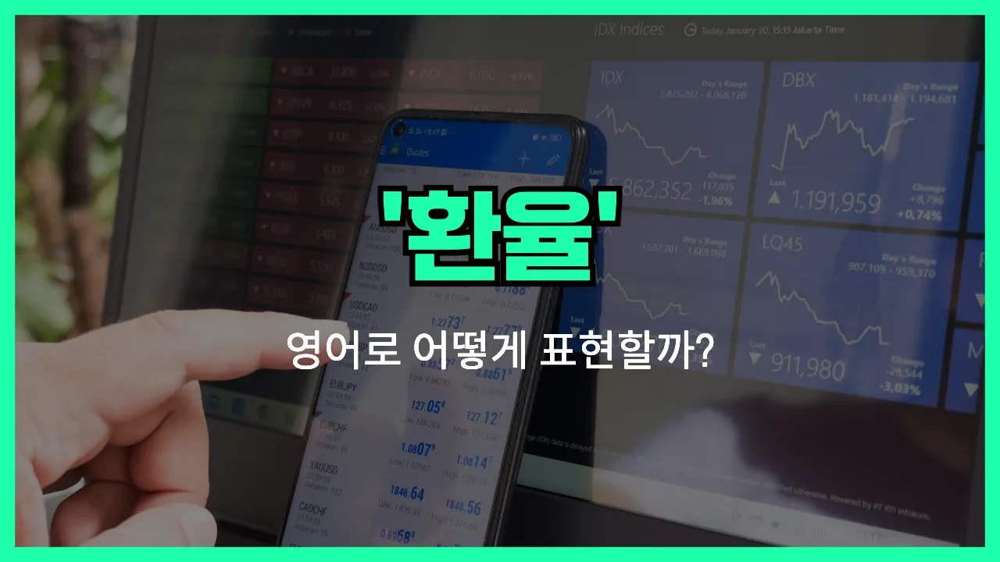

## 🌟 영어 표현 - exchange rate

안녕하세요 👋 오늘은 우리가 해외여행이나 해외송금, 또는 경제 뉴스를 볼 때 자주 접하는 단어, 바로 '**환율**'의 영어 표현에 대해 알아보려고 해요.

'**exchange rate**'는 한 나라의 돈과 다른 나라의 돈이 교환될 때 적용되는 비율을 의미해요. 쉽게 말해, 1달러가 몇 원인지, 1유로가 몇 엔인지 등 **서로 다른 통화 간의 가치**를 비교할 때 쓰는 단어예요!

이 표현은 은행, 공항, 뉴스 등 다양한 상황에서 자연스럽게 사용돼요. 예를 들어, 해외여행을 준비할 때 "오늘 환율이 어떻게 되지?"라고 궁금할 때가 있죠? 이럴 때 "What is the exchange rate today?"라고 물어볼 수 있어요.

또한, 환전소에서 돈을 바꿀 때도 "I want to check the exchange rate for US dollars."라고 말하면 돼요.

## 📖 예문

1. "오늘 달러 환율이 올랐어요."

   "The exchange rate for the dollar went up today."

2. "환율이 자주 변동돼요."

   "The exchange rate changes frequently."

## 💬 연습해보기

<ul data-interactive-list>

  <li data-interactive-item>
    해외로 돈 보낼 때 환율 꼭 확인해요. 거의 매일 바뀌니까 계속 주시해야 해요.
    I checked the exchange rate before I <a href="/blog/in-english/292.send/">sent</a> money overseas. It changes almost every day, so you have to <a href="/blog/in-english/225.keep-an-eye-on/">keep an eye on</a> it.
  </li>

  <li data-interactive-item>
    오늘 미국 달러에서 유로 환율이 어떻게 돼요? 여행 전에 꼭 알아야 해서요.
    What's the exchange rate for US dollars to euros today? I need to know before my trip.
  </li>

  <li data-interactive-item>
    환율이 너무 높아서 요즘 해외에서 물건 사는 게 꽤 비싸요.
    With the exchange rate being so high, it's <a href="/blog/in-english/317.expensive/">expensive</a> to buy things from other countries <a href="/blog/in-english/525.right-now/">right now</a>.
  </li>

  <li data-interactive-item>
    근처에서 환율 제일 좋은 곳 아세요?
    Do you know where I can get the best exchange rate around here?
  </li>

  <li data-interactive-item>
    예전에 여행 갔을 때 환율 신경 안 써서 돈 좀 손해 봤어요.
    Last time I traveled, I <a href="/blog/in-english/457.lose/">lost</a> money because I didn't <a href="/blog/소금-양에-신경써야해-영어표현/">pay attention to</a> the exchange rate.
  </li>

  <li data-interactive-item>
    하룻밤 사이에 환율이 떨어졌네요. 어제 환전했으면 좋았을 텐데.
    The exchange rate <a href="/blog/in-english/361.drop/">dropped</a> <a href="/blog/in-english/134.overnight/">overnight</a>. <a href="/blog/in-english/118.i-wish/">I wish</a> I'd exchanged my currency yesterday.
  </li>

  <li data-interactive-item>
    저는 보통 환율이 좋아질 때까지 기다렸다가 큰 돈 쓸 때 환전해요.
    I usually <a href="/blog/in-english/377.wait-for/">wait for</a> the exchange rate to <a href="/blog/in-english/394.improve/">improve</a> before making big purchases online.
  </li>

  <li data-interactive-item>
    뉴스에서 다음 주에 환율이 오를 거래요.
    The <a href="/blog/in-english/536.news/">news</a> said the exchange rate is expected <a href="/blog/in-english/450.to-go/">to go</a> up next week.
  </li>

  <li data-interactive-item>
    제 친구가 은행에서 일해서 여행 갈 때 항상 좋은 환율로 환전해요.
    My friend works at a bank, so she always gets a good exchange rate when she travels.
  </li>

  <li data-interactive-item>
    일본 가면 공항 떠나기 전에 환율 꼭 확인하는 게 좋아요.
    If you're going to Japan, you should check the exchange rate before you <a href="/blog/in-english/402.leave/">leave</a> the <a href="/blog/in-english/549.airport/">airport</a>.
  </li>

</ul>

## 🤝 함께 알아두면 좋은 표현들

### currency conversion

'currency conversion'은 "통화 환전" 또는 "환전 과정"을 의미해요. 한 나라의 돈을 다른 나라의 돈으로 바꾸는 행위 자체를 강조할 때 사용해요. 여행이나 해외 결제 시 자주 쓰이는 표현이에요.

- "Before traveling to Japan, I checked the currency conversion rates to see how much yen I would get for my dollars."
- "일본에 가기 전에 달러를 엔화로 바꿀 때 환전율이 어떤지 확인해봤어요."

### fixed exchange rate

'fixed exchange rate'는 "고정 환율"을 의미해요. 환율이 시장에 따라 변동하지 않고 정부나 중앙은행에 의해 일정하게 유지되는 경우를 말해요. 변동 환율제의 반대 개념이에요.

- "Some countries [prefer](/blog/in-english/191.prefer/) a fixed exchange rate to keep their currency stable."
- "어떤 나라들은 자국 통화를 안정적으로 유지하기 위해 고정 환율제를 선호해요."

### exchange rate fluctuation

'exchange rate fluctuation'은 "환율 변동"을 의미해요. 환율이 시장 상황에 따라 오르내리는 현상을 나타내는 표현이에요. 주로 경제 뉴스나 금융 관련 대화에서 자주 쓰여요.

- "The recent exchange rate fluctuation has [made it](/blog/in-english/244.make-it/) more expensive to [import](/blog/in-english/680.import/) [goods](/blog/in-english/644.goods/)."
- "최근 환율 변동 때문에 수입품 가격이 더 비싸졌어요."

---

오늘은 '**환율**'이라는 뜻을 가진 영어 표현 '**exchange rate**'에 대해 알아봤어요. 해외여행이나 국제 거래를 할 때 꼭 필요한 표현이니 기억해두면 정말 유용할 거예요 😊

오늘 배운 표현과 예문들을 꼭 최소 3번씩 소리 내서 읽어보세요. 다음에도 더 재미있고 유익한 영어 표현으로 찾아올게요! 감사합니다!

