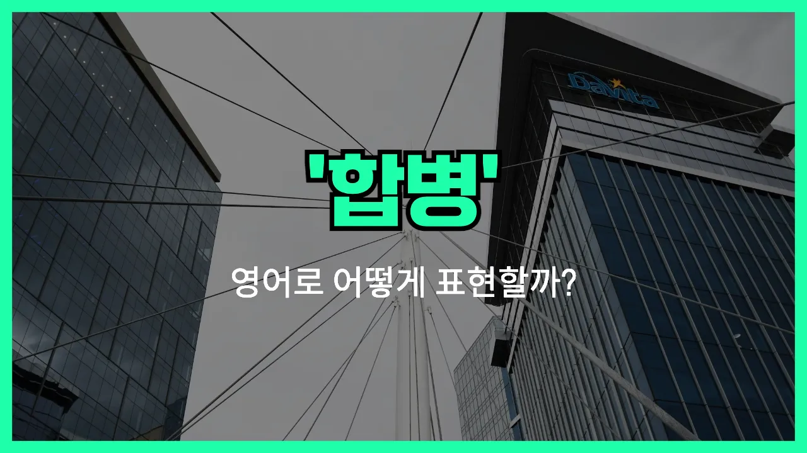

## 🌟 영어 표현 - merger

안녕하세요 👋 오늘은 회사나 조직에서 자주 듣는 단어인 '**합병**'의 영어 표현 '**merger**'에 대해 알아보려고 해요.

'**merger**'는 두 개 이상의 회사나 조직이 하나로 합쳐지는 것을 의미해요. 즉, **서로 다른 기업이나 단체가 힘을 합쳐 하나의 새로운 조직이 되는 상황**을 표현할 때 사용해요!

이 단어는 주로 비즈니스, 경제, 금융 분야에서 많이 쓰여요. 예를 들어, 두 회사가 경쟁력을 높이기 위해 하나로 합쳐질 때 "merger"라는 단어를 사용해요.

예를 들어, "The merger between Company A and Company B was completed last month."라고 하면 "A사와 B사의 합병이 지난달에 완료됐어요."라는 뜻이에요.

또한, 'merger'는 명사로만 사용되고, 동사로는 'merge'를 사용해요. 상황에 따라 적절하게 활용해 보세요!

## 📖 예문

1. "두 은행이 합병을 발표했어요."

   "The two banks announced a merger."

2. "합병 후에 회사 규모가 두 배로 커졌어요."

   "After the merger, the company doubled in size."

## 💬 연습해보기

<ul data-interactive-list>

  <li data-interactive-item>
    오늘 사무실에선 큰 합병 소식이 완전 화제였어요. 다들 그 이야기만 했거든요.
    The <a href="/blog/in-english/536.news/">news</a> about the big merger was all over the office today. Everybody was talking about it.
  </li>

  <li data-interactive-item>
    두 IT 회사의 합병 얘기 들었어요? 업계에 큰 변화가 올 거래요.
    Did you hear about the merger between those two tech companies? It's supposed to <a href="/blog/in-english/460.shake/">shake</a> up the industry.
  </li>

  <li data-interactive-item>
    작년 합병 이후에 회사 운영 방식이 완전 달라졌어요. 어떤 사람들은 새 역할도 맡게 됐고요.
    The merger last year really changed how the company operates. Some people got new roles.
  </li>

  <li data-interactive-item>
    솔직히 우리 부서에 합병이 어떤 영향 줄지 아직 잘 모르겠어요.
    I'm <a href="/blog/in-english/254.still/">still</a> not sure what the merger means for our department, to be honest.
  </li>

  <li data-interactive-item>
    합병 후에 브랜드 이미지가 많이 바뀐 거 같아요. 새 로고는 바로 눈에 띄더라고요.
    After the merger, a lot of the branding started to look different. I <a href="/blog/in-english/061.notice/">noticed</a> the new logo right away.
  </li>

  <li data-interactive-item>
    내 친구는 합병 후에 일자리를 잃었지만, 더 좋은 자리 찾아서 다행이에요.
    My friend <a href="/blog/in-english/457.lose/">lost</a> her job after the merger, but she found a better position somewhere else.
  </li>

  <li data-interactive-item>
    합병이 복지에 어떤 영향 줄지 좀 지켜봐야 할 것 같아요. 인사팀에서 곧 알려줄 거래요.
    Let's wait and see how the merger affects our benefits. HR said they'll let us know soon.
  </li>

  <li data-interactive-item>
    두 회사가 합병 조건에 서로 동의해야 정식으로 진행될 수 있었어요.
    Both companies had to <a href="/blog/in-english/342.agree/">agree</a> on the merger terms before <a href="/blog/in-english/244.make-it/">making it</a> official.
  </li>

  <li data-interactive-item>
    사람들이 합병 때문에 감원 되는 거 아니냐고 많이 걱정하는데 아직 확실한 건 없대요.
    People keep asking if the merger will <a href="/blog/vocab-1/004.lead-to/">lead to</a> layoffs, but nobody knows for sure yet.
  </li>

  <li data-interactive-item>
    합병이 좋은 점도 많지만 직원들한텐 스트레스가 될 수도 있죠.
    Mergers can be a good thing, but they can also be stressful for employees.
  </li>

</ul>

## 🤝 함께 알아두면 좋은 표현들

### acquisition

'acquisition'은 "인수"라는 뜻으로, 한 회사가 다른 회사를 사들이는 것을 말해요. 'merger'가 두 회사가 합쳐져서 하나가 되는 것이라면, 'acquisition'은 한 회사가 다른 회사를 완전히 소유하게 되는 점이 달라요.

- "The tech giant announced the acquisition of a promising startup last week."
- "그 IT 대기업이 지난주에 유망한 스타트업을 인수했다고 발표했어요."

### split-up

'split-up'은 "분할" 또는 "분사"라는 뜻이에요. 회사가 여러 개의 독립된 회사로 나뉘는 것을 의미해서, 'merger'와는 반대되는 개념이에요. 보통 효율성이나 전략적인 이유로 회사를 쪼갤 때 사용해요.

- "After years of operating as one company, they decided on a split-up to [focus on](/blog/in-english/186.focus-on/) different [markets](/blog/in-english/641.market/)."
- "수년간 한 회사로 운영해오다가, 서로 다른 시장에 집중하기 위해 분할하기로 결정했어요."

### joint venture

'joint venture'는 "합작 투자"라는 뜻이에요. 두 회사가 완전히 합쳐지는 'merger'와 달리, 각 회사가 독립성을 유지하면서 특정 사업을 위해 함께 새로운 회사를 만드는 거예요.

- "The two car manufacturers formed a joint venture to develop electric vehicles."
- "그 두 자동차 회사가 전기차 개발을 위해 합작 회사를 설립했어요."

---

오늘은 '**합병**'이라는 뜻을 가진 영어 표현 '**merger**'에 대해 알아봤어요. 앞으로 뉴스나 비즈니스 기사에서 이 단어를 보면 쉽게 이해할 수 있겠죠? 😊

오늘 배운 표현과 예문들을 꼭 최소 3번씩 소리 내서 읽어보세요. 다음에도 더 재미있고 유익한 영어 표현으로 찾아올게요! 감사합니다!~요

