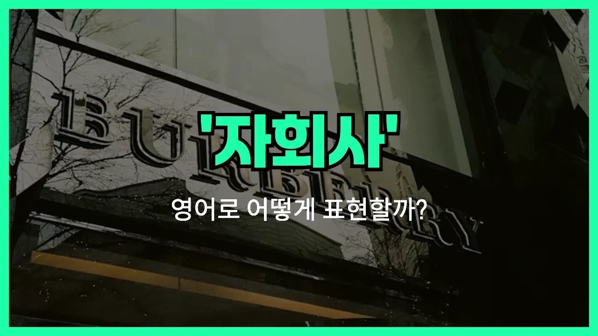

## 🌟 영어 표현 - subsidiary

안녕하세요 👋 오늘은 회사와 관련된 영어 표현 중에서 '**subsidiary**'에 대해 알아보려고 해요. 'subsidiary'는 **자회사**라는 뜻이에요. 즉, 어떤 회사가 다른 회사(모회사)에 의해 소유되거나 지배되는 회사를 말해요.

예를 들어, 큰 기업이 여러 개의 회사를 소유하고 있을 때, 그 중에서 모회사가 지분을 많이 가지고 있는 회사를 'subsidiary'라고 부를 수 있어요. 우리말로는 '자회사', '계열사', 또는 '소유회사'라고도 해요.

이 표현은 비즈니스, 경제 기사, 회사 소개 등에서 자주 볼 수 있어요. 예를 들어, "삼성전자는 삼성그룹의 자회사입니다."와 같은 문장에서 사용돼요.

## 📖 예문

1. "그 회사는 여러 개의 자회사를 가지고 있어요."

   "The company has several subsidiaries."

2. "이 브랜드는 대기업의 자회사예요."

   "This brand is a subsidiary of a large corporation."

## 💬 연습해보기

<ul data-interactive-list>

  <li data-interactive-item>
    내 친구가 번화가에 있는 큰 IT 회사의 자회사에서 막 일을 시작했어요. 새 직무에 완전 신나하더라고요.
    My friend just started working for a subsidiary of a big tech company downtown. He's pretty excited about the new role.
  </li>

  <li data-interactive-item>
    인스타그램이 이제 메타의 자회사라는 거 알고 있었어요? 저도 방금 알았어요.
    Did you know Instagram is actually a subsidiary of Meta now? I just found that out.
  </li>

  <li data-interactive-item>
    모기업이 작년에 작은 자회사 하나를 폐쇄하기로 했대요. 직원들한테 진짜 힘든 일이었을 거예요.
    The parent company <a href="/blog/in-english/062.decide-to/">decided to</a> shut down one of its smaller subsidiaries last year. That must have been <a href="/blog/in-english/183.tough/">tough</a> for the employees.
  </li>

  <li data-interactive-item>
    우리 사무실이 원래는 독립적이었는데 지금은 더 큰 기업의 자회사가 됐어요. 그때 이후로 진짜 많이 변했어요.
    Our office <a href="/blog/in-english/143.used-to/">used to</a> be independent, but now we're a subsidiary of a larger corporation. Things have really changed since then.
  </li>

  <li data-interactive-item>
    뉴스에서 들었는데 큰 자동차 제조사가 해외에 새 자회사를 인수했대요. 진짜 확장하고 있네요.
    I saw on the <a href="/blog/in-english/536.news/">news</a> that a major car manufacturer acquired a new subsidiary overseas. They're really expanding.
  </li>

  <li data-interactive-item>
    텍사스에 있는 자회사로 이동하게 되면서 이사했어요. 솔직히 아직 뜨거운 날씨에 적응 중이에요.
    They moved me to a subsidiary in Texas, so I had to relocate. <a href="/blog/in-english/336.honestly/">Honestly</a>, I'm <a href="/blog/in-english/254.still/">still</a> <a href="/blog/vocab-1/045.get-used-to/">getting used to</a> the heat.
  </li>

  <li data-interactive-item>
    이 브랜드가 자체 회사인지 아니면 자회사인지 헷갈려요.
    Is this brand its own company, or just a subsidiary? I always get confused.
  </li>

  <li data-interactive-item>
    아빠는 모기업에서 일하고, 이모는 자회사 중 한 곳에서 일하세요. 좀 웃긴 상황이에요.
    My dad works for the parent company, but my aunt works at one of the subsidiaries. It's kind of funny.
  </li>

  <li data-interactive-item>
    자회사들이 해외 업무 대부분을 담당해요. 그래서 모기업은 미국 시장에 집중할 수 있죠.
    The subsidiaries handle most of the overseas operations. That way the parent company can <a href="/blog/in-english/186.focus-on/">focus on</a> the U.S. <a href="/blog/in-english/641.market/">market</a>.
  </li>

  <li data-interactive-item>
    그 모든 브랜드가 사실 같은 회사의 자회사라는 걸 알고 놀랐어요. 그래서 비슷하게 보였나 봐요.
    I was surprised to <a href="/blog/in-english/245.learn/">learn</a> that all those brands are actually subsidiaries under the same company. <a href="/blog/in-english/079.no-wonder/">No wonder</a> they look so similar.
  </li>

</ul>

## 🤝 함께 알아두면 좋은 표현들

### parent company

'parent company'는 '모회사'를 의미해요. 자회사를 소유하거나 지배하는 상위 기업을 가리키는 말로, 여러 자회사를 관리하거나 통제하는 역할을 해요.

- "The parent company decided to merge two of its subsidiaries to [improve](/blog/in-english/394.improve/) efficiency."
- "모회사가 효율성을 높이기 위해 두 자회사를 합병하기로 결정했어요."

### affiliate

'affiliate'는 '계열사' 또는 '제휴사'라는 뜻이에요. 자회사와 비슷하지만, 반드시 지배적인 소유 구조가 아니어도 되고, 느슨하게 연결된 회사 관계를 나타낼 때도 써요.

- "Our company has several affiliates in different countries to expand our global reach."
- "우리 회사는 글로벌 진출을 위해 여러 나라에 계열사를 두고 있어요."

### independent company

'independent company'는 '독립 회사'라는 뜻이에요. 자회사와 반대로, 다른 회사의 소유나 지배를 받지 않고 독자적으로 운영되는 회사를 말해요.

- "After the buyout, the business became an independent company and started making its own decisions."
- "인수 이후에 그 회사는 독립 회사가 돼서 자체적으로 의사결정을 내리기 시작했어요."

---

오늘은 '자회사'라는 뜻을 가진 영어 표현 '**subsidiary**'에 대해 알아봤어요. 회사 구조나 비즈니스 관련 대화를 할 때 이 단어를 떠올리면 도움이 될 거예요 😊

오늘 배운 표현과 예문들을 꼭 최소 3번씩 소리 내서 읽어보세요. 다음에도 더 재미있고 유익한 영어 표현으로 찾아올게요! 감사합니다!~요
