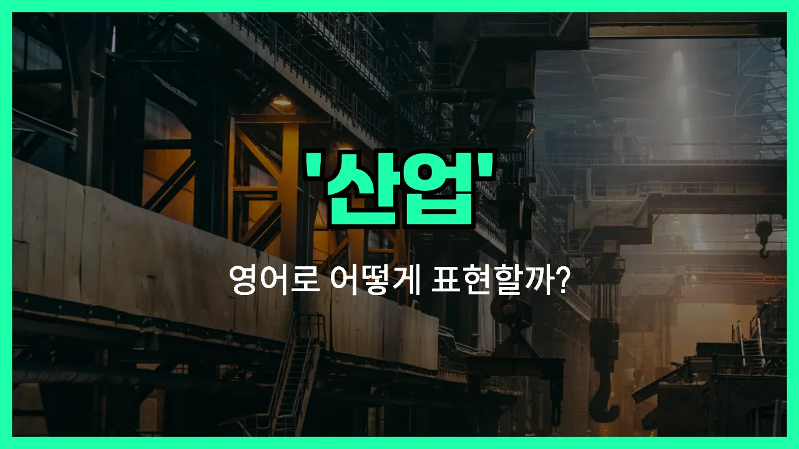

## 🌟 영어 표현 - industry

안녕하세요 👋 오늘은 우리가 자주 듣는 단어인 '**산업**'을 영어로 어떻게 표현하는지 알아보려고 해요.

'**industry**'는 바로 '산업'이라는 뜻이에요. 이 단어는 **특정 상품이나 서비스를 생산하는 경제 활동의 한 분야**를 말할 때 사용돼요. 예를 들어, 자동차 산업, IT 산업, 패션 산업 등 다양한 분야에서 쓸 수 있어요.

또한, 'industry'는 '공업'이나 '업계'라는 의미로도 자주 쓰여요. 그래서 회사나 직업을 이야기할 때도 자연스럽게 활용할 수 있답니다!

## 📖 예문

1. "자동차 산업은 빠르게 발전하고 있어요."

   "The automobile industry is developing rapidly."

2. "IT 산업에서 일하고 있어요."

   "I work in the IT industry."

3. "패션 산업은 경쟁이 치열해요."

   "The fashion industry is very competitive."

## 💬 연습해보기

<ul data-interactive-list>

  <li data-interactive-item>
    요즘 IT 업계가 너무 빨리 변해서 따라가기 힘들어요.
    The tech industry is changing so fast <a href="/blog/in-english/417.these-days/">these days</a>. It can be <a href="/blog/in-english/183.tough/">tough</a> to keep up.
  </li>

  <li data-interactive-item>
    제 동생이 요즘 패션 업계에서 일하기 시작했는데, 완전 좋아해요.
    My sister just started working in the fashion industry. She loves it <a href="/blog/in-english/283.so-far/">so far</a>.
  </li>

  <li data-interactive-item>
    음식 업계가 더 지속 가능하게 변하려고 노력 중이라는 기사를 읽었어요.
    I <a href="/blog/in-english/436.read/">read</a> an article about how the food industry is <a href="/blog/in-english/117.try-to/">trying to</a> be more sustainable.
  </li>

  <li data-interactive-item>
    이 업계에선 특별한 교육이 필요한 일들이 많아서 아마 강의를 들어야 할 거예요.
    A lot of jobs in this industry <a href="/blog/in-english/155.require/">require</a> special training. You'll <a href="/blog/in-english/281.probably/">probably</a> have to take a course.
  </li>

  <li data-interactive-item>
    음악 업계는 경쟁이 엄청 심해서 눈에 띄어야 성공할 수 있어요.
    The music industry can be really competitive. You have to stand out to <a href="/blog/in-english/244.make-it/">make it</a> big.
  </li>

  <li data-interactive-item>
    그 친구는 대학 졸업 후 영화 업계에 들어가서 감독이 되고 싶대요.
    After college, he wants to get into the film industry and become a director.
  </li>

  <li data-interactive-item>
    자동차 업계가 요즘 큰 변화를 겪고 있어요. 전기차가 정말 많아졌거든요.
    The auto industry is dealing with a lot of disruptions <a href="/blog/in-english/525.right-now/">right now</a>. Electric cars are everywhere.
  </li>

  <li data-interactive-item>
    게임 업계에서 일하는 사람 아세요? 멋진 직업일 것 같아요.
    Do you know anyone who works in the gaming industry? I think that would be such a cool job.
  </li>

  <li data-interactive-item>
    그녀가 경력을 바꿔 여행업계에서 보건의료업계로 옮겼어요.
    She switched careers and moved from the travel industry to healthcare.
  </li>

  <li data-interactive-item>
    이 업계는 특히 새로운 기술을 배우려는 사람에게 기회가 많아요.
    This industry has a lot of opportunities, especially if you're willing to <a href="/blog/in-english/245.learn/">learn</a> new skills.
  </li>

</ul>

## 🤝 함께 알아두면 좋은 표현들

### sector

'sector'는 '산업 분야' 또는 '부문'이라는 뜻으로, 경제나 사회에서 특정한 활동이나 역할을 하는 부분을 가리켜요. 'industry'와 비슷하게 사용되지만, 좀 더 세분화된 영역이나 카테고리를 강조할 때 자주 써요.

- "The technology sector is growing rapidly compared to other industries."
- "기술 분야가 다른 산업들에 비해 빠르게 성장하고 있어요."

### manufacturing

'manufacturing'은 '제조업'이라는 뜻으로, 원자재를 가공해서 제품을 만들어내는 산업을 말해요. 'industry' 중에서도 특히 물건을 만드는 분야를 구체적으로 지칭할 때 사용해요.

- "Manufacturing has been a key part of the country's economic development."
- "제조업이 그 나라의 경제 발전에 중요한 역할을 해왔어요."

### agriculture

'agriculture'는 '농업'이라는 뜻으로, 'industry'와는 반대되는 개념으로 쓰일 때가 많아요. 산업화 이전의 경제 구조나, 자연을 기반으로 한 생산 활동을 강조할 때 사용해요.

- "Many people in rural areas [still](/blog/in-english/254.still/) depend on agriculture for their livelihood."
- "시골 지역에서는 아직도 많은 사람들이 농업에 의존해서 살아가고 있어요."

---

오늘은 '산업'이라는 뜻을 가진 영어 표현 '**industry**'에 대해 알아봤어요. 다양한 업계나 분야를 이야기할 때 이 단어를 떠올리면 좋겠어요 😊

오늘 배운 표현과 예문들을 꼭 소리 내서 여러 번 읽어보세요. 다음에도 더 유익한 영어 표현으로 찾아올게요! 감사합니다!

