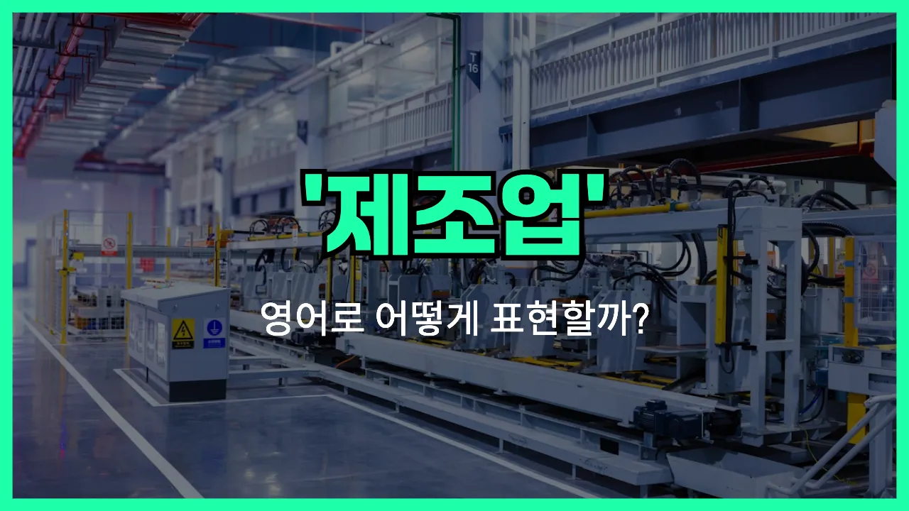

## 🌟 영어 표현 - manufacturing

안녕하세요 👋 오늘은 '제조', '생산'이라는 뜻을 가진 영어 표현을 소개해드릴게요. 바로 '**manufacturing**'이에요.

'**manufacturing**'은 원자재나 부품을 사용해서 새로운 제품을 만들어내는 과정을 의미해요. 즉, 공장에서 물건을 만들거나, 대량으로 생산하는 상황에서 자주 쓰이는 단어예요!

이 단어는 자동차, 전자제품, 의류 등 다양한 산업 분야에서 널리 사용돼요. 예를 들어, 자동차를 만드는 공장이나 휴대폰을 조립하는 곳 모두 'manufacturing'에 해당해요.

또한, 'manufacturing'은 명사로 '제조업' 또는 '제조 과정'을 뜻하고, 동사형은 'manufacture'로 '제조하다'라는 의미로 쓸 수 있어요. 상황에 따라 적절하게 활용해 보세요~

## 📖 예문

1. "한국은 제조업이 매우 발달한 나라예요."

   "Korea has a highly developed manufacturing [industry](/blog/in-english/693.industry/)."

2. "이 회사는 자동차 부품을 제조하고 있어요."

   "This company is manufacturing car parts."

## 💬 연습해보기

<ul data-interactive-list>

  <li data-interactive-item>
    우리 삼촌은 제조업에서 일해요. 거의 20년째 같은 공장에서 근무 중이시거든요.
    My uncle works in manufacturing. He's been with the same factory for almost twenty years.
  </li>

  <li data-interactive-item>
    이 동네 일자리 대부분이 제조업에 달려 있어요. 공장들이 문 닫으면 지역 사회가 진짜 힘들어질 수도 있어요.
    A lot of jobs in this town depend on the manufacturing industry. If the factories close, it could really hurt the community.
  </li>

  <li data-interactive-item>
    그 친구는 기계공학 전공했는데, 제조업 쪽으로 가고 싶어서예요.
    She majored in mechanical engineering because she wants <a href="/blog/in-english/450.to-go/">to go</a> into manufacturing.
  </li>

  <li data-interactive-item>
    요즘 제조업은 새로운 기술이랑 로봇 덕분에 엄청 빠르게 변하고 있어요.
    Manufacturing is changing so fast <a href="/blog/in-english/525.right-now/">right now</a> with all these new technologies and robots.
  </li>

  <li data-interactive-item>
    아빠가 그러시더라고요, 요즘 제조업은 예전이랑 달라서 컴퓨터가 훨씬 많이 쓰인대요.
    My dad says manufacturing today isn't like it <a href="/blog/in-english/143.used-to/">used to</a> be. There's a lot more computers <a href="/blog/in-english/274.involve/">involved</a> now.
  </li>

  <li data-interactive-item>
    도시 근처에 새 제조 공장이 생긴대요, 혹시 들었어요?
    Did you hear they're opening a new manufacturing plant just outside the city?
  </li>

  <li data-interactive-item>
    코로나19 터졌을 때 제조업체들이 한동안 생산을 멈춰야 했대요.
    When COVID-19 hit, a bunch of manufacturing companies had to pause production for a while.
  </li>

  <li data-interactive-item>
    그분은 여름방학 때 자동차 부품 조립하는 제조 라인에서 아르바이트했어요.
    He got a summer job on the manufacturing line putting <a href="/blog/in-english/374.together/">together</a> car parts.
  </li>

  <li data-interactive-item>
    교수님이 제조업이 공급망 전체에 어떤 영향을 끼치는지 설명해 주셨어요.
    The professor explained how manufacturing affects the whole <a href="/blog/in-english/638.supply/">supply</a> chain.
  </li>

  <li data-interactive-item>
    안정적인 일자리 찾는다면, 아직 몇몇 지역에서 제조업이 괜찮은 선택지예요.
    If you're <a href="/blog/in-english/173.look-for/">looking for</a> stable work, manufacturing is <a href="/blog/in-english/254.still/">still</a> a good option in some areas.
  </li>

</ul>

## 🤝 함께 알아두면 좋은 표현들

### production

'production'은 '생산' 또는 '제조'라는 뜻으로, 제조업과 비슷하게 물건이나 제품을 만들어내는 과정을 의미해요. 하지만 'manufacturing'이 공장이나 대규모 설비에서의 생산을 강조한다면, 'production'은 좀 더 넓은 의미로 쓰여요.

- "The company increased its production to meet the growing [demand](/blog/in-english/639.demand/)."
- "회사가 늘어나는 수요를 맞추기 위해 생산량을 늘렸어요."

### assembly line

'assembly line'은 '조립 라인'이라는 뜻으로, 제조업에서 제품을 효율적으로 만들기 위해 각 공정이 순서대로 진행되는 생산 방식을 말해요. 주로 자동차나 전자제품 등 대량 생산에 많이 사용돼요.

- "[Working on](/blog/in-english/370.work-on/) the assembly line can be repetitive, but it's [essential](/blog/in-english/446.essential/) for mass production."
- "조립 라인에서 일하는 건 반복적일 수 있지만, 대량 생산에는 꼭 필요해요."

### service industry

'service industry'는 '서비스업'을 의미하며, 제조업과는 반대되는 개념이에요. 물건을 만드는 대신, 사람들에게 서비스를 제공하는 업종(예: 금융, 교육, 의료 등)을 말해요.

- "Unlike the manufacturing sector, the service industry [focuses on](/blog/in-english/186.focus-on/) providing intangible products to customers."
- "제조업과 달리, 서비스업은 고객에게 무형의 상품을 제공하는 데 집중해요."

---

오늘은 '제조', '생산'이라는 뜻을 가진 영어 표현 '**manufacturing**'에 대해 알아봤어요. 공장이나 생산과 관련된 이야기를 할 때 이 단어를 떠올리면 좋겠어요 😊

오늘 배운 표현과 예문들을 꼭 최소 3번씩 소리 내서 읽어보세요. 다음에도 더 재미있고 유익한 영어 표현으로 찾아올게요! 감사합니다!
