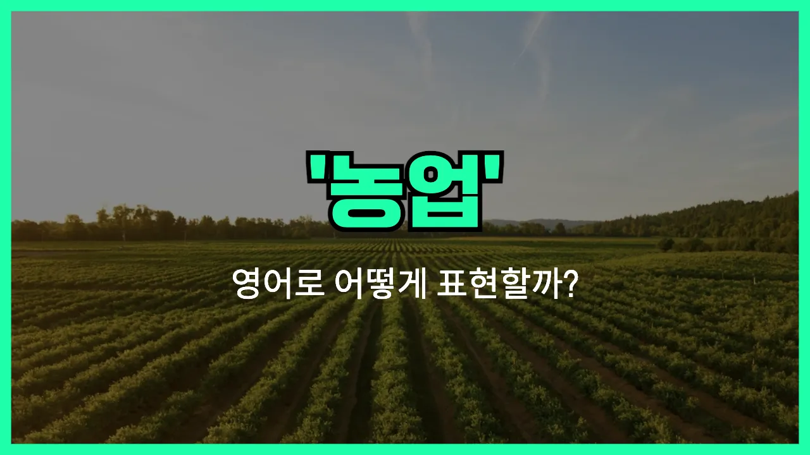

## 🌟 영어 표현 - agriculture

안녕하세요 👋 오늘은 우리가 자주 듣는 단어인 '**농업**'을 영어로 어떻게 표현하는지 알아보려고 해요.

'**agriculture**'는 바로 '농업'을 뜻하는 영어 단어예요. 이 단어는 **땅을 경작하거나 작물을 재배하고, 가축을 기르는 모든 활동**을 포함하는 넓은 의미를 가지고 있어요.

즉, 쌀이나 채소를 키우는 일, 과일을 재배하는 일, 소나 돼지 같은 가축을 기르는 일 등 모두 'agriculture'에 포함돼요. 우리 일상에서 식탁에 오르는 많은 음식들이 바로 이 'agriculture' 덕분에 만들어진다고 할 수 있어요!

이 단어는 학교 수업, 뉴스, 환경 문제, 경제 이야기 등 다양한 상황에서 자주 등장해요. 예를 들어, "농업은 한 나라의 경제에 매우 중요해요."라는 말을 영어로 표현할 때 'agriculture'를 쓸 수 있어요.

## 📖 예문

1. "농업은 많은 사람들에게 일자리를 제공해요."

   "Agriculture provides jobs for many people."

2. "기후 변화는 농업에 큰 영향을 미치고 있어요."

   "Climate change is having a big impact on agriculture."

## 💬 연습해보기

<ul data-interactive-list>

  <li data-interactive-item>
    우리 할아버지는 중서부에서 농사일 하시면서 자라셨어요.
    My grandpa grew up working in agriculture out in the Midwest.
  </li>

  <li data-interactive-item>
    농업은 여기 지역 경제에 진짜 중요한 역할을 해요.
    Agriculture is really <a href="/blog/in-english/318.important/">important</a> to the local <a href="/blog/in-english/637.economy/">economy</a> around here.
  </li>

  <li data-interactive-item>
    환경 과학 수업에서 농업에 대해 많이 배웠어요.
    I <a href="/blog/in-english/245.learn/">learned</a> a lot about agriculture in my environmental science class.
  </li>

  <li data-interactive-item>
    우리 식량 대부분이 농업에서 나오는데, 대부분 사람들은 잘 몰라요.
    A lot of our food comes from agriculture, but most people don't <a href="/blog/in-english/166.realize/">realize</a> it.
  </li>

  <li data-interactive-item>
    커뮤니티 칼리지에 새 농업 센터를 만들고 있어요.
    They're building a new agriculture center at the community college.
  </li>

  <li data-interactive-item>
    농업이 기계화되면서 많은 사람들이 도시로 이사 갔어요.
    Lots of people moved to the city when agriculture started relying more on machines.
  </li>

  <li data-interactive-item>
    그 친구는 지속 가능한 농업에 관심 많고 언젠가 자기 농장을 운영하고 싶어 해요.
    She's interested in sustainable agriculture and wants to start her own farm someday.
  </li>

  <li data-interactive-item>
    지난해 가뭄 때문에 농업 분야가 크게 타격 입었어요.
    The agriculture <a href="/blog/in-english/693.industry/">industry</a> took a big hit during the drought last year.
  </li>

  <li data-interactive-item>
    요즘 농업에 기술이 얼마나 많이 쓰이는지 놀랄 걸요.
    You'd be surprised how much technology is <a href="/blog/in-english/171.used/">used</a> in modern agriculture <a href="/blog/in-english/417.these-days/">these days</a>.
  </li>

  <li data-interactive-item>
    우리 마을은 농업 역사를 기념하는 연례 축제도 열어요.
    The town even has a yearly festival to celebrate the <a href="/blog/in-english/532.history/">history</a> of agriculture in our area.
  </li>

</ul>

## 🤝 함께 알아두면 좋은 표현들

### farming

'farming'은 '농사짓기' 또는 '농업 활동'을 의미해요. 주로 땅을 경작하거나 가축을 기르는 구체적인 농업 행위를 강조할 때 사용돼요.

- "Many families in the countryside depend on farming for their livelihood."
- "시골에 사는 많은 가족들이 농사로 생계를 이어가고 있어요."

### urbanization

'urbanization'은 '도시화'라는 뜻으로, 농촌 지역이 도시로 변하거나 사람들이 농업을 떠나 도시로 이동하는 현상을 말해요. 농업과는 반대되는 개념이에요.

- "Rapid urbanization has [led to](/blog/vocab-1/004.lead-to/) a decline in agricultural [activities](/blog/in-english/546.activity/) in many regions."
- "빠른 도시화 때문에 많은 지역에서 농업 활동이 줄어들었어요."

### agribusiness

'agribusiness'는 '농업 비즈니스' 또는 '농산업'을 의미해요. 단순히 농사를 짓는 것뿐만 아니라, 농산물의 생산, 가공, 유통 등 농업과 관련된 모든 비즈니스 활동을 포함하는 좀 더 넓은 개념이에요.

- "Modern agribusiness relies heavily on technology to increase crop [yields](/blog/in-english/465.yield/)."
- "요즘 농산업은 수확량을 늘리기 위해 기술에 많이 의존하고 있어요."

---

오늘은 '농업'이라는 뜻을 가진 영어 표현 '**agriculture**'에 대해 알아봤어요. 앞으로 농업과 관련된 이야기를 할 때 이 단어를 떠올리면 좋겠어요 😊

오늘 배운 표현과 예문들을 꼭 소리 내서 여러 번 읽어보세요. 다음에도 더 유익한 영어 표현으로 찾아올게요! 감사합니다!

