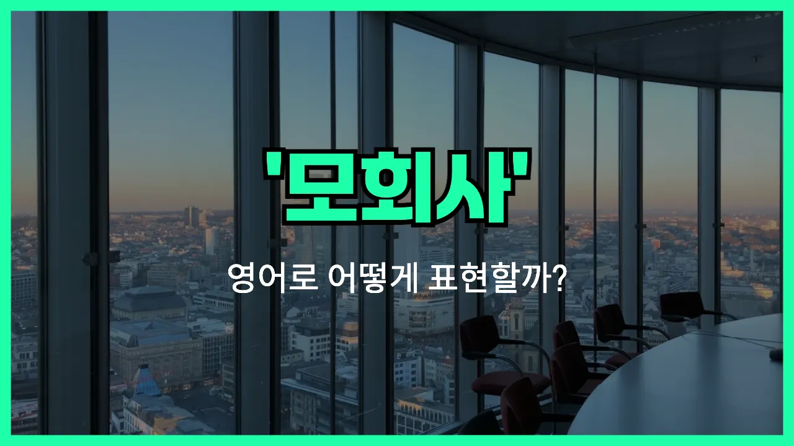

## 🌟 영어 표현 - parent company

안녕하세요 👋 오늘은 기업 구조에서 자주 등장하는 단어인 '**모회사**'의 영어 표현에 대해 알아보려고 해요. 바로 '**parent company**'라는 표현이에요.

'parent company'는 말 그대로 다른 회사를 소유하거나 지배하는 상위 회사를 의미해요. 즉, 한 회사가 다른 회사의 주식이나 지분을 많이 가지고 있어서, 그 회사를 통제하거나 관리할 수 있을 때 'parent company'라고 부르는 거예요.

이 표현은 기업 인수, 합병, 또는 여러 자회사를 거느린 대기업 그룹을 설명할 때 자주 사용돼요. 예를 들어, 삼성전자의 모회사는 삼성물산이라고 할 수 있어요. 또, 여러 브랜드를 소유한 대기업의 경우, 그 대기업이 바로 'parent company'가 되는 거예요.

## 📖 예문

1. "이 회사의 모회사는 일본에 있어요."

   "The parent company of this firm is located in Japan."

2. "모회사가 자회사에 투자하고 있어요."

   "The parent company is investing in its [subsidiary](/blog/in-english/692.subsidiary/)."

## 💬 연습해보기

<ul data-interactive-list>

  <li data-interactive-item>
    모회사가 방금 큰 변화를 발표했어요. 다들 그게 우리한테 어떤 뜻인지 알아보느라 바빠요.
    The parent company just announced some big changes. Everyone's <a href="/blog/in-english/117.try-to/">trying to</a> <a href="/blog/in-english/170.figure-out/">figure out</a> what it means for us.
  </li>

  <li data-interactive-item>
    우리 모회사는 뉴욕에 본사가 있지만, 우리는 LA에서 일하고 있어요.
    Our parent company is based in New York, but we work out of LA.
  </li>

  <li data-interactive-item>
    맞아요, 자유는 좀 있지만 그래도 모회사가 중요한 결정은 다 해요.
    Yeah, we have a lot of freedom, but the parent company <a href="/blog/in-english/254.still/">still</a> makes the major decisions.
  </li>

  <li data-interactive-item>
    모회사가 곧 다른 회사랑 합병할 거라는 얘기를 들었는데, 이게 꽤 큰 변화가 될 수 있어요.
    I heard the parent company might merge with <a href="/blog/in-english/513.another/">another</a> corporation soon. That could <a href="/blog/in-english/460.shake/">shake</a> things up.
  </li>

  <li data-interactive-item>
    모회사에서 다음 달부터 새 정책이 적용된다고 이메일이 왔어요.
    The parent company <a href="/blog/in-english/292.send/">sent</a> an email about new <a href="/blog/in-english/623.policy/">policies</a> coming next month.
  </li>

  <li data-interactive-item>
    우리 브랜드는 따로 있지만 사실 큰 모회사 산하에 있어요.
    Even though we have our own brand, we're actually owned by a large parent company.
  </li>

  <li data-interactive-item>
    문제가 있을 땐 가끔 모회사에 바로 도움을 요청하는 게 도움이 돼요.
    Whenever there's a problem, it <a href="/blog/in-english/270.sometimes/">sometimes</a> helps <a href="/blog/in-english/450.to-go/">to go</a> straight to the parent company for support.
  </li>

  <li data-interactive-item>
    모회사가 보험사를 바꿔서 올해부터 우리 복지도 바뀌었어요.
    Our benefits changed this year because the parent company switched <a href="/blog/in-english/580.insurance/">insurance</a> providers.
  </li>

  <li data-interactive-item>
    모회사는 전 세계에 사무실이 있다고 해요.
    You know, the parent company has offices all over the world.
  </li>

  <li data-interactive-item>
    지역 지사는 꽤 독립적이지만, 결국 모회사에서 최종 결정을 내려요.
    The local branch is pretty independent, but ultimately, the parent company calls the shots.
  </li>

</ul>

## 🤝 함께 알아두면 좋은 표현들

### subsidiary (자회사)

'subsidiary'는 "자회사"라는 뜻으로, 모회사가 지분을 많이 가지고 있어서 경영을 실질적으로 통제하는 회사예요. 즉, 모회사에 의해 소유되거나 관리되는 회사라는 의미로, 모회사와 반대되는 개념이에요.

- "The parent company [decided to](/blog/in-english/062.decide-to/) merge two of its subsidiaries to [improve](/blog/in-english/394.improve/) efficiency."
- "모회사가 효율성을 높이기 위해 두 자회사를 합병하기로 했어요."

### holding company (지주회사)

'[holding](/blog/in-english/388.hold/) company'는 "지주회사"라는 뜻으로, 다른 회사의 주식을 소유함으로써 그 회사를 지배하는 회사예요. 모회사와 비슷하지만, 직접적인 사업 활동보다는 여러 자회사를 관리하고 통제하는 데 초점을 둔 회사예요.

- "The holding company owns several businesses in different [industries](/blog/in-english/693.industry/)."
- "그 지주회사는 여러 산업 분야의 여러 회사를 소유하고 있어요."

### independent company (독립 회사)

'independent company'는 "독립 회사"라는 뜻으로, 다른 회사의 지배를 받지 않고 스스로 운영되는 회사를 말해요. 모회사나 자회사와 달리, 외부의 통제를 받지 않는다는 점에서 반대되는 개념이에요.

- "After the buyout, the business became an independent company."
- "인수 이후에 그 회사는 독립 회사가 되었어요."

---

오늘은 '**모회사**'라는 뜻을 가진 영어 표현 '**parent company**'에 대해 알아봤어요. 기업 관련 뉴스나 기사에서 이 표현을 자주 볼 수 있으니, 꼭 기억해 두면 좋겠어요 😊

오늘 배운 표현과 예문들을 꼭 최소 3번씩 소리 내서 읽어보세요. 다음에도 더 재미있고 유익한 영어 표현으로 찾아올게요! 감사합니다!
