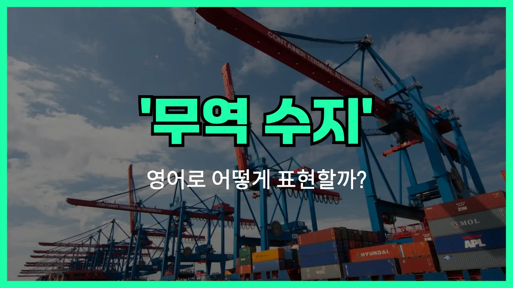

## 🌟 영어 표현 - balance of trade

안녕하세요 👋 오늘은 경제 뉴스나 기사에서 자주 볼 수 있는 표현, '**무역수지**'의 영어 표현에 대해 알아보려고 해요. 바로 '**balance of trade**'라는 단어인데요~

'**balance of trade**'는 한 나라가 일정 기간 동안 수출한 상품의 총액과 수입한 상품의 총액의 차이를 의미해요. 쉽게 말해서, **수출과 수입의 균형**을 나타내는 경제 용어예요~

만약 수출이 수입보다 많으면 '무역수지 흑자([trade surplus](/blog/in-english/685.trade-surplus/))'라고 하고, 반대로 수입이 수출보다 많으면 '무역수지 적자([trade deficit](/blog/in-english/684.trade-deficit/))'라고 해요. 이처럼 국가 경제의 건강 상태를 파악할 때 중요한 지표로 자주 사용돼요~

## 📖 예문

1. "한국의 무역수지가 올해 흑자를 기록했어요."

   "Korea's balance of trade recorded a surplus this year."

2. "무역수지 적자가 계속되면 경제에 부담이 될 수 있어요."

   "A continued trade deficit in the balance of trade can be a [burden](/blog/in-english/713.burden/) on the [economy](/blog/in-english/637.economy/)."

## 💬 연습해보기

<ul data-interactive-list>

  <li data-interactive-item>
    뉴스에서 미국과 중국 사이의 무역수지 변화에 대해 이야기하고 있었어요. 경제적으로 꽤 중요한 문제래요.
    The <a href="/blog/in-english/536.news/">news</a> was talking about how the balance of trade between the US and China is changing. It's a pretty big deal for the economy.
  </li>

  <li data-interactive-item>
    경제 수업에서 무역수지가 플러스라는 건 수출이 수입보다 많다는 뜻이라는 걸 배웠어요.
    I <a href="/blog/in-english/245.learn/">learned</a> in my economics class that a positive balance of trade means a country is exporting more than it's importing.
  </li>

  <li data-interactive-item>
    대통령님이 무역수지가 좋아지면 일자리가 더 많이 생길 거라고 하셨어요.
    The <a href="/blog/in-english/609.president/">president</a> mentioned that <a href="/blog/in-english/394.improve/">improving</a> our balance of trade would help create more jobs here.
  </li>

  <li data-interactive-item>
    솔직히 금융 쪽 일 시작하기 전까지 무역수지가 뭔지 별로 신경 안 썼어요.
    <a href="/blog/in-english/336.honestly/">Honestly</a>, I never really <a href="/blog/소금-양에-신경써야해-영어표현/">paid attention to</a> what the balance of trade was until I started working in finance.
  </li>

  <li data-interactive-item>
    몇몇 나라들은 무역수지가 몇 년째 마이너스인데도 잘 버티는 걸 들었어요.
    I heard some countries have a <a href="/blog/in-english/473.negative/">negative</a> balance of trade for years and <a href="/blog/in-english/254.still/">still</a> <a href="/blog/in-english/175.manage-to/">manage to</a> do alright.
  </li>

  <li data-interactive-item>
    친구가 무역수지가 달러 가치에 영향을 준다면서 해외 여행 가려고 해서 걱정하더라고요.
    My friend is <a href="/blog/in-english/115.nervous/">nervous</a> because the balance of trade affects the strength of the dollar, and he's planning a trip abroad.
  </li>

  <li data-interactive-item>
    무역수지 적자가 점점 커지고 있어서 수입품 가격이 오를 수도 있대요.
    They're saying the balance of trade deficit is getting bigger, so imported <a href="/blog/in-english/644.goods/">goods</a> might get more <a href="/blog/in-english/317.expensive/">expensive</a>.
  </li>

  <li data-interactive-item>
    무역수지가 계속 나빠지면 기름값에도 영향 있을까요?
    If our balance of trade keeps worsening, do you think it could affect gas <a href="/blog/in-english/640.price/">prices</a>?
  </li>

  <li data-interactive-item>
    매일 사는 물건들이 무역수지에 영향을 준다는 게 신기하게 느껴져요.
    It's <a href="/blog/in-english/296.weird/">weird</a> to think about how things we buy every day can impact the balance of trade.
  </li>

  <li data-interactive-item>
    무역수지가 지루하다고 생각했는데, 일자리랑 물가 같은 것들과 연결돼 있다는 걸 이제 알겠어요.
    I always thought the balance of trade was <a href="/blog/vocab-1/040.boring/">boring</a>, but now I see how it connects to stuff like jobs and prices.
  </li>

</ul>

## 🤝 함께 알아두면 좋은 표현들

### trade surplus

'trade surplus'는 "무역 흑자"를 의미해요. 한 나라가 수출을 수입보다 더 많이 해서 이익이 남는 상황을 말해요. 경제 뉴스나 국제 무역 관련 대화에서 자주 쓰여요.

- "Thanks to increased [exports](/blog/in-english/681.export/), the country reported a trade surplus this year."
- "수출이 늘어난 덕분에 올해는 무역 흑자가 났어요."

### trade deficit

'trade deficit'는 "무역 적자"라는 뜻이에요. 수입이 수출보다 많아서 손해를 보는 상황을 나타내요. 경제 상황이 좋지 않을 때 자주 언급되는 표현이에요.

- "The [government](/blog/in-english/608.government/) is concerned about the growing trade deficit."
- "정부는 점점 커지는 무역 적자에 대해 걱정하고 있어요."

### current account balance

'current account balance'는 "경상수지"를 의미해요. 무역수지뿐만 아니라 서비스, 투자 소득 등 다양한 국제 거래를 모두 포함한 국가의 전체적인 수지 상황을 나타내는 경제 용어예요.

- "The current account balance improved [due to](/blog/in-english/335.due-to/) higher tourism [revenue](/blog/in-english/665.revenue/)."
- "관광 수입이 늘어서 경상수지가 좋아졌어요."

---

오늘은 '**무역수지**'라는 뜻을 가진 영어 표현 '**balance of trade**'에 대해 알아봤어요. 경제 관련 뉴스를 볼 때 이 표현을 떠올리면 이해가 더 쉬워질 거예요~ 😊

오늘 배운 표현과 예문들을 꼭 최소 3번씩 소리 내서 읽어보세요. 다음에도 더 재미있고 유익한 영어 표현으로 찾아올게요! 감사합니다!~요

