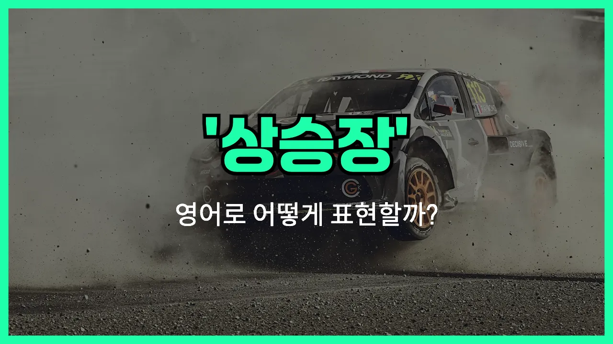

## 🌟 영어 표현 - market rally

안녕하세요 👋 오늘은 주식이나 경제 뉴스를 볼 때 자주 등장하는 영어 표현 '**[market](/blog/in-english/641.market/) rally**'에 대해 알아보려고 해요.

'**market rally**'는 우리말로 '**시장 랠리**'라고 번역할 수 있는데요, 여기서 '랠리(rally)'는 원래 스포츠에서 '연속적으로 치고받는 경기'를 뜻하지만, 금융에서는 **주식 시장이나 자산 가격이 빠르게 오르는 현상**을 의미해요.

즉, 'market rally'는 **주식 시장이 갑자기 활기를 띠며 가격이 급등하는 상황**을 말할 때 쓰여요. 보통 경제 지표가 좋아지거나, 긍정적인 뉴스가 나왔을 때 시장이 한꺼번에 상승할 때 자주 사용돼요.

예를 들어, "There was a strong market rally after the announcement of the new [policy](/blog/in-english/623.policy/)."라고 하면, "새 정책 발표 이후에 강한 시장 랠리가 있었다."라는 뜻이에요.

## 📖 예문

1. "최근 기술주 중심으로 시장 랠리가 이어지고 있어요."

   "There has been a market rally led by tech [stocks](/blog/in-english/671.stock/) recently."

2. "좋은 경제 지표 덕분에 오늘 시장이 랠리를 보였어요."

   "The market showed a rally today thanks to positive economic data."

## 💬 연습해보기

<ul data-interactive-list>

  <li data-interactive-item>
    오늘 시장이 진짜 활짝 오르고 내 주식도 쭉 올랐어요. 사무실에선 다들 그 얘기로 난리였어요.
    There was a huge market rally today and my stocks shot up. Everyone at the office was talking about it.
  </li>

  <li data-interactive-item>
    지난주에 그 시장 폭등 봤어요? 나도 그 전에 투자했으면 좋았을 걸 싶어요.
    Did you see that market rally last week? <a href="/blog/in-english/118.i-wish/">I wish</a> I'd invested before that happened.
  </li>

  <li data-interactive-item>
    시장 폭등할 때마다 아빠가 포트폴리오를 미친 듯이 확인해요.
    Every time there's a market rally, my dad starts checking his portfolio like crazy.
  </li>

  <li data-interactive-item>
    요즘 추세가 계속 오르면 곧 또다시 시장 폭등이 올 수도 있을 것 같아요.
    We could be experiencing <a href="/blog/in-english/513.another/">another</a> market rally soon if things keep trending upward.
  </li>

  <li data-interactive-item>
    사실 어제 시장 폭등 이후로 은퇴 자금에 대해 좀 더 희망적으로 생각하게 됐어요.
    <a href="/blog/in-english/336.honestly/">Honestly</a>, after that market rally yesterday, I feel a bit more optimistic about my retirement savings.
  </li>

  <li data-interactive-item>
    시장 폭등할 땐 다들 신나는데 전 아직 투자하는 게 조심스러워요.
    People are always excited during a market rally, but I'm <a href="/blog/in-english/254.still/">still</a> cautious about investing <a href="/blog/in-english/525.right-now/">right now</a>.
  </li>

  <li data-interactive-item>
    이번 시장 폭등이 오래 갈지 잘 모르겠어서 일부 주식을 팔까 고민 중이에요.
    I'm not sure if this market rally will last, so I'm thinking about selling some <a href="/blog/in-english/248.share/">shares</a>.
  </li>

  <li data-interactive-item>
    올해 초 시장 폭등 후에 많은 사람이 다시 주식시장에 뛰어들었어요.
    After the market rally <a href="/blog/in-english/397.earlier/">earlier</a> this year, a lot of folks jumped back into the stock market.
  </li>

  <li data-interactive-item>
    그냥 뉴스 하나에 갑자기 시장이 확 오르는 거 진짜 신기해요.
    It's wild how a simple <a href="/blog/in-english/536.news/">news</a> <a href="/blog/in-english/537.story/">story</a> can trigger a sudden market rally like that.
  </li>

  <li data-interactive-item>
    지난 시장 폭등으로 친구가 꽤 벌었는데 이제는 주식 고수인 척해요.
    My friend made a good chunk of money off the last market rally. Now he thinks he's a stock guru.
  </li>

</ul>

## 🤝 함께 알아두면 좋은 표현들

### bull market

'[bull market](/blog/in-english/678.bull-market/)'은 "강세장"을 의미하는 표현이에요. 주식이나 자산 가격이 전반적으로 오르고 투자 심리가 긍정적인 시장 상황을 가리켜요. 'market rally'와 비슷하게 시장이 활기를 띠고 있다는 점에서 유사한 표현이에요.

- "Investors are optimistic because we are currently in a bull market."
- "지금은 강세장이라서 투자자들이 낙관적인 분위기예요."

### market correction

'[market correction](/blog/in-english/708.market-correction/)'은 "시장 조정"을 뜻하는 표현이에요. 주가나 자산 가격이 단기간에 급등한 후 일정 부분 하락하면서 균형을 찾는 현상을 말해요. 'market rally'와는 반대로, 가격이 오르다가 잠시 쉬어가는 상황을 나타내요.

- "After a long market rally, a correction was expected by many analysts."
- "오랜 시장 랠리 이후에 많은 분석가들이 조정장이 올 거라고 예상했어요."

### bear market

'[bear market](/blog/in-english/679.bear-market/)'은 "약세장"을 의미해요. 주식이나 자산 가격이 전반적으로 하락하고 투자 심리가 위축된 시장 상황을 가리켜요. 'market rally'와는 반대되는 개념으로, 시장이 침체되어 있는 상태를 나타내요.

- "During a bear market, many investors become more cautious with their money."
- "약세장일 때는 많은 투자자들이 돈을 더 신중하게 다루게 돼요."

---

오늘은 '**시장 랠리**', '**급등**', '**상승장**'이라는 뜻을 가진 영어 표현 '**market rally**'에 대해 알아봤어요. 앞으로 경제 뉴스나 주식 관련 소식을 볼 때 이 표현을 떠올리면 좋겠어요 😊

오늘 배운 표현과 예문들을 꼭 최소 3번씩 소리 내서 읽어보세요. 다음에도 더 재미있고 유익한 영어 표현으로 찾아올게요! 감사합니다!

