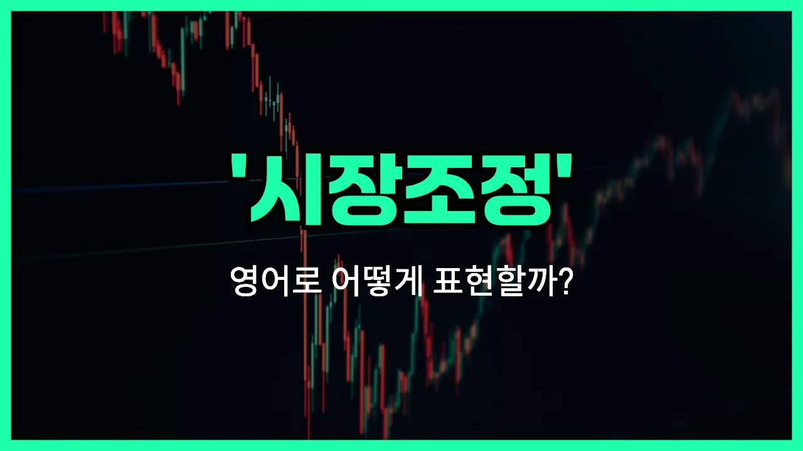

## 🌟 영어 표현 - market correction

안녕하세요 👋 오늘은 경제 뉴스나 투자 이야기를 할 때 자주 듣는 표현, '**시장 조정**'의 영어 표현에 대해 알아보려고 해요.

바로 '**[market](/blog/in-english/641.market/) correction**'이라는 단어인데요. 이 표현은 주식 시장이나 부동산 시장 등에서 **가격이 갑자기 너무 많이 올랐을 때, 일정 부분 다시 내려가는 현상**을 의미해요. 즉, 시장이 과열되어 비정상적으로 높아진 가격이 정상적인 수준으로 돌아오는 걸 말해요.

보통 주가가 단기간에 10% 이상 하락할 때 'market correction'이라고 표현해요. 하지만 이건 꼭 나쁜 현상만은 아니에요. 시장이 건강하게 유지되기 위해서는 때때로 이런 조정이 필요하거든요!

## 📖 예문

1. "최근 주식 시장에 시장 조정이 일어나고 있어요."

   "There is a market correction happening in the [stock](/blog/in-english/671.stock/) market recently."

2. "시장 조정 후에 투자자들은 더 신중해졌어요."

   "After the market correction, investors became more cautious."

## 💬 연습해보기

<ul data-interactive-list>

  <li data-interactive-item>
    친구랑 주식 얘기하는데, 이제 슬슬 시장 조정이 올 때가 됐대요.
    I was <a href="/blog/in-english/359.talk-to/">talking to</a> my friend about stocks and he said a market correction was overdue.
  </li>

  <li data-interactive-item>
    투자한 게 좀 떨어져도 너무 놀라지 마요. 가끔씩은 그냥 시장 조정일 뿐이거든요.
    Don't <a href="/blog/in-english/266.freak-out/">freak out</a> if your <a href="/blog/in-english/414.investment/">investments</a> <a href="/blog/in-english/361.drop/">drop</a> a bit. <a href="/blog/in-english/270.sometimes/">Sometimes</a> it's just a normal market correction.
  </li>

  <li data-interactive-item>
    갑작스런 시장 조정에 사람들이 긴장하는데, 보통 금방 회복돼요.
    People get <a href="/blog/in-english/115.nervous/">nervous</a> when there's a sudden market correction, but it usually bounces back.
  </li>

  <li data-interactive-item>
    지난달 수익이 좋았던 뒤라, 전문가들이 곧 시장 조정이 올 거라 예측해요.
    After last month's gains, some experts are predicting a market correction soon.
  </li>

  <li data-interactive-item>
    뭐든 너무 뜨거워지면 바로 시장 조정이 오곤 하는 것 같아요.
    <a href="/blog/한-것-같아-영어표현/">It feels like</a> every time things get too hot, there's a <a href="/blog/in-english/439.quick/">quick</a> market correction.
  </li>

  <li data-interactive-item>
    동생이 지난 시장 조정 때 좀 손해 봤는데, 팔진 않았대요.
    My brother <a href="/blog/in-english/457.lose/">lost</a> some money during the last market correction, but he didn't sell.
  </li>

  <li data-interactive-item>
    시장 조정은 오히려 장기적으로 경제에 건강할 수 있어요.
    A market correction can actually be healthy for the <a href="/blog/in-english/637.economy/">economy</a> <a href="/blog/in-english/179.in-the-long-run/">in the long run</a>.
  </li>

  <li data-interactive-item>
    지난 봄 갑자기 온 시장 조정 때문에 좀 당황했어요.
    We were caught off guard by the rapid market correction last spring.
  </li>

  <li data-interactive-item>
    저는 보통 시장 조정을 좋은 매수 기회로 봐요.
    I usually see a market correction as a good buying opportunity.
  </li>

  <li data-interactive-item>
    그 친구는 시장 조정 때 투자를 시작해서 꽤 잘했어요.
    She started investing during a market correction and ended up doing pretty well.
  </li>

</ul>

## 🤝 함께 알아두면 좋은 표현들

### market downturn

'market downturn'은 "시장 하락" 또는 "경기 침체"를 의미해요. 주식이나 자산 가격이 전반적으로 하락하는 시기를 가리키며, 보통 경제 상황이 나빠지거나 투자 심리가 위축될 때 자주 사용돼요.

- "Investors are [worried about](/blog/in-english/209.worry-about/) a possible market downturn after recent economic reports."
- "최근 경제 보고서들 때문에 투자자들이 시장 하락을 걱정하고 있어요."

### bull market

'[bull market](/blog/in-english/678.bull-market/)'은 "강세장" 또는 "시장 상승세"를 뜻해요. 주식이나 자산 가격이 전반적으로 오르는 시기를 말하며, 투자자들이 낙관적이고 활발하게 투자하는 분위기를 나타낼 때 써요. 'market correction'과는 반대되는 개념이에요.

- "During a bull market, people are more [likely to](/blog/in-english/208.likely-to/) invest in stocks."
- "강세장일 때는 사람들이 주식에 더 많이 투자하려고 해요."

### price stabilization

'[price](/blog/in-english/640.price/) stabilization'은 "가격 안정화"라는 뜻이에요. 시장에서 가격이 급격하게 오르거나 내리지 않고 일정하게 유지되는 상태를 말해요. 'market correction'이 급격한 조정이라면, 이 표현은 변동이 적고 안정적인 상황을 강조할 때 써요.

- "After months of volatility, the market [finally](/blog/in-english/182.finally/) showed signs of price stabilization."
- "몇 달간의 변동성 끝에 시장이 드디어 가격 안정화 조짐을 보였어요."

---

오늘은 '**시장 조정**'이라는 뜻을 가진 영어 표현 '**market correction**'에 대해 알아봤어요. 앞으로 경제 뉴스나 투자 관련 대화를 할 때 이 표현을 활용해보면 좋겠어요 😊

오늘 배운 표현과 예문들을 꼭 최소 3번씩 소리 내서 읽어보세요. 다음에도 더 재미있고 유익한 영어 표현으로 찾아올게요! 감사합니다!
