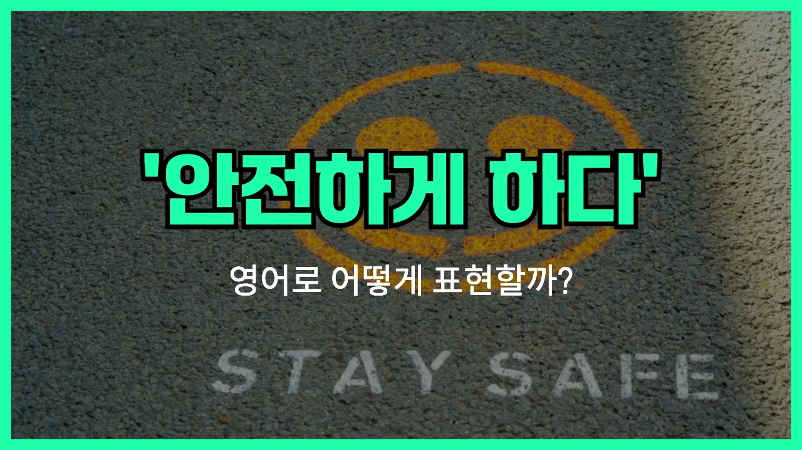

## 🌟 영어 표현 - play it safe

안녕하세요 👋 오늘은 일상에서 자주 쓰이는 영어 표현인 '**play it safe**'에 대해 알아보려고 해요. 이 표현은 '**안전하게 행동하다**', '**조심하다**', '**신중하게 행동하다**'라는 뜻을 가지고 있어요.

'play it safe'는 위험을 감수하지 않고, 안전하고 확실한 방법을 선택할 때 자주 사용돼요. 예를 들어, 새로운 시도를 하기보다는 이미 검증된 방법을 택하거나, 위험한 상황을 피하고 싶을 때 쓸 수 있어요.

예를 들어, 날씨가 안 좋을 때 "오늘은 그냥 집에 있을래. 안전하게 행동하는 게 좋겠어."라고 말하고 싶을 때 'play it safe'를 사용할 수 있어요. 또는, 중요한 시험을 앞두고 무리하지 않고 평소처럼 공부할 때도 이 표현을 쓸 수 있답니다!

## 📖 예문

1. "비가 많이 오니까 오늘은 안전하게 행동하는 게 좋겠어요."

   "Since it's raining heavily, let's play it safe today."

2. "모르는 음식은 먹지 않고 조심하는 게 좋아요."

   "It's better to play it safe and not eat [unfamiliar](/blog/in-english/337.unfamiliar/) food."

## 💬 연습해보기

<ul data-interactive-list>

  <li data-interactive-item>
    등산 갈까 생각했는데, 날씨가 별로라 안전하게 그냥 집에 있으려고 해요.
    I was thinking about going hiking, but since the weather looks bad, I'm just gonna play it safe and stay home.
  </li>

  <li data-interactive-item>
    그 친구가 밤새 운전하겠대서, 제가 안전하게 호텔 잡으라고 했어요.
    He wanted to drive all night, but I told him to play it safe and get a hotel.
  </li>

  <li data-interactive-item>
    이 시험은 절대 안 무리하고 안전하게 답 다시 한 번 꼼꼼히 체크하려고요.
    I'm not taking any chances with this test. I'm gonna play it safe and double-check all my answers.
  </li>

  <li data-interactive-item>
    새 식당은 아직 안 가고 안전하게 그냥 배달 시키기로 했어요.
    We <a href="/blog/in-english/062.decide-to/">decided to</a> play it safe and <a href="/blog/in-english/066.order-takeout/">order takeout</a> <a href="/blog/in-english/169.instead-of/">instead of</a> trying that new restaurant just yet.
  </li>

  <li data-interactive-item>
    해산물 확신이 없다면 안전하게 다른 걸 고르는 게 낫죠.
    If you're not sure about the seafood, it's better to play it safe and pick something else.
  </li>

  <li data-interactive-item>
    부모님께서는 항상 큰 결정할 땐 안전하게 하라고 하세요.
    My parents always tell me to play it safe with big decisions.
  </li>

  <li data-interactive-item>
    좀 더 투자할 수도 있지만, 지금은 그냥 안전하게 가자고요.
    We could invest more, but let's play it safe for now.
  </li>

  <li data-interactive-item>
    요즘 다들 아파서 이번 주는 안전하게 큰 모임은 피하려고 해요.
    Since everyone's getting sick, I'll just play it safe and avoid big gatherings this week.
  </li>

  <li data-interactive-item>
    멋진 골 하려고 할 수도 있지만, 가끔은 안전하게 패스하는 게 더 현명해요.
    He could try for a flashy goal, but <a href="/blog/in-english/270.sometimes/">sometimes</a> it's smarter to play it safe and pass.
  </li>

  <li data-interactive-item>
    서두를 필요 없어요~ 잘 알 때까지는 안전하게 행동하세요.
    You don't need to rush into things—just play it safe until you know more.
  </li>

</ul>

## 🤝 함께 알아두면 좋은 표현들

### err on the side of caution

'err on the side of caution'은 "조심하는 쪽을 택하다" 또는 "안전하게 행동하다"라는 뜻이에요. 위험을 감수하기보다는 실수하지 않으려고 더 신중하게 행동하는 상황에서 자주 써요.

- "When hiking in unfamiliar areas, it's best to err on the side of caution and [stick to](/blog/vocab-1/015.stick-to/) marked trails."
- "익숙하지 않은 곳에서 등산할 때는 조심하는 게 좋으니까 표시된 길로만 다니는 게 좋아요."

### take a risk

'take a [risk](/blog/in-english/676.risk/)'는 "위험을 감수하다"라는 뜻이에요. 안전하게 행동하기보다는 새로운 도전이나 모험을 선택할 때 쓰는 표현이에요. 뭔가를 얻기 위해 일부러 위험을 무릅쓰는 상황에서 자주 사용돼요.

- "Sometimes you have to take a risk if you want to achieve something great."
- "가끔은 뭔가 대단한 걸 이루고 싶으면 위험을 감수해야 해요."

### stick to the tried and true

'stick to the tried and true'는 "검증된 방법만 고수하다" 또는 "안전하게 익숙한 것만 하다"라는 의미예요. 새로운 시도보다는 이미 효과가 입증된 방법이나 방식을 계속 사용하는 걸 말해요.

- "Whenever I [cook](/blog/in-english/461.cook/) for guests, I stick to the tried and true recipes I know everyone likes."
- "손님들한테 요리할 때는 항상 다들 좋아하는 검증된 레시피만 써요."

---

오늘은 '**안전하게 행동하다**', '**조심하다**', '**신중하게 행동하다**'라는 뜻을 가진 영어 표현 '**play it safe**'에 대해 알아봤어요. 앞으로 위험하거나 불확실한 상황에서 이 표현을 떠올려 보세요 😊

오늘 배운 표현과 예문들을 꼭 최소 3번씩 소리 내서 읽어보세요. 다음에도 더 재미있고 유익한 영어 표현으로 찾아올게요! 감사합니다!

