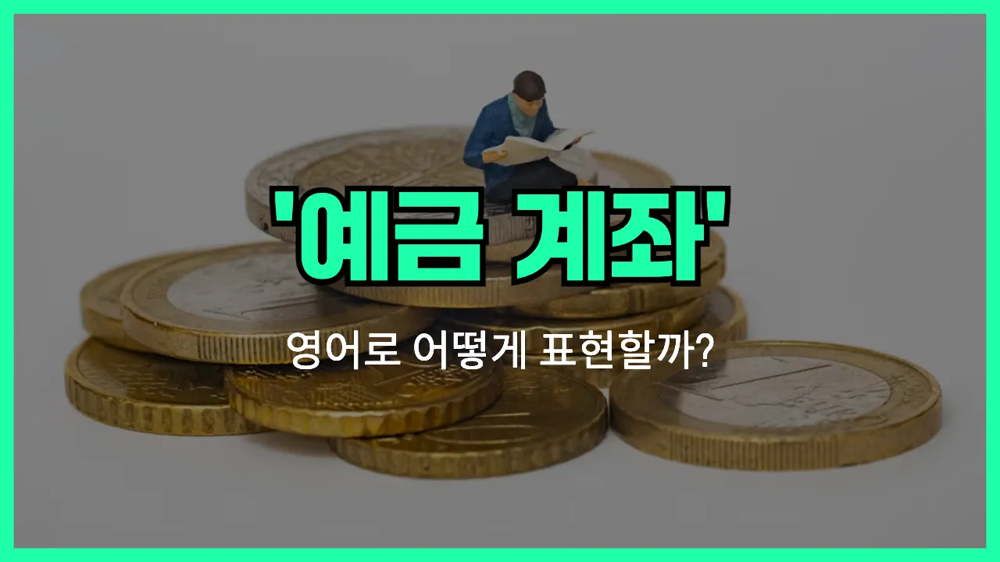

## 🌟 영어 표현 - savings account

안녕하세요 👋 오늘은 은행에서 자주 듣는 단어인 '**저축예금**'을 영어로 어떻게 표현하는지 알아보려고 해요. 바로 '**savings account**'라는 표현이에요.

'savings account'는 은행에 돈을 저축해 두고, 필요할 때 인출하거나 이자를 받을 수 있는 계좌를 의미해요. 즉, **돈을 모으고 관리하는 데 사용하는 계좌**를 말해요!

이 표현은 일상생활에서 은행 업무를 볼 때 정말 자주 쓰여요. 예를 들어, 은행에 가서 "저축예금 계좌를 개설하고 싶어요"라고 말하고 싶을 때 "I want to open a savings account."라고 할 수 있어요.

또한, 'savings account'는 보통 'checking account(당좌예금)'와 구분해서 사용돼요. 저축 목적이라면 'savings account', 일상적인 입출금이 많다면 'checking account'를 사용해요.

## 📖 예문

1. "저는 저축예금 계좌에 돈을 넣고 있어요."

   "I am putting money into my savings account."

2. "이 은행의 저축예금 이율이 높아요."

   "The [interest rate](/blog/in-english/657.interest-rate/) on this bank's savings account is high."

## 💬 연습해보기

<ul data-interactive-list>

  <li data-interactive-item>
    나 어제 은행에서 통장 개설했어요. 이제 좀 더 저축하는 습관 들여보려고요.
    I just opened a savings account at the bank yesterday. I'm <a href="/blog/in-english/117.try-to/">trying to</a> get better about <a href="/blog/in-english/293.save/">saving</a> up.
  </li>

  <li data-interactive-item>
    저축통장에 돈 넣는 게 나을까요, 아니면 다른 데 투자하는 게 나을까요? 엄마는 항상 저축부터 하라고 하시더라고요.
    Do you think it's better to keep money in a savings account or invest it somewhere else? My mom always tells me to start with savings.
  </li>

  <li data-interactive-item>
    매달 월급에서 조금씩 저축통장에 넣고 있는데, 모이면 꽤 도움이 되더라고요.
    I've been putting a little bit of my paycheck into my savings account every month. It really adds up <a href="/blog/in-english/189.over-time/">over time</a>.
  </li>

  <li data-interactive-item>
    우리 은행 저축통장 이자율 괜찮은 편이에요. 좀 더 옮겨야겠어요.
    My bank offers a pretty good interest rate on their savings accounts. I should <a href="/blog/in-english/281.probably/">probably</a> transfer some money over.
  </li>

  <li data-interactive-item>
    지난 여름휴가 비용을 저축통장에서 땄어요.
    I <a href="/blog/in-english/171.used/">used</a> the money from my savings account to help pay for my <a href="/blog/in-english/516.vacation/">vacation</a> last summer.
  </li>

  <li data-interactive-item>
    자동이체 설정하면 저축이 훨씬 쉬워질 것 같아요. 그렇게 할 수 있나요?
    Can I <a href="/blog/in-english/635.set-up/">set up</a> automatic transfers into my savings account? That would make saving a lot easier for me.
  </li>

  <li data-interactive-item>
    처음 만든 저축통장에 5만원 좀 안 됐는데, 그땐 엄청 설레었었어요.
    My first savings account only had like fifty bucks in it, but it felt like a big deal back then.
  </li>

  <li data-interactive-item>
    저축통장에서 너무 자주 출금하면 수수료 붙나요? 그게 궁금해요.
    Do you know if there's a fee if I withdraw money from my savings account too <a href="/blog/in-english/326.often/">often</a>?
  </li>

  <li data-interactive-item>
    어렸을 때 할아버지, 할머니가 생일선물 돈을 저축통장에 넣어주셨었거든요.
    When I was a kid, my grandparents <a href="/blog/in-english/143.used-to/">used to</a> deposit birthday money in a savings account for me.
  </li>

  <li data-interactive-item>
    저축통장 해지하고 혜택 좋은 데 알아보려 해요. 집 앞 은행 조건 꽤 괜찮더라고요.
    I'm thinking about closing my savings account and <a href="/blog/in-english/173.look-for/">looking for</a> one with better perks. The bank <a href="/blog/in-english/328.around-the-corner/">around the corner</a> has a good deal.
  </li>

</ul>

## 🤝 함께 알아두면 좋은 표현들

### checking account

'checking account'는 '당좌예금' 또는 '입출금 계좌'를 의미해요. 주로 일상적인 지출이나 월급 입금, 자동이체 등 자주 돈을 입금하거나 출금할 때 사용하는 계좌예요. 저축보다는 돈의 자유로운 이동에 초점이 맞춰져 있어요.

- "I use my checking account to pay my [bills](/blog/in-english/620.bill/) and withdraw cash whenever I need it."
- "저는 공과금을 내거나 현금을 필요할 때마다 찾으려고 입출금 계좌를 사용해요."

### fixed deposit

'fixed deposit'는 '정기예금'을 뜻해요. 일정 기간 동안 돈을 예치해두고, 만기 시에 원금과 이자를 받는 방식이에요. 'savings account'보다 이자가 높지만, 중간에 돈을 쉽게 뺄 수 없다는 차이가 있어요.

- "She put her bonus into a fixed deposit to earn higher interest."
- "그녀는 더 높은 이자를 받으려고 보너스를 정기예금에 넣어뒀어요."

### spendthrift

'spendthrift'는 '돈을 헤프게 쓰는 사람' 또는 '낭비벽이 있는 사람'을 의미해요. 'savings account'처럼 저축하는 것과는 반대되는 개념으로, 돈을 모으지 않고 쉽게 써버리는 사람을 가리킬 때 써요.

- "Being a spendthrift, he never bothered to open a savings account."
- "그는 워낙 돈을 펑펑 쓰는 편이라 저축 계좌를 만들 생각조차 안 했어요."

---

오늘은 '**저축예금**'이라는 뜻을 가진 영어 표현 '**savings account**'에 대해 알아봤어요. 은행에서 계좌를 만들거나 돈을 저축할 때 이 표현을 꼭 기억해 두면 좋겠어요 😊

오늘 배운 표현과 예문들을 꼭 최소 3번씩 소리 내서 읽어보세요. 다음에도 더 재미있고 유익한 영어 표현으로 찾아올게요! 감사합니다!

