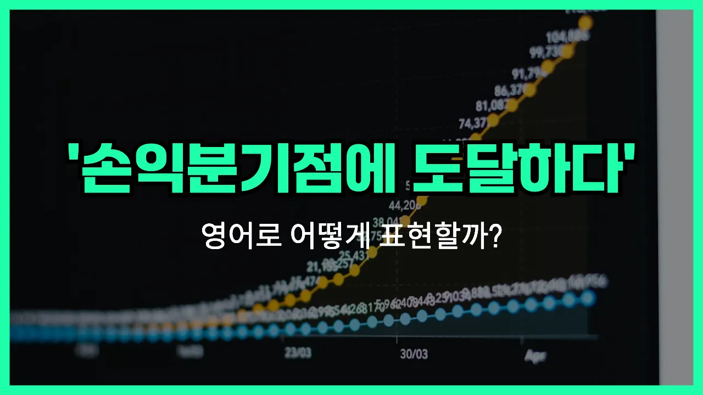

## 🌟 영어 표현 - break even

안녕하세요 👋 오늘은 비즈니스나 투자에서 자주 듣는 표현, '**손익분기점에 도달하다**'를 영어로 어떻게 말하는지 알아볼 거예요.

바로 '**break even**'이라는 표현이에요. 이 표현은 **수입과 지출이 같아져서 이익도 손해도 없는 상태**를 의미해요. 즉, 투자한 만큼 딱 회수해서 본전이 되는 순간을 말할 때 쓰여요!

예를 들어, 사업을 시작해서 초기 투자비용을 모두 회수하고 더 이상 손해를 보지 않는 시점이 바로 'break even'이에요. 이때 "We [finally](/blog/in-english/182.finally/) broke even this month."라고 말할 수 있어요.

또한, 주식이나 부동산 투자에서도 투자금만큼 수익을 내서 손해를 보지 않은 상태를 설명할 때도 자주 사용돼요.

## 📖 예문

1. "우리는 올해 말에 손익분기점에 도달할 거예요."

   "We will break even by the end of this year."

2. "이 프로젝트는 아직 손익분기점을 넘지 못했어요."

   "This project hasn't broken even yet."

## 💬 연습해보기

<ul data-interactive-list>

  <li data-interactive-item>
    우리는 올해 말까지 손익분기점을 맞추길 바라고 있어요. 이번 새 프로젝트가 초반 비용이 꽤 많이 들었거든요.
    We're hoping to break even by the end of the year. This new project <a href="/blog/in-english/664.cost/">cost</a> a lot upfront.
  </li>

  <li data-interactive-item>
    작은 사업이 손익분기점에 도달하려면 보통 몇 년은 걸려요.
    It usually takes a couple of years for a small business to finally break even.
  </li>

  <li data-interactive-item>
    조금 더 티켓만 팔리면 적어도 손해는 안 보고 본전은 맞출 수 있으니까 걱정하지 마요.
    Don't worry, if we sell just a few more tickets, we'll <a href="/blog/in-english/167.at-least/">at least</a> break even.
  </li>

  <li data-interactive-item>
    지난달에는 간신히 손익분기점을 맞췄어요. 그래도 돈을 잃지 않은 게 다행이에요.
    Last month, we <a href="/blog/in-english/078.barely/">barely</a> <a href="/blog/in-english/175.manage-to/">managed to</a> break even. At least we didn't <a href="/blog/in-english/457.lose/">lose</a> money.
  </li>

  <li data-interactive-item>
    예상치 못한 지출들이 많아서 이번 분기에는 손익분기점 맞출 수 있을지 모르겠어요.
    With all these unexpected expenses, I'm not sure we'll break even this quarter.
  </li>

  <li data-interactive-item>
    모든 청구서를 다 내고 나니, 손익분기점에 겨우 도달했어요. 아직은 이익은 없어요.
    After paying all the <a href="/blog/in-english/620.bill/">bills</a>, we managed to break even at best. No <a href="/blog/in-english/663.profit/">profits</a> yet.
  </li>

  <li data-interactive-item>
    그 식당은 한 1년 가까이 영업하고 나서야 겨우 손익분기점을 넘겼어요.
    The restaurant finally broke even after being open for almost a year.
  </li>

  <li data-interactive-item>
    이번 여행에서는 큰 수익 바라지 않고 본전만 겨우 건지려고 해요.
    I'm just looking to break even on this trip, not make a huge profit.
  </li>

  <li data-interactive-item>
    비용을 맞추려면 최소 100장 정도 셔츠를 팔아야 해요.
    We need to sell at least 100 shirts to break even on our costs.
  </li>

  <li data-interactive-item>
    위험했지만 투자에서 본전을 건졌다고 해서 그가 기뻐했어요.
    He was happy to break even on the <a href="/blog/in-english/414.investment/">investment</a>, considering how risky it was.
  </li>

</ul>

## 🤝 함께 알아두면 좋은 표현들

### turn a profit

'turn a profit'은 "이익을 내다"라는 뜻이에요. 즉, 비용을 모두 충당하고 남는 돈이 생기는 상황을 말해요. 사업이나 투자에서 실제로 수익이 발생했을 때 자주 쓰는 표현이에요.

- "After two years of hard work, the company finally turned a profit last quarter."
- "2년간 열심히 일한 끝에, 회사가 지난 분기에 드디어 이익을 냈어요."

### run at a loss

'run at a [loss](/blog/in-english/722.loss/)'는 "적자를 내다" 또는 "손해를 보다"라는 의미예요. 수입보다 지출이 더 많아서 돈을 잃고 있는 상황을 나타낼 때 사용해요. 사업이 아직 안정되지 않았거나 어려움을 겪고 있을 때 자주 쓰는 표현이에요.

- "Many small businesses run at a [loss](/blog/in-english/722.loss/) during their first year."
- "많은 소규모 사업체들이 첫 해에는 적자를 보는 경우가 많아요."

### cover one's costs

'cover one's costs'는 "비용을 충당하다"라는 뜻이에요. 즉, 벌어들인 돈이 딱 들어간 비용만큼이어서 이익도 손해도 없는 상태를 말해요. 'break even'과 비슷하지만, 이익이 남지는 않는다는 점을 강조할 때 써요.

- "We need to sell at least 100 tickets to cover our costs for the event."
- "행사 비용을 충당하려면 최소 100장 정도는 티켓을 팔아야 해요."

---

오늘은 '**손익분기점에 도달하다**'라는 뜻의 영어 표현 '**break even**'에 대해 알아봤어요. 사업이나 투자 이야기를 할 때 이 표현을 떠올리면 좋겠어요 😊

오늘 배운 표현과 예문들을 꼭 최소 3번씩 소리 내서 읽어보세요. 다음에도 더 재미있고 유익한 영어 표현으로 찾아올게요! 감사합니다!
