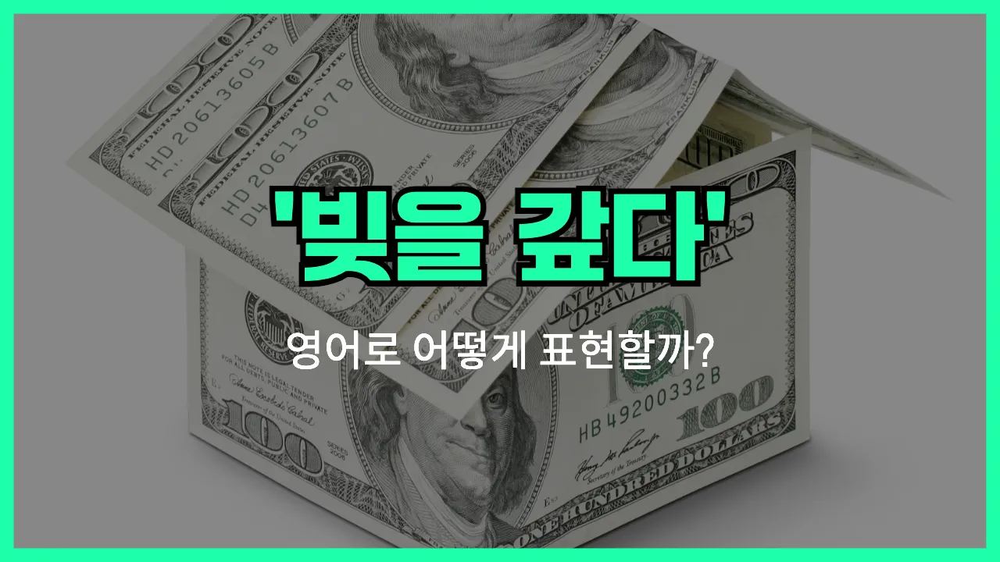

## 🌟 영어 표현 - debt-free

안녕하세요 👋 오늘은 '빚이 없는', '무채무'라는 뜻을 가진 영어 표현을 소개해드릴게요. 바로 '**[debt](/blog/in-english/662.debt/)-free**'라는 단어예요.

'**debt-free**'는 말 그대로 **빚(debt)이 없는(free)** 상태를 의미해요. 즉, 대출이나 카드값, 각종 채무를 모두 갚아서 더 이상 갚아야 할 돈이 없는 상황을 표현할 때 사용해요.

이 표현은 개인뿐만 아니라 회사, 국가 등 다양한 주체에 쓸 수 있어요. 예를 들어, 누군가가 학자금 대출을 모두 갚았다면 "I am [finally](/blog/in-english/182.finally/) debt-free!"라고 기쁘게 말할 수 있어요.

또한, 재정적으로 자유로워졌다는 긍정적인 의미로도 자주 쓰여요. 경제적 목표를 이룬 사람들에게 축하의 의미로도 많이 사용된답니다!

## 📖 예문

1. "저는 이제 빚이 없어요."

   "I am now debt-free."

2. "그 회사는 무채무 상태예요."

   "The company is debt-free."

3. "빚에서 벗어나 자유로워졌어요."

   "I feel free now that I am debt-free."

## 💬 연습해보기

<ul data-interactive-list>

  <li data-interactive-item>
    드디어 학자금 대출 다 갚고 빚 없는 삶 시작했어요. 진짜 기분 최고예요!
    I finally <a href="/blog/in-english/199.pay-off/">paid off</a> my student loans and now I'm debt-free. It feels amazing!
  </li>

  <li data-interactive-item>
    저 사람들 몇 년간 엄청 열심히 해서 빚에서 벗어났어요.
    They worked really hard for years to become debt-free.
  </li>

  <li data-interactive-item>
    빚 다 갚으면 집 살 돈 모으기 시작할 수 있대요.
    Once we're debt-free, we can start <a href="/blog/in-english/293.save/">saving</a> for a house.
  </li>

  <li data-interactive-item>
    서른 되기 전에 완전 빚 없는 상태가 목표예요.
    My goal is to be completely debt-free before I turn thirty.
  </li>

  <li data-interactive-item>
    오래된 차 팔고 나서 빚 없이 잘 버텼대요.
    After selling their old car, they <a href="/blog/in-english/175.manage-to/">managed to</a> stay debt-free.
  </li>

  <li data-interactive-item>
    빚 없으면 마음이 완전 편해져요.
    Being debt-free gives you so much peace of mind.
  </li>

  <li data-interactive-item>
    전에는 신용카드 고지서 때문에 힘들었는데 이제 완전 빚 청산했어요.
    I <a href="/blog/in-english/143.used-to/">used to</a> <a href="/blog/잘-안돼-영어표현/">struggle with</a> credit card <a href="/blog/in-english/620.bill/">bills</a>, but now I'm finally debt-free.
  </li>

  <li data-interactive-item>
    걔는 빚 없다고 자랑 엄청 해요. 뭐, 잘 된 거죠 뭐.
    He brags about being debt-free all the time. <a href="/blog/in-english/336.honestly/">Honestly</a>, good for him.
  </li>

  <li data-interactive-item>
    불필요한 지출 줄여서 빚 갚는 계획 세웠어요.
    We made a plan to get debt-free by cutting out unnecessary <a href="/blog/in-english/725.expense/">expenses</a>.
  </li>

  <li data-interactive-item>
    많은 사람이 빚 없길 바라지만, 거기까지 가려면 자기 절제가 필요해요.
    A lot of people dream about being debt-free, but it takes discipline to get there.
  </li>

</ul>

## 🤝 함께 알아두면 좋은 표현들

### financially independent

'financially independent'는 "경제적으로 독립된" 또는 "누구의 도움 없이 스스로 경제적 자립을 이룬" 상태를 의미해요. 빚이 없을 뿐만 아니라, 자신의 수입과 자산으로 생활을 꾸려나갈 수 있을 때 주로 사용해요.

- "She worked hard for years to become financially independent before turning thirty."
- "그녀는 서른 살이 되기 전에 경제적으로 독립하기 위해 몇 년 동안 열심히 일했어요."

### in the red

'in the red'는 "적자 상태인" 또는 "빚이 있는" 상황을 뜻해요. 주로 은행 계좌나 회사 재정이 마이너스일 때, 즉 빚이 있거나 돈이 부족할 때 사용해요. 'debt-free'의 반대 의미예요.

- "After the unexpected [expenses](/blog/in-english/725.expense/), the company found itself in the red for the first time in years."
- "예상치 못한 지출 때문에 회사가 몇 년 만에 처음으로 적자 상태가 됐어요."

### owe money

'[owe money](/blog/in-english/730.owe-money/)'는 "돈을 빚지다"라는 뜻이에요. 누군가에게 돈을 갚아야 하는 상황을 나타내며, 'debt-free'와는 반대되는 의미로 쓰여요.

- "I [still](/blog/in-english/254.still/) owe money on my student loans, so I can't say I'm debt-free yet."
- "아직 학자금 대출을 갚아야 해서, 저는 아직 빚이 없다고 말할 수 없어요."

---

오늘은 '빚이 없는', '무채무'라는 뜻의 영어 표현 '**debt-free**'에 대해 알아봤어요. 혹시 빚을 다 갚고 자유로워진 기분을 표현하고 싶을 때 이 단어를 꼭 떠올려보세요 😊

오늘 배운 표현과 예문들을 꼭 최소 3번씩 소리 내서 읽어보세요. 다음에도 더 재미있고 유익한 영어 표현으로 찾아올게요! 감사합니다!
