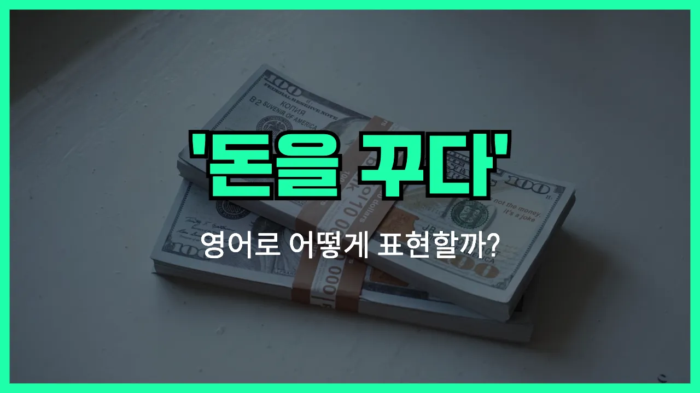

## 🌟 영어 표현 - owe money

안녕하세요 👋 오늘은 우리가 일상에서 자주 쓰는 표현인 '**빚지다**', 즉 '**돈을 빌리다**', '**돈을 갚아야 할 때**'를 영어로 어떻게 말하는지 알아볼 거예요.

바로 '**owe money**'라는 표현을 사용해요. 여기서 'owe'는 '빚지다', '빚을 지고 있다'라는 뜻이고, 'money'는 '돈'이니까 합쳐서 '돈을 빚지다'라는 의미가 돼요.

이 표현은 친구에게 돈을 빌렸거나, 카드값을 아직 갚지 않았을 때 등 다양한 상황에서 쓸 수 있어요. 예를 들어, 친구에게 5만 원을 빌렸다면 "I owe my friend 50,000 [won](/blog/in-english/456.win/)."이라고 말할 수 있어요.

또한, 'owe'는 꼭 돈뿐만 아니라 감사나 설명 등도 빚졌을 때 쓸 수 있지만, 오늘은 '돈'에 집중해서 설명할게요.

## 📖 예문

1. "나는 아직 은행에 돈을 빚지고 있어요."

   "I [still](/blog/in-english/254.still/) owe money to the bank."

2. "너 나한테 2만 원 빚졌잖아요."

   "You owe me 20,000 won."

## 💬 연습해보기

<ul data-interactive-list>

  <li data-interactive-item>
    저 아직 차 할부금 다 못 냈어요. 끝이 안 날 것 같아요.
    I still owe money on my car loan. <a href="/blog/한-것-같아-영어표현/">It feels like</a> it'll never end.
  </li>

  <li data-interactive-item>
    제 남동생이 여기저기 여러 사람한테 빚이 있어요. 제발 재정 좀 잘 관리했으면 좋겠어요.
    My brother owes money to a bunch of different people. He really needs to get his finances <a href="/blog/in-english/374.together/">together</a>.
  </li>

  <li data-interactive-item>
    그 비싼 저녁 먹고 나서 마크한테 돈 빚진 거 떠올랐어요. 곧 꼭 갚아야 할 것 같아요.
    After that <a href="/blog/in-english/317.expensive/">expensive</a> dinner, I <a href="/blog/in-english/166.realize/">realized</a> I owe money to Mark. I should pay him back soon.
  </li>

  <li data-interactive-item>
    돈 빚지는 건 어쩔 수 없으면 안 지는 게 좋아요. 계속 쌓이니까요.
    You should always try not to owe money if you can help it. It just piles up.
  </li>

  <li data-interactive-item>
    아직 학자금 대출금 남았어요?
    Do you still owe money on your student loans?
  </li>

  <li data-interactive-item>
    그녀는 빚 지는 걸 싫어해서 청구서는 항상 바로바로 내요.
    She <a href="/blog/in-english/392.hate/">hates</a> owing money, so she always pays her <a href="/blog/in-english/620.bill/">bills</a> right away.
  </li>

  <li data-interactive-item>
    전 케이블 회사한테 돈 빚진 것 같아요. 청구서 내는 걸 자꾸 깜빡해요.
    I think I owe money to the cable company. I keep <a href="/blog/in-english/023.forget/">forgetting</a> to pay my bill.
  </li>

  <li data-interactive-item>
    예전 신용카드에 빚이 있어서 외식 줄여야 했어요.
    We owed money on our old credit card, so we had to <a href="/blog/in-english/059.cut-back-on/">cut back on</a> eating out.
  </li>

  <li data-interactive-item>
    지난주에 제게 20달러 빌리고 아직도 안 갚았어요.
    He <a href="/blog/in-english/466.borrow/">borrowed</a> $20 from me last week and still owes me money.
  </li>

  <li data-interactive-item>
    월세 늦었을 때 집주인이 이번 달 돈 빚졌다며 상기시켜 줬어요.
    When the rent was <a href="/blog/in-english/391.late/">late</a>, the landlord <a href="/blog/in-english/114.remind/">reminded</a> us that we owe money for this month.
  </li>

</ul>

## 🤝 함께 알아두면 좋은 표현들

### be in debt

'be in [debt](/blog/in-english/662.debt/)'는 "빚을 지고 있다" 또는 "부채가 있다"는 뜻이에요. 돈을 빌려서 갚아야 할 상황을 나타낼 때 자주 쓰는 표현이에요.

- "After buying a new car, she found herself in debt for the first time in her life."
- "새 차를 사고 나서 그녀는 인생에서 처음으로 빚을 지게 됐어요."

### pay off

'[pay off](/blog/in-english/199.pay-off/)'는 "빚을 다 갚다" 또는 "부채를 청산하다"는 의미예요. 빌린 돈이나 남아 있던 금액을 모두 갚아서 더 이상 빚이 없는 상태를 말할 때 사용해요.

- "It took him five years to pay off his student loans."
- "그는 학자금 대출을 다 갚는 데 5년이 걸렸어요."

### be debt-free

'be [debt-free](/blog/in-english/729.debt-free/)'는 "빚이 없는 상태"를 의미해요. 더 이상 갚아야 할 돈이 없어서 경제적으로 자유로운 상태를 강조할 때 써요.

- "After years of hard work, they are [finally](/blog/in-english/182.finally/) [debt-free](/blog/in-english/729.debt-free/)."
- "수년간 열심히 일한 끝에 그들은 드디어 빚이 없어졌어요."

---

오늘은 '**빚지다**', '**돈을 빌리다**', '**돈을 갚아야 할 때**'라는 뜻을 가진 영어 표현 '**owe money**'에 대해 알아봤어요. 혹시 누군가에게 돈을 빌렸거나, 아직 갚지 않은 돈이 있다면 이 표현을 떠올려 보세요 😊

오늘 배운 표현과 예문들을 꼭 최소 3번씩 소리 내서 읽어보세요. 다음에도 더 재미있고 유익한 영어 표현으로 찾아올게요! 감사합니다!
