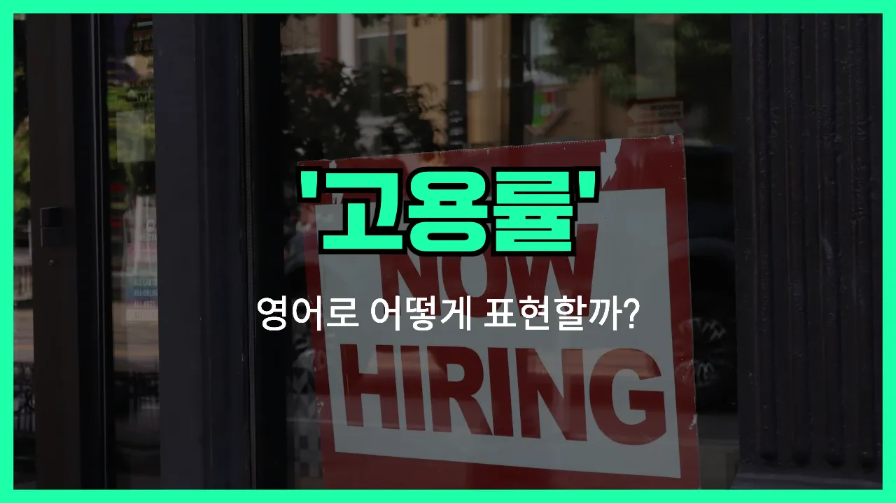

## 🌟 영어 표현 - employment rate

안녕하세요 👋 오늘은 경제 뉴스나 학교, 취업 관련 이야기에서 자주 듣는 단어인 '**취업률**'의 영어 표현을 알아보려고 해요. 바로 '**employment rate**'라는 단어인데요~

'**employment rate**'는 말 그대로 **일할 수 있는 사람들 중 실제로 일하고 있는 사람의 비율**을 의미해요. 즉, 전체 인구 중에서 얼마나 많은 사람이 일자리를 가지고 있는지를 나타내는 지표예요~

이 표현은 경제 상황을 파악할 때 아주 중요한 역할을 해요. 예를 들어, 취업률이 높으면 많은 사람들이 일하고 있다는 뜻이고, 낮으면 실업자가 많다는 의미가 될 수 있어요~

학교 졸업생의 취업률, 국가별 고용률 등 다양한 상황에서 자연스럽게 사용돼요. 예를 들어, "올해 대학 졸업생의 취업률이 높아졌어요."라고 말하고 싶을 때 영어로는 "The employment rate of university graduates increased this year."라고 할 수 있어요~

## 📖 예문

1. "한국의 취업률이 작년에 비해 상승했어요."

   "The employment rate in Korea has increased compared to last year."

2. "졸업생들의 취업률이 80%에 달해요."

   "The employment rate of graduates reaches 80%."

## 💬 연습해보기

<ul data-interactive-list>

  <li data-interactive-item>
    올해 취업률이 올랐대요, 요즘 졸업생들한테는 좋은 소식이죠.
    The employment rate went up this year, which is great <a href="/blog/in-english/536.news/">news</a> for recent graduates.
  </li>

  <li data-interactive-item>
    뉴스 봤어요? 우리 시 취업률이 역대 최고래요.
    Did you see the news? The employment rate in our city is at an all-time high.
  </li>

  <li data-interactive-item>
    경제가 안 좋아지면 취업률이 떨어질까봐 걱정돼요.
    I'm worried that the employment rate might <a href="/blog/in-english/361.drop/">drop</a> if the <a href="/blog/in-english/637.economy/">economy</a> <a href="/blog/in-english/234.get-worse/">gets worse</a>.
  </li>

  <li data-interactive-item>
    정부는 취업률 상승에 자부심을 느끼지만, 좋은 일자리 찾는 사람들은 아직 힘든 상황이에요.
    The <a href="/blog/in-english/608.government/">government</a> is proud of the rising employment rate, but people are <a href="/blog/in-english/254.still/">still</a> struggling to find good jobs.
  </li>

  <li data-interactive-item>
    동생이 경제학 전공이라 취업률이 얼마나 중요한지 항상 얘기해요.
    My sister studied economics, so she always talks about how the employment rate affects everything.
  </li>

  <li data-interactive-item>
    그 회사는 취업률 낮을 때만 사람 뽑아서 일할 사람 구하기 쉽대요.
    Their company only <a href="/blog/in-english/331.hire/">hires</a> when the employment rate is low, so they can find workers easily.
  </li>

  <li data-interactive-item>
    취업률만으로는 직업의 질을 다 알 수 없다는 얘기도 봤어요.
    I <a href="/blog/in-english/436.read/">read</a> that the employment rate doesn't always tell the whole <a href="/blog/in-english/537.story/">story</a> about job <a href="/blog/in-english/304.quality/">quality</a>.
  </li>

  <li data-interactive-item>
    팬데믹 후에 취업률 회복하는 데 시간이 좀 걸렸어요.
    After the pandemic, it took a while for the employment rate to recover.
  </li>

  <li data-interactive-item>
    취업률 높아지면 대체로 사람들이 돈을 더 많이 쓴다고 하더라고요.
    They say that a higher employment rate usually means people are <a href="/blog/in-english/258.spend/">spending</a> more money.
  </li>

  <li data-interactive-item>
    취업률도 중요하지만, 고용 불안정 상태도 봐야 취업 시장을 제대로 이해할 수 있어요.
    The employment rate is <a href="/blog/in-english/318.important/">important</a>, but you should also <a href="/blog/in-english/319.look-at/">look at</a> underemployment to understand the job <a href="/blog/in-english/641.market/">market</a>.
  </li>

</ul>

## 🤝 함께 알아두면 좋은 표현들

### job market

'job market'은 "취업 시장" 또는 "노동 시장"이라는 뜻이에요. 일자리를 구하는 사람들과 일자리를 제공하는 기업들이 만나는 시장을 의미해요. 취업 기회가 얼마나 많은지, 구직이 쉬운지 어려운지 등을 이야기할 때 자주 써요.

- "The job market has become more competitive in recent years."
- "최근 몇 년 사이에 취업 시장이 더 치열해졌어요."

### unemployment rate

'unemployment rate'는 "실업률"이라는 뜻으로, 일할 의사가 있지만 일자리를 구하지 못한 사람들의 비율을 나타내요. 'employment rate'의 반대 개념으로, 경제 상황이 좋지 않을 때 실업률이 높아지는 경향이 있어요.

- "The government is concerned about the rising unemployment rate."
- "정부는 높아지는 실업률에 대해 걱정하고 있어요."

### labor force participation rate

'[labor](/blog/in-english/648.labor/) force participation rate'는 "경제활동참가율"이라는 뜻이에요. 일할 수 있는 연령의 인구 중에서 실제로 일하거나 구직 활동을 하는 사람들의 비율을 나타내요. 단순히 취업한 사람뿐만 아니라 구직자도 포함된다는 점이 'employment rate'와 달라요.

- "The labor force participation rate has increased as more people are [looking for](/blog/in-english/173.look-for/) jobs."
- "더 많은 사람들이 일자리를 찾으면서 경제활동참가율이 높아졌어요."

---

오늘은 '**취업률**', '**고용률**'이라는 뜻을 가진 영어 표현 '**employment rate**'에 대해 알아봤어요. 경제 기사나 뉴스에서 이 표현을 자주 볼 수 있으니 꼭 기억해두세요~ 😊

오늘 배운 표현과 예문들을 소리 내서 여러 번 읽어보면 더 쉽게 익힐 수 있어요. 다음에도 더 유익한 영어 표현으로 찾아올게요! 감사합니다~

