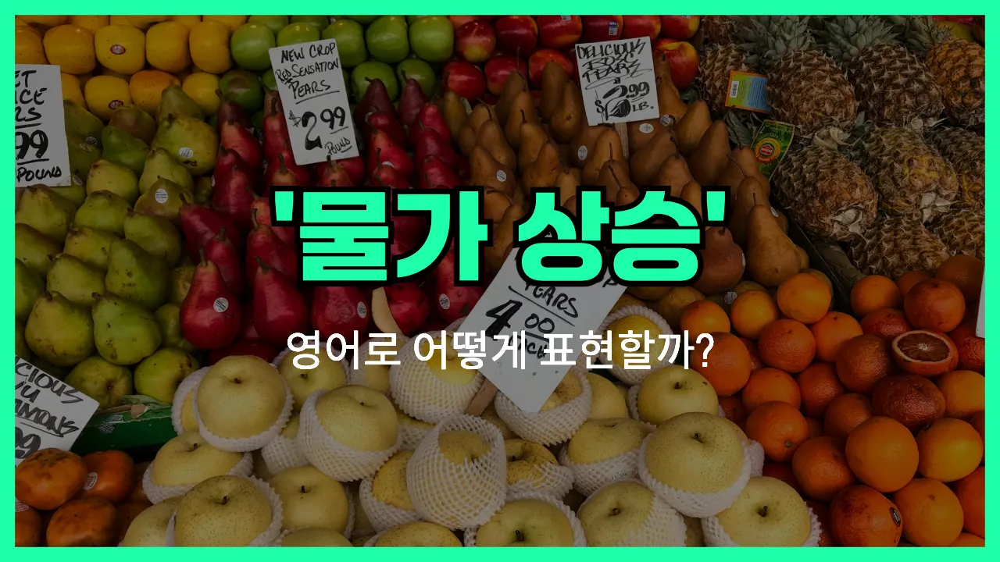

## 🌟 영어 표현 - rising prices

안녕하세요 👋 오늘은 일상에서 자주 듣는 경제 용어인 '**물가 상승**'을 영어로 어떻게 표현하는지 알아보려고 해요.

'**Rising [prices](/blog/in-english/640.price/)**'는 말 그대로 **가격이 점점 오르는 현상**을 의미해요. 즉, 우리가 마트나 시장에서 물건을 살 때 예전보다 더 비싸졌다고 느끼는 상황을 표현할 때 쓰는 말이에요!

이 표현은 경제 뉴스, 일상 대화, 회사 회의 등 다양한 상황에서 자연스럽게 사용돼요. 예를 들어, "최근에 식료품 가격이 많이 올랐어."라고 말하고 싶을 때 "There has been rising prices in groceries recently."라고 할 수 있어요.

또한, 'rising prices'는 'price increase', '[inflation](/blog/in-english/652.inflation/)'과도 비슷한 의미로 쓰이니 상황에 따라 적절하게 골라서 사용해 보세요.

## 📖 예문

1. "최근에 물가가 계속 오르고 있어요."

   "Prices have been rising continuously [these days](/blog/in-english/417.these-days/)."

2. "물가 상승 때문에 생활비가 부담돼요."

   "Rising prices make living [expenses](/blog/in-english/725.expense/) burdensome."

## 💬 연습해보기

<ul data-interactive-list>

  <li data-interactive-item>
    가격이 계속 오르니까 주간 장보기가 점점 힘들어져요.
    Rising prices are <a href="/blog/in-english/244.make-it/">making it</a> harder to do my weekly grocery shopping.
  </li>

  <li data-interactive-item>
    요즘 기름값 봤어요? 이 물가 상승은 진짜 통제가 안 돼요.
    Did you see how much gas <a href="/blog/in-english/664.cost/">costs</a> now? These rising prices are out of control.
  </li>

  <li data-interactive-item>
    요즘 계속 오르는 물가 때문에 전세 보증금도 또 올랐어요.
    My rent went up again because of all the rising prices lately.
  </li>

  <li data-interactive-item>
    커피부터 옷까지, 요즘은 다 물가가 오르는 것 같아요.
    <a href="/blog/한-것-같아-영어표현/">It feels like</a> rising prices are everywhere, from coffee to clothes.
  </li>

  <li data-interactive-item>
    솔직히 물가 오르니까 돈 관리 더 꼼꼼히 하게 돼요.
    <a href="/blog/in-english/336.honestly/">Honestly</a>, I have to <a href="/blog/in-english/661.budget/">budget</a> more carefully because of rising prices.
  </li>

  <li data-interactive-item>
    영화 가격 오르니까 밖에 나가는 횟수가 확 줄었어요.
    Rising prices at the movies mean I go out a lot less.
  </li>

  <li data-interactive-item>
    요즘 물가 상승 때문에 다들 휴가 계획이 많이 바뀌었다고 얘기했어요.
    We were talking about how rising prices are affecting everyone's <a href="/blog/in-english/516.vacation/">vacations</a> this year.
  </li>

  <li data-interactive-item>
    계란이나 우유 같은 기본 식재료도 다 가격이 올랐어요.
    Even <a href="/blog/in-english/445.basic/">basic</a> stuff like eggs and milk have rising prices now.
  </li>

  <li data-interactive-item>
    확인할 때마다 자꾸만 쓰는 것들이 가격 인상 소식과 맞닥뜨리네요.
    I feel like every time I check, rising prices have hit something else I use.
  </li>

  <li data-interactive-item>
    친구들이랑 농담삼아 요즘 물가가 진짜 우리가 일하는 사장님 같다고 말해요.
    My friends and I joke about how rising prices are the real boss we work for.
  </li>

</ul>

## 🤝 함께 알아두면 좋은 표현들

### inflation

'inflation'은 경제에서 '물가 상승'이나 '화폐 가치 하락'을 의미하는 단어예요. 전반적으로 상품과 서비스의 가격이 오르는 현상을 공식적으로 표현할 때 자주 사용해요.

- "Many families are struggling to [keep up with](/blog/vocab-1/027.keep-up-with/) inflation these days."
- "요즘 많은 가정들이 물가 상승 때문에 따라가기 힘들어하고 있어요."

### cost of living increase

'cost of living increase'는 '생활비 상승'이라는 뜻으로, 일상생활에 필요한 비용이 전반적으로 오르는 상황을 말해요. 주로 월세, 식비, 교통비 등 생활에 꼭 필요한 것들의 가격이 오를 때 사용해요.

- "The cost of living increase has made it harder for young people to [save money](/blog/in-english/726.save-money/)."
- "생활비가 오르면서 젊은 사람들이 돈을 모으기가 더 힘들어졌어요."

### falling prices

'falling prices'는 '가격 하락' 또는 '물가 하락'을 의미하는 표현이에요. 물가가 오르는 것과 반대되는 상황으로, 상품이나 서비스의 가격이 내려가는 현상을 나타낼 때 써요.

- "Falling prices in the tech [industry](/blog/in-english/693.industry/) have made gadgets more affordable for everyone."
- "기술 업계에서 가격이 내려가면서 전자기기를 더 저렴하게 살 수 있게 됐어요."

---

오늘은 '**물가 상승**'이라는 뜻을 가진 영어 표현 '**rising prices**'에 대해 알아봤어요. 앞으로 뉴스나 대화에서 이 표현이 나오면 바로 이해할 수 있겠죠? 😊

오늘 배운 표현과 예문들을 꼭 최소 3번씩 소리 내서 읽어보세요. 다음에도 더 재미있고 유익한 영어 표현으로 찾아올게요! 감사합니다!
