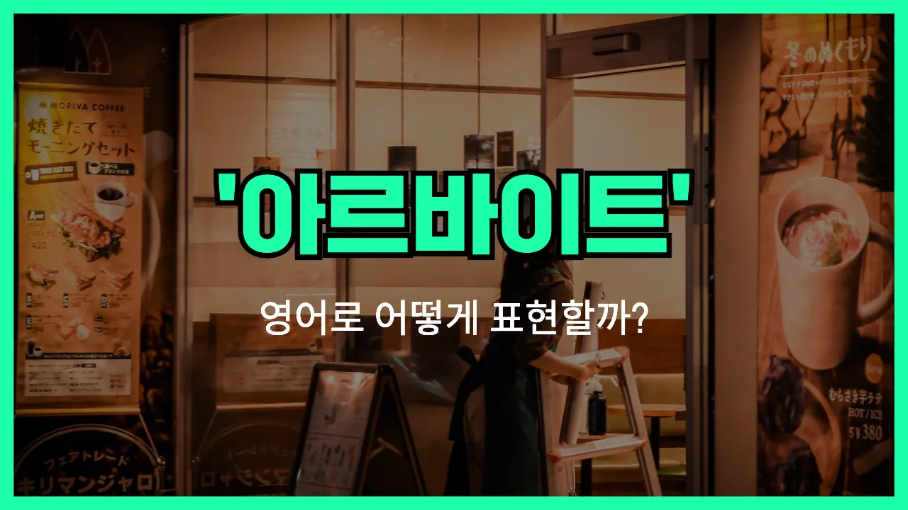

## 🌟 영어 표현 - part-time

안녕하세요 👋 오늘은 많은 분들이 궁금해하는 영어 표현, 바로 '**알바**'에 대해 이야기해보려고 해요. 우리가 흔히 쓰는 '알바'는 '아르바이트'의 줄임말로, 정규직이 아닌 **시간제로 일하는 것**을 의미해요. 영어에서는 이럴 때 '**part-time**'이라는 단어를 사용해요!

'**part-time**'은 말 그대로 '부분적인 시간'이라는 뜻이에요. 즉, 하루 종일(풀타임)이 아니라 **일정 시간만 일하는 형태**를 말해요. 학생들이나 직장인들이 본업 외에 추가로 일할 때, 혹은 시간에 여유가 있을 때 주로 하는 일이죠.

예를 들어, 카페에서 일하거나, 서점에서 일하는 등 다양한 분야에서 'part-time job'을 할 수 있어요. 이때 'job'을 붙여서 'part-time job'이라고도 많이 해요. 물론, 그냥 'I'm working part-time.'처럼 쓸 수도 있어요!

## 📖 예문

1. "저는 카페에서 알바하고 있어요."

   "I'm working part-time at a cafe."

2. "그는 학생이지만 파트타임으로 일해요."

   "He is a student, but he works part-time."

## 💬 연습해보기

<ul data-interactive-list>

  <li data-interactive-item>
    저는 학교 다니면서 커피숍에서 아르바이트하고 있어요.
    I'm working part-time at a coffee shop while I <a href="/blog/in-english/295.finish/">finish</a> school.
  </li>

  <li data-interactive-item>
    제 동생이 도서관에서 아르바이트 새로 시작했는데, 되게 신나해요.
    My sister just got a part-time job at the library. She's pretty excited about it.
  </li>

  <li data-interactive-item>
    풀타임 찾는 거예요, 아니면 그냥 파트타임 원해요?
    Are you <a href="/blog/in-english/173.look-for/">looking for</a> something full-time or just part-time?
  </li>

  <li data-interactive-item>
    돈 좀 벌어야 해서 주말에 파트타임 일 해볼까 생각 중이에요.
    I need some <a href="/blog/in-english/265.extra/">extra</a> cash, so I'm considering <a href="/blog/in-english/178.pick-up/">picking up</a> a part-time gig on the weekends.
  </li>

  <li data-interactive-item>
    그 친구는 파트타임만 하니까 아이들이랑 보낼 시간이 더 많아요.
    He only works part-time, so he has more time to <a href="/blog/in-english/258.spend/">spend</a> with his kids.
  </li>

  <li data-interactive-item>
    그녀가 파트타임만 하면서도 여행을 자주 다닌다는 거 알고 있었어요?
    Did you know she only works part-time and <a href="/blog/in-english/254.still/">still</a> <a href="/blog/in-english/175.manage-to/">manages to</a> travel all the time?
  </li>

  <li data-interactive-item>
    저는 제 프로젝트도 신경 쓰고 싶어서 파트타임 자리를 찾고 있어요.
    I'm looking for a part-time position because I want to <a href="/blog/in-english/186.focus-on/">focus on</a> my own projects, too.
  </li>

  <li data-interactive-item>
    파트타임 월급으로 생활비 버는 건 힘들지만, 그래도 시간이 더 많아서 좋아요.
    It can be <a href="/blog/in-english/183.tough/">tough</a> to pay the <a href="/blog/in-english/620.bill/">bills</a> on a part-time <a href="/blog/in-english/650.salary/">salary</a>, but <a href="/blog/in-english/167.at-least/">at least</a> I have more free time.
  </li>

  <li data-interactive-item>
    엄마는 은퇴 후에 파트타임으로 다시 일 시작하셨어요.
    My mom went back to work part-time after she retired.
  </li>

  <li data-interactive-item>
    학생들이 학교랑 일 병행하기에는 파트타임 시간이 딱 좋죠.
    Part-time hours are <a href="/blog/in-english/413.perfect/">perfect</a> for students who need to balance school and work.
  </li>

</ul>

## 🤝 함께 알아두면 좋은 표현들

### full-time

'full-time'은 "정규직" 또는 "풀타임"이라는 뜻으로, 주로 주 40시간 정도 일하는 정규 근무 형태를 말해요. 'part-time'의 반대 개념으로, 근무 시간이 더 길고, 복지나 혜택도 더 많이 받을 수 있는 경우가 많아요.

- "She recently switched from a part-time job to a full-time position at the same company."
- "그녀는 최근에 같은 회사에서 파트타임에서 정규직으로 전환했어요."

### side job

'side job'은 "부업"이나 "투잡"을 의미해요. 본업 외에 추가로 하는 일이나 아르바이트를 가리키며, 'part-time'과 비슷하게 정규직이 아닌 일을 뜻하지만, 주로 본업이 따로 있을 때 쓰는 표현이에요.

- "He works a side job as a delivery driver in the evenings to earn extra money."
- "그는 저녁에 배달기사로 부업을 해서 추가 수입을 벌고 있어요."

### temporary position

'[temporary](/blog/in-english/425.temporary/) position'은 "임시직"이나 "계약직"을 의미해요. 정규직이나 파트타임과 달리, 일정 기간 동안만 일하는 직업을 말해요. 보통 프로젝트나 특정 기간에만 필요한 인력을 채용할 때 사용해요.

- "She accepted a temporary position at the company while looking for a permanent job."
- "그녀는 정규직을 찾는 동안 회사에서 임시직을 수락했어요."

---

오늘은 '알바', '파트타임', '시간제'라는 뜻을 가진 영어 표현 '**part-time**'에 대해 알아봤어요. 혹시 주변에 알바를 구하는 친구가 있다면 이 표현을 알려주면 좋겠어요 😊

오늘 배운 표현과 예문들을 꼭 최소 3번씩 소리 내서 읽어보세요. 다음에도 더 재미있고 유익한 영어 표현으로 찾아올게요! 감사합니다!

